# WAD - Web Application Document - Módulo 2 - Inteli

**_Os trechos em itálico servem apenas como guia para o preenchimento da seção. Por esse motivo, não devem fazer parte da documentação final_**

## Nome do Grupo

#### Nomes dos integrantes do grupo

-Clara Rapuano

-Felipe Escobar

-Henrique Botini

-João Pedro Poveda 

-Maria Fernanda Medeiros

-Theo Lewin

-Vitor Dias 

-Vinicios Ramos


## Sumário

[1. Introdução](#c1)

[2. Visão Geral da Aplicação Web](#c2)

[3. Projeto Técnico da Aplicação Web](#c3)

[4. Desenvolvimento da Aplicação Web](#c4)

[5. Testes da Aplicação Web](#c5)

[6. Estudo de Mercado e Plano de Marketing](#c6)

[7. Conclusões e trabalhos futuros](#c7)

[8. Referências](c#8)

[Anexos](#c9)

<br>


# <a name="c1"></a>1. Introdução 

O crescimento urbano desordenado em regiões metropolitanas brasileiras tem ampliado a exposição de populações a áreas de risco geológico e hidrológico, tornando a gestão preventiva e a resposta a desastres desafios cada vez mais relevantes para os municípios. Nesse contexto, o Departamento de Proteção e Defesa Civil de Santo André, reconhecido por sua atuação na gestão de riscos e proteção da população, enfrenta dificuldades relacionadas à fragmentação das informações utilizadas no cadastramento e monitoramento de famílias residentes em áreas vulneráveis.

Atualmente, parte dos dados coletados em campo é registrada por meio de formulários físicos ou sistemas não integrados, dificultando a atualização das informações, a identificação de perfis prioritários para atendimento e a consolidação dos dados necessários para o planejamento de ações preventivas e emergenciais. Essa realidade reduz a eficiência operacional da Defesa Civil e limita a capacidade de análise das condições socioestruturais das famílias expostas a riscos.

Para contribuir com a solução desse problema, foi desenvolvido o GeoRisco Santo André, uma aplicação web georreferenciada voltada ao cadastro e à gestão de famílias residentes em áreas de risco. A plataforma permite o registro de informações socioeconômicas, dados da moradia, perfis de vulnerabilidade, necessidades específicas e registros fotográficos do imóvel, além da captura de coordenadas geográficas por GPS. Os dados cadastrados podem ser consultados, filtrados e atualizados por meio de uma interface centralizada, facilitando o acesso às informações por agentes de campo e coordenadores operacionais.

O Produto Mínimo Viável (MVP) desenvolvido contempla as funcionalidades essenciais para o cadastramento georreferenciado de famílias, edição de registros existentes, busca com filtros avançados e armazenamento de imagens associadas aos imóveis cadastrados. Dessa forma, a solução contribui para a organização das informações da Defesa Civil, apoiando a tomada de decisão baseada em dados e fortalecendo as ações de prevenção e resposta em situações de risco no município de Santo André.

Como evolução futura da plataforma, estão previstas funcionalidades complementares, como visualização georreferenciada em mapas interativos, geração de relatórios exportáveis e ampliação do suporte à gestão de operações emergenciais.

# <a name="c2"></a>2. Visão Geral da Aplicação Web 

O GeoRisco Santo André consiste em uma aplicação web cuja finalidade é centralizar o cadastramento e a gestão de famílias residentes em áreas de risco acompanhadas pela Defesa Civil de Santo André. A plataforma foi estruturada em torno do Módulo de Mapeamento Socioestrutural Georreferenciado, contemplando o cadastro de moradores com captura de coordenadas GPS, identificação de perfis de vulnerabilidade, registro de informações da moradia, anexação de imagens e consulta dos dados por meio de filtros operacionais. As seções seguintes detalham o escopo do projeto, as personas envolvidas e as histórias de usuário que orientam o desenvolvimento da solução.

## 2.1. Escopo do Projeto

O projeto GeoRisco Santo André consiste no desenvolvimento de uma aplicação web unificada voltada à gestão de dados socioestruturais de famílias em áreas de risco. A proposta busca resolver a fragmentação atual das informações, centralizando em uma única plataforma o cadastro de responsáveis e membros familiares, a captura ou inserção manual de coordenadas geográficas, o registro de características da moradia, a identificação de perfis vulneráveis, como idosos, crianças, gestantes e pessoas com deficiência, e a anexação de imagens vinculadas ao imóvel. A solução contempla ainda informações sociais relevantes, como benefícios, veículos, animais domésticos, meios de alerta e destino em caso de evacuação. Além disso, permite a consulta e filtragem dos dados por critérios como bairro, faixa etária e tipo de deficiência, apoiando diretamente a priorização de atendimentos em situações emergenciais. Funcionalidades como exportação de relatórios, visualização em mapa interativo e ampliação para gestão de abrigos e logística humanitária permanecem como evoluções futuras, por não integrarem o escopo implementado no MVP.


### 2.1.1 Modelo de 5 Forças de Porter

Esta subseção apresenta a análise estrutural de soluções tecnológicas aplicadas à gestão de riscos e desastres no setor público, com base no Modelo de 5 Forças de Porter. O objetivo é compreender o ambiente competitivo e identificar fatores que influenciam a adoção e efetividade de sistemas como o GeoRisco Santo André.

**Ameaça de Novos Entrantes**

A ameaça é baixa a moderada devido às barreiras institucionais e operacionais existentes no setor público.[^1] Embora o desenvolvimento web não exija alto investimento inicial, é necessário conhecimento especializado sobre políticas públicas, processos administrativos e integração entre órgãos. Além disso, exigências legais como a Lei Geral de Proteção de Dados (LGPD) e a necessidade de credibilidade institucional dificultam a entrada de novos competidores, tornando a consolidação no setor complexa mesmo para organizações com capacidade técnica.

**Ameaça de Produtos Substitutos**

A ameaça é alta, principalmente pelo uso consolidado de métodos tradicionais como planilhas, registros físicos e sistemas isolados.[^1] Embora menos eficientes, esses métodos ainda atendem parcialmente às necessidades da Defesa Civil. A familiaridade dos servidores com essas práticas e a resistência à mudança institucional dificultam a adoção de novas soluções, exigindo que o GeoRisco demonstre ganhos claros em eficiência, integração e agilidade operacional.

**Poder de Barganha dos Fornecedores**

O poder de barganha dos fornecedores é baixo a moderado, em razão da ampla oferta de tecnologias disponíveis no mercado, como linguagens de programação, frameworks e serviços de hospedagem em nuvem.[^1] Essa diversidade reduz a dependência de fornecedores específicos. No entanto, a necessidade de mão de obra qualificada em desenvolvimento web e gestão de dados geoespaciais pode representar um fator de dependência relevante.

**Poder de Barganha dos Clientes**

O poder de barganha é alto, uma vez que a Prefeitura de Santo André e a Defesa Civil detêm o poder de decisão sobre a adoção da solução.[^1] Restrições orçamentárias, exigências legais e a necessidade de validação institucional aumentam o nível de exigência, tornando essencial demonstrar benefícios operacionais concretos e alinhamento com as diretrizes do setor público.
**Rivalidade entre Concorrentes**

A rivalidade é moderada. Existem soluções concorrentes no mercado, como o Sistema Integrado de Informações sobre Desastres (S2iD) do governo federal, plataformas de gestão de emergências desenvolvidas por estados e municípios, e sistemas proprietários de empresas de tecnologia cívica.[^1] A disputa ocorre pela eficiência, integração de dados e capacidade de resposta em emergências. Soluções que oferecem centralização de dados, geolocalização e suporte à decisão em tempo real possuem vantagem competitiva nesse cenário.


### 2.1.2 Análise SWOT da Instituição Parceira

Esta subseção apresenta uma visão geral da situação do Departamento de Proteção e Defesa Civil de Santo André com base na matriz SWOT, identificando forças, fraquezas, oportunidades e ameaças com foco no posicionamento da instituição frente ao contexto tecnológico e competitivo em que está inserida.


**Figura 1**: Análise SWOT

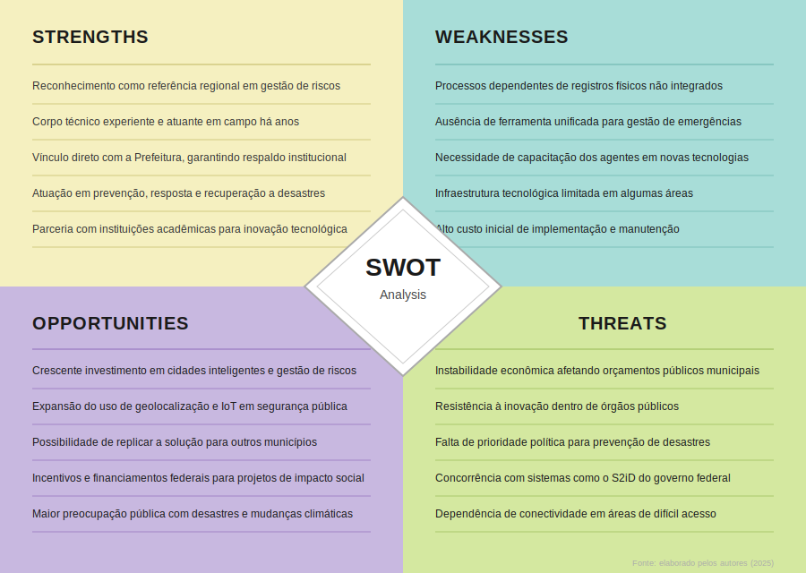
             
**Fonte**: autoral (2026)
### 2.1.3. Solução (sprints 1 a 5)
Esta seção apresenta os aspectos essenciais da solução desenvolvida para a Defesa Civil de Santo André, detalhando o problema identificado, os dados disponíveis, a proposta de solução, sua forma de utilização, os benefícios esperados e os critérios de sucesso adotados. Cada aspecto é descrito de forma objetiva, com o objetivo de contextualizar a proposta de valor do produto e seu alinhamento com as necessidades operacionais do parceiro.

#### 2.1.3.1 Problema a ser resolvido
A Defesa Civil de Santo André processa dados de cadastramento de famílias em áreas de risco de forma isolada, frequentemente em suportes físicos ou sistemas não integrados. Essa descentralização compromete a atualização das informações, a identificação de perfis vulneráveis, como idosos, pessoas com deficiência, gestantes e crianças, e a consulta rápida a dados de moradia, localização e necessidades específicas. Como consequência, a priorização de atendimentos e o planejamento preventivo dependem de consolidações manuais, sujeitas a atraso, retrabalho e perda de informação.

#### 2.1.3.2 Dados disponíveis
Os dados utilizados como base para o desenvolvimento da solução foram fornecidos pela Secretaria de Desenvolvimento Urbano e Habitação (SDUH) de Santo André. Os materiais disponibilizados incluem a Ficha de Atualização de Dados dos Moradores em Assentamentos Precários, mapas de risco do município, estudo de vulnerabilidade populacional, Formulário Nacional SUAS para situações de emergência, Ficha de Resgate de Animais e Formulário de Registro de Bens sob Guarda da Defesa Civil.

#### 2.1.3.3 Solução proposta
Propõe-se o desenvolvimento do GeoRisco Santo André, uma aplicação web unificada e georreferenciada voltada ao cadastro socioestrutural de famílias em áreas de risco. A solução implementa o registro de responsáveis e membros familiares, dados de moradia, perfis de vulnerabilidade, informações sociais, captura ou preenchimento manual de coordenadas geográficas e upload de imagens associadas ao imóvel. A aplicação organiza esses dados em uma base relacional PostgreSQL, com armazenamento de imagens via Supabase Storage, permitindo consulta posterior por meio de filtros operacionais.

#### 2.1.3.4 Forma de utilização da solução
Agentes de campo utilizarão a aplicação via dispositivo móvel, como tablets ou celulares, para realizar o cadastro georreferenciado de famílias diretamente nas áreas de vulnerabilidade. Quando o GPS estiver disponível e autorizado, as coordenadas são capturadas pelo navegador; quando houver indisponibilidade ou negativa de permissão, o sistema permite o preenchimento manual. A coordenação operacional acessará os cadastros e o painel de busca para consultar registros, aplicar filtros por bairro, faixa etária e tipo de deficiência, e apoiar decisões de priorização com base nos dados consolidados.

#### 2.1.3.5 Benefícios esperados
A solução centraliza as informações em uma interface única, agilizando a identificação de perfis prioritários para atendimento e reduzindo a dependência de registros físicos. Espera-se a redução significativa do retrabalho gerado pela fragmentação dos dados, maior confiabilidade na consulta a informações socioestruturais e apoio mais direto ao planejamento preventivo da Defesa Civil. A base digital também facilita a evolução futura da plataforma para visualizações georreferenciadas, relatórios exportáveis e integração com processos de resposta emergencial.

#### 2.1.3.6 Critério de sucesso e como será avaliado
O sucesso da solução será avaliado com base em critérios objetivos e verificáveis. O MVP deverá realizar a captura ou inserção manual de coordenadas geográficas, validar os dados inseridos no formulário, persistir os cadastros no banco de dados e permitir o registro fotográfico do imóvel. O painel de busca deverá possibilitar a filtragem de registros por bairro, faixa etária e tipo de deficiência, exibindo mensagem informativa quando não houver resultados. Por fim, a aderência às necessidades do parceiro será avaliada por meio de testes de usabilidade realizados com usuários da Defesa Civil ao longo do desenvolvimento.


### 2.1.4. Value Proposition Canvas:

Esta subseção apresenta o Value Proposition Canvas elaborado para o projeto GeoRisco Santo André, estruturado a partir da proposta de valor da solução e do perfil do cliente identificado. O canvas evidencia o alinhamento entre os produtos e serviços oferecidos, os criadores de ganho e os aliviadores de dor da plataforma com os ganhos esperados, as dores enfrentadas e as tarefas desempenhadas pelos usuários da Defesa Civil de Santo André. 

**Figura 2:** Canvas Proposta de Valor 

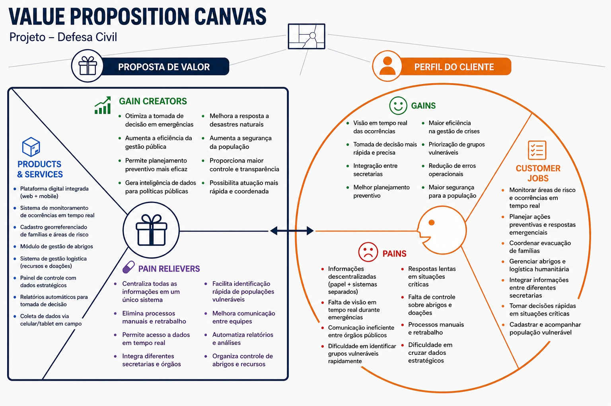

**Fonte:** Autoral (2026)

### 2.1.5. Matriz de Riscos do Projeto 

Esta seção apresenta a Matriz de Riscos do projeto GeoRisco Santo André, identificando os principais riscos e oportunidades associados ao desenvolvimento da solução. Para cada item, foram definidos níveis de probabilidade e impacto, acompanhados de ações de mitigação ou aproveitamento, com o objetivo de subsidiar o planejamento e a tomada de decisão ao longo das sprints.

**Figura 3:** Matriz de Risco

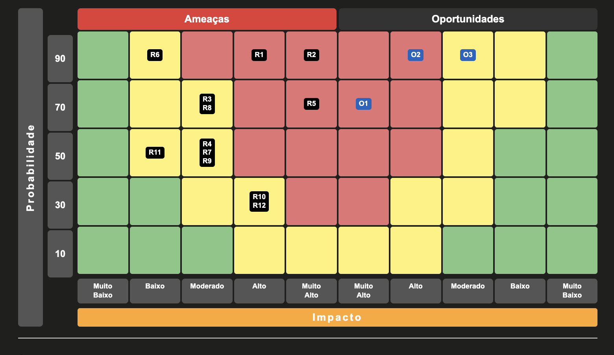

Fonte: Autoral (2026)

R1 — Dificuldade na implementação da captura de GPS em dispositivos móveis (Probabilidade: Muito Provável | Impacto: Alto)
A API de geolocalização do navegador apresenta comportamento inconsistente em diferentes dispositivos móveis e sistemas operacionais, especialmente em ambientes com sinal fraco. Como o georreferenciamento é o requisito central do MVP, falhas nessa funcionalidade comprometem diretamente a principal entrega do projeto, inviabilizando o vínculo entre o cadastro familiar e sua posição geográfica.
Ação de mitigação: manter a captura via API de geolocalização do navegador e disponibilizar preenchimento manual de latitude e longitude quando o GPS estiver indisponível ou a permissão for negada, conforme previsto nas regras RN04 e RN05.

R2 — Problemas de conectividade em campo durante o cadastro (Probabilidade: Muito Provável | Impacto: Muito Alto)
Assentamentos precários frequentemente estão localizados em áreas com cobertura de sinal limitada ou instável. Sem conexão com a internet, o formulário não pode ser submetido, inviabilizando o cadastro em campo e exigindo que os agentes retornem posteriormente para registrar os dados, comprometendo a agilidade da resposta emergencial.
Ação de mitigação: tratar o modo offline como evolução futura da plataforma, avaliando armazenamento local temporário e sincronização posterior dos dados quando a conexão for restabelecida.

R3 — Dificuldade no upload e armazenamento de fotos (Probabilidade: Provável | Impacto: Moderado)
O upload de imagens depende de conexão estável e pode falhar em dispositivos com pouca memória ou armazenamento disponível. Embora o registro fotográfico da fachada e do entorno seja um dado complementar relevante para o cadastro socioestrutural, sua ausência não inviabiliza o preenchimento completo do formulário.
Ação de mitigação: utilizar o Supabase Storage para persistência dos arquivos e registrar metadados na tabela `imagem`. Como melhoria futura, implementar compressão, limite de tamanho e validação explícita de formato para reduzir falhas e alinhar integralmente o upload ao RF028.

R4 — Incompatibilidade do sistema com diferentes navegadores e dispositivos móveis (Probabilidade: Possível | Impacto: Moderado)
A equipe não tem controle sobre quais dispositivos e versões de navegador os agentes de campo utilizarão. Versões desatualizadas podem não suportar determinadas funcionalidades da aplicação, afetando a experiência de uso e a confiabilidade do cadastro realizado.
Ação de mitigação: definir desde o início os navegadores e versões mínimas suportadas, realizando testes de compatibilidade regulares ao longo das sprints com diferentes configurações de dispositivos.

R5 — Complexidade na implementação do painel de mapa georreferenciado (Probabilidade: Provável | Impacto: Muito Alto)
A implementação de mapas interativos com dados em tempo real envolve bibliotecas complexas e uma curva de aprendizado significativa para a equipe. O painel georreferenciado é um entregável de alto valor estratégico para o parceiro, mas não integrou o MVP entregue, permanecendo como evolução futura junto ao painel de indicadores agregados.
Ação de mitigação: manter as coordenadas geográficas persistidas no cadastro e priorizar, em iterações futuras, uma visualização simples dos pontos cadastrados antes de adicionar camadas de complexidade como filtros espaciais e mapas de calor.

R6 — Sobrecarga de membros da equipe ao longo das sprints (Probabilidade: Muito Provável | Impacto: Baixo)
O ritmo de sprints curtas combinado com as demandas de outras disciplinas do curso tende a gerar acúmulo de tarefas e sobrecarga entre os membros da equipe. Esse cenário pode afetar a qualidade das entregas e o cumprimento dos prazos estabelecidos no planejamento.
Ação de mitigação: realizar planejamentos semanais com distribuição equilibrada de tarefas, monitorando a carga de trabalho individual e redistribuindo responsabilidades sempre que necessário ao longo das sprints.

R7 — Dificuldade da equipe com tecnologias novas adotadas no projeto (Probabilidade: Possível | Impacto: Moderado)
Parte da equipe pode ter pouca experiência com a API de geolocalização do navegador, integração com Supabase, PostgreSQL, validações com Zod e organização em camadas no backend. Essa lacuna técnica tende a gerar atrasos no desenvolvimento e retrabalho em funcionalidades já implementadas.
Ação de mitigação: identificar previamente as tecnologias que representam maior desafio para a equipe e dedicar tempo de estudo dirigido nas fases iniciais do projeto, promovendo sessões de compartilhamento de conhecimento entre os membros.

R8 — Dificuldade em conseguir usuários reais da Defesa Civil para testes (Probabilidade: Provável | Impacto: Moderado)
Os agentes e gestores da Defesa Civil de Santo André possuem rotina operacional intensa, o que pode dificultar sua disponibilidade para participar de sessões de teste de usabilidade ao longo do projeto. Isso compromete a qualidade da validação do sistema com usuários reais do contexto de emergência.
Ação de mitigação: agendar sessões de teste com antecedência junto ao ponto focal do parceiro, priorizando formatos curtos e remotos, e complementar com testes baseados em personas simuladas quando necessário.

R9 — Dados fictícios utilizados nos testes não representando a realidade do campo (Probabilidade: Possível | Impacto: Moderado)
A restrição imposta pela LGPD obriga o uso de dados fictícios ou anonimizados durante todo o desenvolvimento, os quais podem não refletir a complexidade e a diversidade real dos cadastros realizados pelos agentes em campo. Essa limitação pode gerar lacunas na validação do sistema.
Ação de mitigação: desenvolver um conjunto de dados sintéticos cuidadosamente elaborado com base nos formulários e materiais fornecidos pelo parceiro, simulando cenários reais de vulnerabilidade para garantir a qualidade dos testes.

R10 — Inconsistência entre os formulários físicos e os campos implementados no sistema (Probabilidade: Improvável | Impacto: Alto)
Embora os formulários físicos já tenham sido fornecidos e mapeados pela equipe, alterações posteriores solicitadas pelo parceiro ou campos mal interpretados durante o desenvolvimento podem gerar inconsistências entre o formulário digital e o físico utilizado em campo.
Ação de mitigação: validar o mapeamento completo dos campos com o ponto focal do parceiro antes da implementação e estabelecer um processo formal de aprovação para qualquer alteração nos formulários ao longo do projeto.

R11 — Falta de alinhamento interno entre os membros da equipe sobre decisões técnicas (Probabilidade: Possível | Impacto: Baixo)
Decisões técnicas tomadas sem consenso entre os membros da equipe podem gerar retrabalho, conflitos de implementação e inconsistências no código desenvolvido ao longo das sprints. Esse risco tende a se intensificar à medida que o projeto avança e a complexidade das funcionalidades aumenta.
Ação de mitigação: estabelecer reuniões de alinhamento técnico regulares, documentar as decisões arquiteturais tomadas e utilizar ferramentas de controle de versão com revisão de código entre os membros da equipe.

R12 — Impossibilidade de visita presencial aos assentamentos em Santo André (Probabilidade: Possível | Impacto: Alto)
A realização de visitas presenciais aos assentamentos precários de Santo André depende de logística, segurança e disponibilidade do parceiro, fatores que podem não se alinhar ao calendário do projeto. A ausência dessas visitas limita a compreensão do contexto real de uso da aplicação pelos agentes de campo.
Ação de mitigação: compensar a ausência de visitas presenciais com reuniões remotas frequentes com o ponto focal, análise detalhada dos materiais fornecidos pelo parceiro e aplicação de entrevistas com os agentes de campo para compreender melhor o fluxo de trabalho em situações de emergência.
 
Oportunidades:

O1 — Parceiro altamente engajado e disponível para validações frequentes (Probabilidade: Provável | Impacto: Muito Alto)
O alto nível de engajamento da Defesa Civil de Santo André com o projeto representa uma oportunidade significativa para a equipe. A disponibilidade do parceiro para reuniões e validações frequentes facilita o alinhamento de requisitos e reduz o risco de retrabalho por escopo mal definido.
Ação de aproveitamento: estabelecer um calendário fixo de reuniões com o ponto focal do parceiro, aproveitando sua disponibilidade para validar entregas incrementais ao final de cada sprint.

O2 — Tecnologias de georreferenciamento bem documentadas e de acesso livre (Probabilidade: Muito Provável | Impacto: Alto)
Tecnologias como a API de Geolocalização do navegador, Leaflet e OpenStreetMap são amplamente documentadas, de acesso livre e possuem grande comunidade de suporte. Isso reduz a curva de aprendizado da equipe e facilita tanto a captura de coordenadas no MVP quanto a futura implementação de visualização em mapa.
Ação de aproveitamento: utilizar a API nativa do navegador para captura de coordenadas no cadastro e manter Leaflet e OpenStreetMap como alternativas prioritárias para a evolução do painel georreferenciado.

O3 — Formulários físicos já fornecidos pelo parceiro facilitam o mapeamento dos requisitos (Probabilidade: Muito Provável | Impacto: Moderado)
A disponibilização antecipada dos formulários físicos utilizados pela Defesa Civil oferece uma base sólida para o mapeamento dos requisitos do sistema, reduzindo ambiguidades e acelerando a modelagem do banco de dados.
Ação de aproveitamento: utilizar os formulários como referência primária para a definição dos campos do sistema, validando o mapeamento com o parceiro antes do início da implementação para garantir aderência total aos processos reais da Defesa Civil.

## 2.2. Personas

Representando indivíduos específicos de forma singular, as personas são descrições que, embora fictícias, devem ser realistas o suficiente para caracterizar usuários semelhantes ao público-alvo do produto sendo desenvolvido. A partir da compreensão de comportamentos, objetivos e atitudes dos usuários, uma persona permite a visualização das necessidades que devem ser contempladas no projeto da solução. Foram reunidas, para cada perfil, informações relevantes como idade, ocupação, comportamentos e dores com foco em características que impactam diretamente o que está sendo desenvolvido. A seguir, são apresentadas as personas elaboradas para o projeto GeoRisco Santo André, contemplando os principais perfis envolvidos no MVP: o agente de campo responsável pelo cadastro socioestrutural e a coordenadora operacional responsável pela análise consolidada dos dados.

**Figura 4:** Persona do agente de campo


Fonte: Autoral (2026)

**Figura 5:** Persona da coordenadora operacional


Fonte: Autoral (2026)


---


## 2.3. User Stories

As User Stories descrevem, de forma simples e objetiva, as necessidades dos usuários e o valor que o sistema deve entregar, permitindo que a equipe compreenda o projeto sob a perspectiva do usuário.
No presente projeto, as User Stories foram elaboradas com base no princípio INVEST (Independentes, Negociáveis, Valiosas, Estimáveis, Pequenas e Testáveis), garantindo clareza e viabilidade no desenvolvimento. Além disso, foram organizadas no backlog de um quadro Kanban, possibilitando a priorização e o acompanhamento das atividades ao longo das sprints.
Para o desenvolvimento do Produto Mínimo Viável (MVP), foram definidas como prioritárias as User Stories relacionadas ao cadastro socioestrutural, captura de coordenadas, identificação de vulnerabilidades, busca com filtros e consulta/edição de registros. Ao longo do desenvolvimento, funcionalidades complementares de caracterização da moradia, informações sociais e upload de imagens também foram incorporadas ao fluxo de cadastro. As histórias de exportação, mapa interativo e painel de indicadores permanecem registradas como evolução futura da solução.

**User Story 01**

| Identificação | US01 |
| --- | --- |
| Persona | Marcelo Tavares |
| User Story | Como agente de campo da Defesa Civil, posso cadastrar uma família em área de risco por meio de um formulário com validação automática dos dados, para garantir que as informações socioestruturais sejam registradas de forma padronizada e confiável. |
| Critério de aceite 1 | **CR1:** Quando o agente preencher o formulário e tentar salvá-lo sem informar os campos obrigatórios (nome do chefe de família, CPF, composição familiar e setor de risco), o sistema deve impedir o envio e exibir mensagens de erro pontuais junto a cada campo em branco. |
| Critério de aceite 2 | **CR2:** O sistema deve validar o formato do CPF informado e impedir a duplicidade de cadastros para um mesmo CPF entre chefes de família distintos. |
| Critério de aceite 3 | **CR3:** Quando todos os campos obrigatórios forem preenchidos corretamente, o sistema deve persistir o cadastro no banco de dados e exibir mensagem de confirmação ao usuário. |
| Critérios INVEST | **Independente:** A funcionalidade pode ser desenvolvida de forma isolada, antes mesmo da geolocalização e dos filtros de busca, dado que constitui o ponto de entrada do sistema. **Negociável:** O conjunto de campos obrigatórios pode ser refinado em conversa com o parceiro ao longo da sprint. **Valiosa:** Representa a entrada de dados central do sistema, sem a qual nenhum outro módulo opera. **Estimável:** O esforço é mensurável, dado que envolve componentes conhecidos de formulário e validação. **Pequena:** Pode ser concluída dentro de uma sprint, restrita ao formulário e às suas regras de validação. **Testável:** Os critérios de aceite são objetivos e verificáveis por testes manuais e automatizados. |


**User Story 02**

| Identificação | US02 |
| --- | --- |
| Persona | Marcelo Tavares |
| User Story | Como agente de campo da Defesa Civil, posso capturar as coordenadas de latitude e longitude por meio de uma ação manual no sistema, para vincular a posição geográfica exata da residência ao registro da família. |
| Critério de aceite 1 | *CR1:* Quando o agente, em dispositivo móvel com GPS ativo, acionar o botão de captura no formulário, o sistema deve obter as coordenadas via GPS e preencher automaticamente os campos de latitude e longitude com valores válidos. |
| Critério de aceite 2 | *CR2:* Caso o GPS esteja indisponível ou o usuário negue a permissão de localização, o sistema deve exibir mensagem clara informando o problema e permitir o preenchimento manual das coordenadas. |
| Critério de aceite 3 | *CR3:* Quando o cadastro for salvo, as coordenadas capturadas devem ser persistidas vinculadas ao registro da família, permitindo sua posterior recuperação. |
| Critérios INVEST | *Independente:* A captura de geolocalização é um componente isolado que se acopla ao formulário sem depender de outras funcionalidades. *Negociável:* A forma de acionamento e o comportamento em falhas podem ser ajustados em conjunto com o parceiro. *Valiosa:* Foi explicitamente destacada pelo parceiro como obrigatória, sendo elemento essencial para a espacialização dos dados. *Estimável:* Envolve o uso da API de geolocalização do navegador mediante ação do usuário, com escopo bem delimitado. *Pequena:* Restringe-se à captura, persistência e tratamento de erros das coordenadas. *Testável:* Pode ser validada com testes funcionais simulando GPS ativo, inativo e negado. |


**User Story 03**

| Identificação | US03 |
| --- | --- |
| Persona | Marcelo Tavares |
| User Story | Como agente de campo da Defesa Civil, posso registrar perfis de vulnerabilidade do núcleo familiar (idosos, crianças, gestantes e PCDs), para que a priorização em planos de evacuação seja realizada com base em dados confiáveis. |
| Critério de aceite 1 | **CR1:** O sistema deve disponibilizar campos para informar o número de moradores por faixa etária, com ênfase em crianças de 0 a 12 anos e idosos acima de 60 anos, persistindo corretamente os quantitativos no banco de dados. |
| Critério de aceite 2 | **CR2:** O sistema deve permitir a sinalização específica de pessoas com deficiência (motora, visual, auditiva ou intelectual) e de pessoas acamadas ou com mobilidade reduzida, mantendo essas marcações visíveis em consulta posterior. |
| Critério de aceite 3 | **CR3:** Quando um cadastro contiver perfis de vulnerabilidade, o sistema deve destacá-lo visualmente nas listas de busca, indicando que se trata de família prioritária. |
| Critérios INVEST | **Independente:** O registro de vulnerabilidades constitui um conjunto de campos do formulário que pode ser implementado de forma autônoma. **Negociável:** As categorias e a granularidade dos perfis de vulnerabilidade podem ser refinadas com o parceiro. **Valiosa:** Sustenta diretamente o objetivo central do projeto, qual seja a priorização em planos de evacuação. **Estimável:** O esforço é claramente mensurável, dado que se trata de campos estruturados com regras de negócio definidas. **Pequena:** Pode ser entregue em uma sprint, restrita aos campos de vulnerabilidade e à sinalização visual. **Testável:** Os critérios de aceite permitem validação direta por meio da inspeção dos cadastros e das listas. |


**User Story 04**

| Identificação | US04 |
| --- | --- |
| Persona | Cintia Aparecida Rossati |
| User Story | Como coordenadora operacional da Defesa Civil, posso buscar cadastros aplicando filtros por bairro, faixa etária e tipo de deficiência, para localizar rapidamente perfis específicos durante o planejamento e a resposta a eventos. |
| Critério de aceite 1 | **CR1:** Ao acessar o painel de busca, o sistema deve disponibilizar e tornar funcionais os filtros de bairro, faixa etária e tipo de deficiência. |
| Critério de aceite 2 | **CR2:** O sistema deve permitir a aplicação simultânea de múltiplos filtros, retornando apenas os registros que atendam a todas as condições selecionadas. |
| Critério de aceite 3 | **CR3:** Quando nenhum registro corresponder aos filtros aplicados, o sistema deve exibir mensagem informativa de "nenhum cadastro encontrado", evitando interpretações equivocadas de tela vazia. |
| Critérios INVEST | **Independente:** O painel de busca pode ser construído de forma desacoplada, dependendo apenas da existência de dados cadastrados. **Negociável:** O conjunto de filtros e sua disposição visual podem ser refinados conforme feedback do parceiro. **Valiosa:** Constitui parte explícita do MVP do projeto e habilita a tomada de decisão estratégica pela coordenação. **Estimável:** O esforço é mensurável, pois envolve consultas estruturadas com critérios bem definidos. **Pequena:** Pode ser dividida em incrementos por filtro, sendo viável dentro de uma sprint. **Testável:** Permite validação objetiva por meio de cenários de busca controlados. |


**User Story 05**

| Identificação | US05 |
| --- | --- |
| Persona | Marcelo Tavares |
| User Story | Como agente de campo da Defesa Civil, posso consultar e editar cadastros previamente realizados, para manter as informações atualizadas em decorrência de mudanças na composição familiar ou nas condições de risco do imóvel. |
| Critério de aceite 1 | *CR1:* Quando o agente localizar um cadastro pelo painel de busca, o sistema deve disponibilizar opção para visualizar os detalhes completos da família, exibindo corretamente todos os campos previamente preenchidos. |
| Critério de aceite 2 | *CR2:* Ao editar um cadastro, o sistema deve aplicar as mesmas regras de validação utilizadas no cadastro inicial, persistindo as alterações apenas se os dados forem válidos. |
| Critério de aceite 3 | *CR3:* Quando uma edição for concluída com sucesso, o sistema deve persistir as alterações no cadastro. O registro automático de data e hora da última atualização permanece condicionado à correção da inconsistência identificada no campo `atualizado_em` da tabela `pessoa`. |
| Critérios INVEST | *Independente:* Embora dependa das funcionalidades de cadastro e busca previamente implementadas, esta User Story representa uma etapa específica do fluxo do usuário, podendo ser planejada como um incremento separado. *Negociável:* Os campos editáveis e o nível de histórico mantido podem ser ajustados com o parceiro. *Valiosa:* Garante que a base de dados permaneça atualizada, preservando a confiabilidade da informação ao longo do tempo. *Estimável:* O esforço é claramente delimitado, dado que reaproveita componentes existentes. *Pequena:* Restringe-se à edição e ao registro de timestamp, sendo viável em uma sprint. *Testável:* Pode ser validada por meio de cenários de edição válida e inválida. |


**User Story 06**

| Identificação | US06 |
| --- | --- |
| Persona | Marcelo Tavares |
| User Story | Como agente de campo da Defesa Civil, posso registrar a caracterização estrutural do imóvel (número de pavimentos, condição de ocupação e sinais de alerta observados), para complementar o cadastro com elementos essenciais à análise de risco. |
| Critério de aceite 1 | **CR1:** O sistema deve disponibilizar campos específicos para o registro do número de pavimentos, da condição de ocupação (próprio, alugado, cedido ou ocupação irregular) e dos sinais de alerta observados, persistindo as informações no banco de dados. |
| Critério de aceite 2 | **CR2:** O sistema deve permitir a inserção de referências geográficas e de pontos de interesse próximos ao imóvel, com livre preenchimento textual. |
| Critério de aceite 3 | **CR3:** As informações de caracterização do imóvel devem ser exibidas integralmente na tela de detalhes do cadastro, ficando disponíveis para consultas posteriores. |


**User Story 07**

| Identificação | US07 |
| --- | --- |
| Persona | Marcelo Tavares |
| User Story | Como agente de campo da Defesa Civil, posso registrar os dados de saúde dos moradores (doenças crônicas e medicamentos contínuos) e os vínculos com programas sociais, para qualificar o perfil de vulnerabilidade da família cadastrada. |
| Critério de aceite 1 | **CR1:** O sistema deve permitir o registro de doenças crônicas e do uso de medicamentos contínuos por morador, persistindo as informações vinculadas ao cadastro. |
| Critério de aceite 2 | **CR2:** O sistema deve disponibilizar campo para a indicação de vínculos com programas sociais, incluindo o número de identificação social (NIS), com validação de formato. |
| Critério de aceite 3 | **CR3:** Os cadastros que apresentem doenças crônicas ou uso de medicamentos contínuos devem ser sinalizados visualmente nas listas de busca, indicando atenção redobrada durante eventos emergenciais. |


**User Story 08**

| Identificação | US08 |
| --- | --- |
| Persona | Marcelo Tavares |
| User Story | Como agente de campo da Defesa Civil, posso anexar registros fotográficos da fachada e do entorno do imóvel ao cadastro, para documentar visualmente as condições estruturais e os sinais de alerta observados. |
| Critério de aceite 1 | **CR1:** O sistema deve permitir o envio de imagens vinculadas ao cadastro, garantindo sua persistência no Supabase Storage e o registro dos metadados no banco de dados. A validação explícita de formato JPG ou PNG permanece como melhoria futura. |
| Critério de aceite 2 | **CR2:** Cada imagem anexada deve ser corretamente associada ao registro da família correspondente, sem aparição cruzada em outros cadastros. |
| Critério de aceite 3 | **CR3:** Quando um cadastro possuir múltiplas imagens anexadas, o sistema deve exibi-las em galeria simples na tela de detalhes do registro. |


**User Story 09**

| Identificação | US09 |
| --- | --- |
| Persona | Marcelo Tavares |
| User Story | Como agente de campo da Defesa Civil, posso registrar a logística de emergência do núcleo familiar (animais de estimação, posse de veículo próprio e local de destino em caso de evacuação voluntária), para subsidiar o planejamento operacional de eventuais protocolos de remoção. |
| Critério de aceite 1 | **CR1:** O sistema deve disponibilizar campos para o registro de animais de estimação (cães, gatos e aves domésticas), com a indicação da quantidade e da espécie, persistindo as informações vinculadas ao cadastro. |
| Critério de aceite 2 | **CR2:** O sistema deve permitir a indicação de posse de veículo próprio pela família, bem como o preenchimento textual do local de destino em caso de evacuação voluntária. |
| Critério de aceite 3 | **CR3:** Os dados de logística de emergência devem ser exibidos na tela de detalhes do cadastro e considerados como filtros opcionais no painel de busca. |


**User Story 10**

| Identificação | US10 |
| --- | --- |
| Persona | Cintia Aparecida Rossati |
| User Story | Como coordenadora operacional da Defesa Civil, quero futuramente exportar listas filtradas de cadastros nos formatos PDF e CSV, para subsidiar reuniões intersecretariais e o Plano de Contingência municipal. |
| Critério de aceite 1 | **CR1:** Quando a coordenadora aplicar filtros e selecionar a exportação em CSV, o sistema deve gerar arquivo contendo todos os campos visíveis na lista filtrada com integridade dos dados. |
| Critério de aceite 2 | **CR2:** O sistema deve gerar relatórios em PDF com cabeçalho institucional, identificação dos filtros aplicados e listagem correta dos registros filtrados. |
| Critério de aceite 3 | **CR3:** O sistema deve oferecer opção de anonimização de dados pessoais (nome e CPF) na exportação, em conformidade com a LGPD. |


**User Story 11**

| Identificação | US11 |
| --- | --- |
| Persona | Cintia Aparecida Rossati |
| User Story | Como coordenadora operacional da Defesa Civil, quero futuramente visualizar os cadastros georreferenciados em um mapa interativo com mapa de calor, para identificar regiões de maior densidade de vulnerabilidade no município. |
| Critério de aceite 1 | **CR1:** Ao acessar o painel do mapa, o sistema deve exibir os cadastros como pontos georreferenciados com base em suas coordenadas. |
| Critério de aceite 2 | **CR2:** O sistema deve oferecer camada de mapa de calor que represente, visualmente, a concentração de cadastros por região. |
| Critério de aceite 3 | **CR3:** Quando a coordenadora clicar sobre um ponto plotado no mapa, o sistema deve exibir resumo do cadastro associado com opção de acesso aos detalhes completos. |


**User Story 12**

| Identificação | US12 |
| --- | --- |
| Persona | Cintia Aparecida Rossati |
| User Story | Como coordenadora operacional da Defesa Civil, quero futuramente visualizar um painel de indicadores com totalizadores e gráficos agregados (cadastros por bairro, distribuição etária e perfis de vulnerabilidade), para obter visão consolidada do panorama de risco do município. |
| Critério de aceite 1 | **CR1:** O painel deve exibir os totalizadores de cadastros segmentados por setor de risco e por bairro, com atualização automática a cada novo registro persistido. |
| Critério de aceite 2 | **CR2:** O sistema deve apresentar gráficos com a distribuição etária e os perfis de vulnerabilidade (idosos, crianças, gestantes e PCDs) dos moradores cadastrados. |
| Critério de aceite 3 | **CR3:** Os indicadores devem refletir, em tempo real, os filtros aplicados pela usuária no painel, permitindo análises segmentadas por região ou perfil. |


---


# <a name="c3"></a>3. Projeto da Aplicação Web (sprints 1 a 5)

Está seção descreve todos as partes da aplicação web que foram feitas durante o projeto.

## 3.1. Requisitos do Sistema (sprints 1 a 5)

Está seção descreve quais são os requisitos do sistema, como os requisitos funcionais, não funcionais, regras de negócio e matriz de requisito funcionais e não funcionais.

### 3.1.1. Requisitos Funcionais (sprint 1, refinar até sprint 5)


| ID    | Descrição                                                                                                   | Prioridade | Status    |
|-------|-------------------------------------------------------------------------------------------------------------|------------|-----------|
| RF001 | O sistema deve permitir informar município e UF da ocorrência                                               | Alta       | Planejado |
| RF002 | O sistema deve permitir cadastrar dados do responsável familiar (nome, e-mail, telefone)                    | Alta       | Planejado |
| RF003 | O sistema deve permitir cadastrar e validar o CPF do responsável familiar                                   | Alta       | Planejado |
| RF004 | O sistema deve permitir indicar se o respondente é membro da família                                        | Média      | Planejado |
| RF005 | O sistema deve permitir cadastrar referência familiar                                                       | Alta       | Planejado |
| RF006 | O sistema deve permitir adicionar múltiplos membros da família                                              | Alta       | Planejado |
| RF007 | O sistema deve permitir inserir dados dos membros (nome, parentesco, data de nascimento etc.)               | Alta       | Planejado |
| RF008 | O sistema deve permitir cadastrar dados socioeconômicos (escolaridade, ocupação etc.)                       | Média      | Planejado |
| RF009 | O sistema deve permitir cadastrar telefone dos membros                                                      | Média      | Planejado |
| RF010 | O sistema deve permitir informar benefícios sociais recebidos                                               | Média      | Planejado |
| RF011 | O sistema deve permitir informar se há pessoas com deficiência                                              | Alta       | Planejado |
| RF012 | O sistema deve permitir identificar gestantes ou nutrizes                                                   | Média      | Planejado |
| RF013 | O sistema deve permitir identificar mobilidade reduzida                                                     | Alta       | Planejado |
| RF014 | O sistema deve permitir registrar restrições alimentares                                                    | Alta       | Planejado |
| RF015 | O sistema deve permitir registrar uso de medicamentos contínuos                                             | Alta       | Planejado |
| RF016 | O sistema deve permitir registrar necessidade de cuidados especiais                                         | Alta       | Planejado |
| RF017 | O sistema deve permitir indicar pertencimento a grupos populacionais específicos                            | Baixa      | Planejado |
| RF018 | O sistema deve permitir cadastrar endereço da família                                                       | Alta       | Planejado |
| RF019 | O sistema deve capturar automaticamente coordenadas geográficas (latitude/longitude) via GPS                | Alta       | Planejado |
| RF020 | O sistema deve permitir a inserção manual de coordenadas geográficas                                        | Média      | Planejado |
| RF021 | O sistema deve permitir informar situação da moradia                                                        | Alta       | Planejado |
| RF022 | O sistema deve permitir informar abastecimento de água                                                      | Média      | Planejado |
| RF023 | O sistema deve permitir informar situação atual da família (abrigo, rua, residência etc.)                   | Alta       | Planejado |
| RF024 | O sistema deve permitir registrar endereço atual caso diferente do endereço de origem                       | Média      | Planejado |
| RF025 | O sistema deve permitir selecionar necessidades imediatas da família                                        | Alta       | Planejado |
| RF026 | O sistema deve permitir descrever necessidades específicas da família                                       | Alta       | Planejado |
| RF027 | O sistema deve permitir adicionar observações adicionais                                                    | Baixa      | Planejado |
| RF028 | O sistema deve permitir anexar imagens vinculadas ao cadastro familiar (JPG ou PNG, máx. 5MB)               | Média      | Planejado |
| RF029 | O sistema deve permitir registrar dados do responsável pelo preenchimento do cadastro                       | Alta       | Planejado |
| RF030 | O sistema deve registrar automaticamente data e hora de criação e de última modificação do cadastro         | Alta       | Planejado |
| RF031 | O sistema deve permitir busca e filtragem de cadastros por múltiplos critérios simultâneos                  | Alta       | Planejado |
| RF032 | O sistema deve exibir mensagem informativa quando não houver resultados para os filtros aplicados           | Média      | Planejado |
| RF033 | O sistema deve permitir exportar dados filtrados nos formatos CSV e PDF, com opção de anonimização          | Alta       | Planejado |
### 3.1.2. Regras de Negócio (sprint 1, refinar até sprint 5)


| ID   | Descrição                                                                                                                                                       | RF Associado               |
|------|-----------------------------------------------------------------------------------------------------------------------------------------------------------------|----------------------------|
| RN01 | O sistema deve impedir a persistência de cadastro de família caso qualquer campo obrigatório (nome do responsável, CPF, composição familiar e endereço) esteja ausente ou inválido. | RF002, RF003, RF006, RF018 |
| RN02 | O sistema deve validar o CPF informado quanto ao formato e aos dígitos verificadores, rejeitando valores inválidos.                                             | RF003                      |
| RN03 | O sistema deve garantir a unicidade do CPF do responsável, impedindo a existência de múltiplos cadastros ativos com o mesmo identificador.                      | RF003                      |
| RN04 | O sistema deve capturar automaticamente as coordenadas de latitude e longitude via GPS no momento do cadastro, quando autorizado pelo usuário.                  | RF019                      |
| RN05 | O sistema deve permitir a inserção manual das coordenadas geográficas caso o GPS esteja indisponível ou a permissão seja negada.                                | RF020                      |
| RN06 | O sistema deve garantir que toda coordenada registrada esteja vinculada a um cadastro de família.                                                               | RF019, RF020               |
| RN07 | O sistema deve garantir que cada família cadastrada possua, no mínimo, um membro registrado.                                                                    | RF006, RF007               |
| RN08 | O sistema deve permitir o registro estruturado de perfis de vulnerabilidade, incluindo idosos, crianças, gestantes e pessoas com deficiência.                   | RF011, RF012, RF017        |
| RN09 | O sistema deve classificar automaticamente como prioridade alta as famílias que possuam ao menos um perfil de vulnerabilidade.                                  | RF011, RF012               |
| RN10 | O sistema deve exigir que cada membro da família possua, obrigatoriamente, nome, data de nascimento e grau de parentesco.                                       | RF007                      |
| RN11 | O sistema deve permitir o registro de informações de saúde, incluindo uso de medicamentos contínuos, restrições alimentares e necessidade de cuidados especiais. | RF014, RF015, RF016        |
| RN12 | O sistema deve exigir que todo cadastro de família possua um endereço válido.                                                                                   | RF018                      |
| RN13 | O sistema deve permitir a classificação da situação atual da família (ex.: abrigo, residência, rua, entre outros).                                              | RF023                      |
| RN14 | O sistema deve permitir o registro de necessidades imediatas e necessidades específicas da família.                                                             | RF025, RF026               |
| RN15 | O sistema deve registrar automaticamente a data, a hora e a identificação do responsável pelo preenchimento no momento da criação do cadastro.                  | RF029, RF030               |
| RN16 | O sistema deve aplicar todas as regras de validação do cadastro inicial durante operações de atualização.                                                       | RF002–RF026                |
| RN17 | O sistema deve atualizar automaticamente o campo de data e hora da última modificação sempre que um cadastro for editado.                                       | RF030                      |
| RN18 | O sistema deve garantir que toda imagem anexada esteja vinculada a um cadastro de família existente.                                                            | RF028                      |
| RN19 | O sistema deve aceitar apenas imagens nos formatos JPG ou PNG, respeitando limite máximo de tamanho configurado (ex.: 5MB).                                     | RF028                      |
| RN20 | O sistema deve permitir a aplicação simultânea de múltiplos filtros na consulta de cadastros.                                                                   | RF031                      |
| RN21 | O sistema deve exibir mensagem informativa quando não houver resultados para os filtros aplicados.                                                              | RF032                      |
| RN22 | O sistema deve permitir a exportação de dados filtrados nos formatos CSV e PDF.                                                                                 | RF033                      |
| RN23 | O sistema deve oferecer opção de anonimização de dados pessoais (nome e CPF) durante a exportação.                                                              | RF003, RF033               |
| RN24 | O sistema deve impedir a existência de registros dependentes (membros, imagens, bens ou animais) sem vínculo com um cadastro de família.                        | RF006, RF028               |
| RN25 | O sistema deve garantir a integridade referencial entre entidades relacionadas por meio de chaves estrangeiras no banco de dados.                               | RF006, RF007               |
| RN26 | O sistema deve validar a consistência entre dados informados, como quantidade de membros e perfis de vulnerabilidade registrados.                               | RF006, RF011               |


### 3.1.3. Requisitos Não Funcionais — 8 Eixos ISO/IEC 25010 (sprints 1 a 5)

*Preencha os 8 eixos. Cada eixo deve ter ao menos um RNF verificável (com métrica, limite ou critério concreto) ou justificativa explícita de ausência. Evolua do conceitual (sprint 1) ao técnico mensurável (sprint 5).*

| Eixo                     | Requisito | Métrica / Critério | Como atendido |
|--------------------------|-----------|--------------------|---------------|
| USAB — Usabilidade       | Interface Intuitiva| Cadastro completo em 10 minutos| Organização clara e agrupamento de campos| 
| USAB — Usuabilidade      | Validação de campos| 100% dos campos obrigatórios validados| Validação front-end e back-end| 
| USAB — Usuabilidade      | Feedback do usuário| Resposta em até 1 segundo| Mensagens visuais de erro/sucesso| 
| USAB — Usabilidade       | Responsividade| Suporte a telas >=320px| Layout responsivo (Flexbox/Grid)| 
| USAB — Usabilidade       | Acessibilidade| Conformidade básica de acessibilidade| Contraste adequado e navegação por teclado| 
| CONF — Confiabilidade    | Persistência de dados|0% de perda de dados após envio|Salvamento em banco confiável|
| CONF — Confiabilidade    | Integridade dos dados| 100% dos dados consistentes| Validação e restrições no banco| 
| CONF — Confiabilidade    | Recuperação de falhas| Recuperação em até 5 minutos| Backup automático| 
| CONF — Confiabilidade    | Disponibilidade| >=99% de uptime| Monitoramento do sistema|
| CONF — Confiabilidade    | Prevenção de erros| Redução de erros em 90%| Máscaras e validações| 
| CONF — Confiabilidade    | Consitência de dados| Sem divergência entre registros| Controle de transações| 
| CONF — Confiabilidade    | Tolerância a falhas| Sistema parcialmente funcional em erro| Tratamento de exceções| 
| DES — Desempenho         | Tempo de resposta| <= 2 segundos| Otimização de requisições| 
| DES — Desempenho         | Carregamento|<=3 segundos|Cache e otimização de arquivos|
| DES — Desempenho         | Concorrência| Suporte a múltiplos usuários| Backend escalável| 
| SUP — Suportabilidade    | Manutenção| Código documentado | Padrões de código|
| SUP — Suportabilidade    | Logs de erro| 100% de erros registrados| Sistema de logs| 
| SUP — Suportabilidade    | Atualizações| Sem parada total| Deploy continuo| 
| SUP — Suportabilidade    | Evolução| Facil inclusão de features| Arquitetura modular| 
| SEG — Segurança          | Proteção de dados| 100% dos dados sensíveis protegidos| Criptografia|
| SEG — Segurança          | Conformidade legal| Adequação à Lei Geral de Proteção de Dados (LGPD)| Políticas de privacidade| 
| SEG — Segurança          | Autenticação| 100% dos acessos autenticados| Sistema de login| 
| SEG — Segurança          | Comunicação segura| 100% via HTTPS| Certificado SSL|  
| CAP — Capacidade         | Volume de dados| Crescimento continuo suportado| Banco escalável|
| CAP — Capacidade         | Múltiplos membros| Suporte a vários registros por família| Modelagem relacional| 
| REST — Restrições Design | Plataforma| Aplicação web| Execução em navegador|
| REST — Restrições Design | Arquitetura| Padrão MVC| Separação de camadas| 
| REST — Restrições Design | Compatibilidade| Chrome, Edge, Firefox| Testes cross-browser| 
| REST — Restrições Design | Banco de dados| Uso de SGBD| MySQL/PostgreSQL| 
| ORG — Organizacionais    | Versionamento| 100% versionado| Uso de Git|
| ORG — Organizacionais    | Documentação| Documentação completa| README e diagramas| 
| ORG — Organizacionais    | Auditoria| Registro de ações| Logs do sistema| 
| ORG — Organizacionais    | Gestão| Definição de responsáveis| Organização de equipe| 

### 3.1.4 — Matriz de Rastreabilidade RF → RN → Endpoint

A matriz de rastreabilidade RF → RN → Endpoint apresenta a relação entre os requisitos funcionais, regras de negócio e os endpoints responsáveis pela implementação das funcionalidades da API do sistema GeoRisco Defesa Civil.

Seu objetivo é garantir a rastreabilidade entre os elementos do sistema, assegurando consistência entre os requisitos definidos, as regras aplicadas e os serviços disponibilizados pela aplicação. Além disso, a matriz auxilia na validação, manutenção e evolução do sistema ao longo das sprints de desenvolvimento.

| RF    | RN Associadas          | Endpoint                                        | Método |
| ----- | ---------------------- | ----------------------------------------------- | ------ |
| RF001 | RN01                   | Não implementado nesta versão                   | —      |
| RF002 | RN01, RN15             | `/pessoas`                                      | POST   |
| RF003 | RN01, RN02, RN03, RN23 | `/pessoas`                                      | POST   |
| RF004 | —                      | `/pessoas`                                      | POST   |
| RF005 | RN01                   | `/pessoas/:id/membros`                          | POST   |
| RF006 | RN07, RN24, RN25       | `/pessoas/:id/membros`                          | POST   |
| RF007 | RN07, RN10, RN25, RN26 | `/pessoas/:id/membros`                          | POST   |
| RF008 | —                      | `/pessoas`                                      | POST   |
| RF009 | —                      | Não implementado nesta versão                   | —      |
| RF010 | —                      | `/informacoes-sociais`                          | POST   |
| RF011 | RN08, RN09, RN26       | `/necessidades`                                 | POST   |
| RF012 | RN08, RN09             | `/pessoas` e `/necessidades`                    | POST   |
| RF013 | RN08                   | `/necessidades`                                 | POST   |
| RF014 | RN11                   | Não implementado nesta versão                   | —      |
| RF015 | RN11                   | `/necessidades`                                 | POST   |
| RF016 | RN11                   | Não implementado nesta versão                   | —      |
| RF017 | RN08                   | `/necessidades`                                 | POST   |
| RF018 | RN01, RN12             | `/moradias`                                     | POST   |
| RF019 | RN04, RN06             | `/moradias`                                     | POST   |
| RF020 | RN05, RN06             | `/moradias`                                     | POST   |
| RF021 | —                      | `/moradias`                                     | POST   |
| RF022 | —                      | Não implementado nesta versão                   | —      |
| RF023 | RN13                   | Não implementado nesta versão                   | —      |
| RF024 | —                      | Não implementado nesta versão                   | —      |
| RF025 | RN14                   | Não implementado nesta versão                   | —      |
| RF026 | RN14                   | Não implementado nesta versão                   | —      |
| RF027 | —                      | Não implementado nesta versão                   | —      |
| RF028 | RN18, RN19, RN24       | `/imagens/:id`                                  | POST   |
| RF029 | RN15                   | Não implementado nesta versão                   | —      |
| RF030 | RN15, RN17             | Não implementado nesta versão                   | —      |
| RF031 | RN20                   | Leitura via Supabase (`/rest/v1/pessoa`)         | GET    |
| RF032 | RN21                   | Leitura via Supabase (`/rest/v1/pessoa`)         | GET    |
| RF033 | RN22, RN23             | Não implementado nesta versão                   | —      |


# 3.2 Arquitetura (Sprints 1 a 5)

### 3.2.1. Diagrama de Arquitetura (sprints 3 e 4)

**Figura 6:** Diagrama de Arquitetura

<!-- PNG antigo DiagramaDeArquitetura.png substituído por Mermaid; remover de assets -->
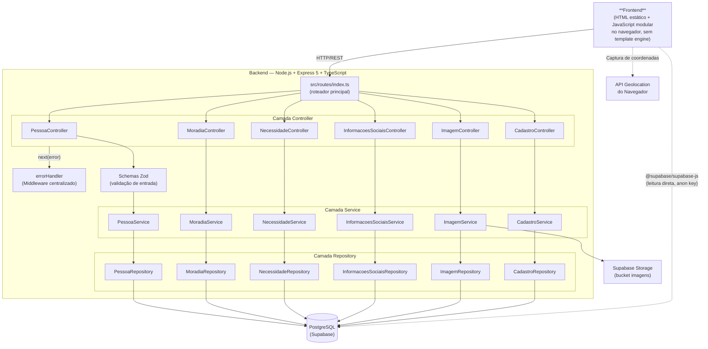
```mermaid
flowchart TD
    FE["**Frontend**\n(HTML estático + JavaScript modular\nno navegador, sem template engine)"]

    subgraph Backend ["Backend — Node.js + Express 5 + TypeScript"]
        direction TB
        R["src/routes/index.ts\n(roteador principal)"]

        subgraph Controllers ["Camada Controller"]
            PC[PessoaController]
            MC[MoradiaController]
            NC[NecessidadeController]
            ISC[InformacoesSociaisController]
            IC[ImagemController]
            CC[CadastroController]
        end

        subgraph Services ["Camada Service"]
            PS[PessoaService]
            MS[MoradiaService]
            NS[NecessidadeService]
            ISS[InformacoesSociaisService]
            IS[ImagemService]
            CS[CadastroService]
        end

        subgraph Repositories ["Camada Repository"]
            PR[PessoaRepository]
            MR[MoradiaRepository]
            NR[NecessidadeRepository]
            ISR[InformacoesSociaisRepository]
            IR[ImagemRepository]
            CR[CadastroRepository]
        end

        EH["errorHandler\n(Middleware centralizado)"]
        ZOD["Schemas Zod\n(validação de entrada)"]
    end

    PG[("PostgreSQL\n(Supabase)")]
    SS["Supabase Storage\n(bucket imagens)"]
    GEO["API Geolocation\ndo Navegador"]

    FE -->|"HTTP/REST"| R
    R --> PC & MC & NC & ISC & IC & CC
    PC --> ZOD --> PS --> PR --> PG
    MC --> MS --> MR --> PG
    NC --> NS --> NR --> PG
    ISC --> ISS --> ISR --> PG
    IC --> IS --> IR --> PG
    IS --> SS
    CC --> CS --> CR --> PG
    Controllers -->|"next(error)"| EH
    FE -.->|"Captura de coordenadas"| GEO
    FE -.->|"@supabase/supabase-js\n(leitura direta, anon key)"| PG
```

Fonte: Autoral (2026)

O diagrama de arquitetura do sistema GeoRisco Santo André apresenta a organização estrutural da aplicação em camadas, demonstrando como ocorre o fluxo de comunicação entre a interface do usuário, as regras de negócio, o acesso aos dados e os serviços externos utilizados pela plataforma. A arquitetura foi desenvolvida seguindo o padrão em camadas Controller → Service → Repository, promovendo separação de responsabilidades, maior organização do código e facilidade de manutenção.

Na camada de Frontend encontra-se a interface web utilizada pelos agentes de campo e coordenadores operacionais da Defesa Civil, construída com páginas HTML estáticas e módulos JavaScript (ES Modules) executados no navegador, sem template engine server-side. Por meio dela, os usuários realizam cadastros de famílias e consultam registros. O frontend possui dois caminhos de acesso a dados: requisições HTTP/REST ao backend Express (escrita via POST/PATCH/DELETE e busca filtrada via GET /cadastros/filtros) e leitura direta do PostgreSQL via @supabase/supabase-js com chave anônima/publishable (listarCadastros e buscarCadastro), sem passar pelo backend — ver observações de consumo em 3.7.7/3.7.8.

A camada Controller é composta por seis controladores reais: `PessoaController`, `MoradiaController`, `NecessidadeController`, `InformacoesSociaisController`, `ImagemController` e `CadastroController`. Cada um recebe as requisições HTTP, delega a validação de entrada aos schemas Zod correspondentes e encaminha a operação ao Service. Os controladores de escrita (POST/PATCH/DELETE) repassam erros ao `errorHandler` centralizado via `next(error)`; os métodos do `CadastroController` (GET) tratam erros internamente.

Na camada Service estão concentradas as regras de negócio da aplicação: verificação de unicidade de CPF (RN03), consistência de vínculos pessoa–moradia, transação BEGIN/COMMIT/ROLLBACK no cadastro de moradia (RN24) e ordenação de prioridade por vulnerabilidade (RN09).

A camada Repository encapsula todas as operações SQL diretas via `pool.query` do `pg`, isolando o acesso ao PostgreSQL das demais camadas.

O banco de dados PostgreSQL, hospedado no Supabase, armazena todas as informações do sistema. Como serviços externos, o sistema utiliza o **Supabase Storage** (bucket `imagens`) para persistência dos arquivos de imagem e a **API de Geolocalização do Navegador** (`navigator.geolocation`) para captura de coordenadas GPS em campo.

### 3.2.2. Diagrama de Casos de Uso (sprint 1)

Os casos de uso do sistema GeoRisco Santo André representam as funcionalidades disponíveis para os usuários da plataforma, descrevendo as interações entre os atores e o sistema. O objetivo principal é garantir o gerenciamento eficiente das informações das famílias residentes em áreas de risco, auxiliando a Defesa Civil no monitoramento, análise e tomada de decisão.

| Caso de uso | Tipo de caso |Descrição| 
|-------|----------------------------|----------------------------------------------------------------------------------------------------|
| 1 | Consultar Cadastros |  |  
| 2 | Descrição | Permite visualizar e consultar os registros das famílias cadastradas no sistema. | |
| 3 | Atores | Agente de Campo, Coordenadora Operacional | |
| 4 | Atores secundários | - | |
| 5 | Pré-Requisitos | Usuário autenticado no sistema. | Existência de cadastros no sistema. |
| 6 | Pós-Requisitos | Informações exibidas para consulta. | |
| 7 | Fluxo Principal | 1. O usuário acessa a área de consultas. | |
|   |  | 2. O sistema apresenta a lista de cadastros disponíveis. | |
|   |  | 3. O usuário aplica filtros (opcional). | |
|   |  | 4. O usuário seleciona um cadastro para visualização. | |
| 8 | Includes | - | |
| 9 | Extends | - | |

| Caso de uso | Tipo de caso | Descrição       | 
|-------|----------------------------|----------------------------------------------------------------------------------------------------|
| 1 | Editar Cadastro |  |  
| 2 | Descrição | Permite atualizar as informações de uma família já cadastrada. | |
| 3 | Atores | Agente de Campo | |
| 4 | Atores secundários | - | |
| 5 | Pré-Requisitos | Usuário autenticado no sistema. | Cadastro previamente existente. |
| 6 | Pós-Requisitos | Informações atualizadas no sistema. | |
| 7 | Fluxo Principal | 1. O agente localiza o cadastro desejado. | |
|   |  | 2. O sistema exibe os dados atuais. | |
|   |  | 3. O agente realiza as alterações necessárias. | |
|   |  | 4. O sistema valida e salva as alterações. | |
| 8 | Includes | - | |
| 9 | Extends | - | |

| Caso de uso | Tipo de caso | Descrição       | 
|-------|----------------------------|----------------------------------------------------------------------------------------------------|
| 1 | Buscar Cadastros com Filtros |  |  
| 2 | Descrição | Permite pesquisar registros utilizando filtros específicos. | |
| 3 | Atores | Coordenadora Operacional | |
| 4 | Atores secundários | - | |
| 5 | Pré-Requisitos | Usuário autenticado no sistema. | Existência de registros cadastrados. |
| 6 | Pós-Requisitos | Resultados filtrados exibidos na tela. | |
| 7 | Fluxo Principal | 1. A coordenadora acessa a área de pesquisa. | |
|   |  | 2. Define os filtros desejados. | |
|   |  | 3. O sistema processa a pesquisa. | |
|   |  | 4. Os resultados são apresentados. | |
| 8 | Includes | Consultar Cadastros | |
| 9 | Extends | - | |

| Caso de uso | Tipo de caso | Descrição       | 
|-------|----------------------------|----------------------------------------------------------------------------------------------------|
| 1 | Visualizar Mapa Georreferenciado |  |  
| 2 | Descrição | Permite visualizar os registros em um mapa interativo georreferenciado. | |
| 3 | Atores | Coordenadora Operacional | |
| 4 | Atores secundários | Serviço de Mapas | |
| 5 | Pré-Requisitos | Dados geográficos cadastrados. | Usuário autenticado no sistema. |
| 6 | Pós-Requisitos | Mapa exibido com os pontos geográficos registrados. | |
| 7 | Fluxo Principal | 1. A coordenadora acessa o mapa georreferenciado. | |
|   |  | 2. O sistema carrega os dados geográficos. | |
|   |  | 3. Os pontos são exibidos no mapa. | |
| 8 | Includes | Buscar Cadastros com Filtros | |
| 9 | Extends | - | |

| Caso de uso | Tipo de caso | Descrição       | 
|-------|----------------------------|----------------------------------------------------------------------------------------------------|
| 1 | Exportar Relatórios |  |  
| 2 | Descrição | Permite gerar relatórios em PDF ou CSV com os dados cadastrados. | |
| 3 | Atores | Coordenadora Operacional | |
| 4 | Atores secundários | Serviço de Exportação de Arquivos | |
| 5 | Pré-Requisitos | Existência de registros cadastrados. | Usuário autenticado no sistema. |
| 6 | Pós-Requisitos | Relatório exportado com sucesso. | |
| 7 | Fluxo Principal | 1. A coordenadora seleciona o tipo de relatório. | |
|   |  | 2. O sistema processa os dados. | |
|   |  | 3. O sistema gera o arquivo para download. | |
| 8 | Includes | Anonimizar Dados Pessoais | |
| 9 | Extends | - | |

| Caso de uso | Tipo de caso | Descrição       | 
|-------|----------------------------|----------------------------------------------------------------------------------------------------|
| 1 | Capturar Coordenadas GPS |  |  
| 2 | Descrição | Permite capturar automaticamente as coordenadas geográficas do imóvel. | |
| 3 | Atores | Agente de Campo | |
| 4 | Atores secundários | Serviço de Geolocalização (GPS) | |
| 5 | Pré-Requisitos | GPS habilitado no dispositivo. | Permissão de localização concedida. |
| 6 | Pós-Requisitos | Coordenadas registradas no sistema. | |
| 7 | Fluxo Principal | 1. O agente inicia a captura de localização. | |
|   |  | 2. O sistema acessa o GPS do dispositivo. | |
|   |  | 3. As coordenadas são registradas. | |
| 8 | Includes | - | |
| 9 | Extends | Inserir Coordenadas Manualmente | |

| Caso de uso | Tipo de caso | Descrição       | 
|-------|----------------------------|----------------------------------------------------------------------------------------------------|
| 1 | Inserir Coordenadas Manualmente |  |  
| 2 | Descrição | Permite informar manualmente latitude e longitude quando o GPS estiver indisponível. | |
| 3 | Atores | Agente de Campo | |
| 4 | Atores secundários | - | |
| 5 | Pré-Requisitos | Falha ou indisponibilidade do GPS. | |
| 6 | Pós-Requisitos | Coordenadas manuais registradas no sistema. | |
| 7 | Fluxo Principal | 1. O sistema identifica falha no GPS. | |
|   |  | 2. O agente informa latitude e longitude manualmente. | |
|   |  | 3. O sistema valida e salva os dados. | |
| 8 | Includes | - | |
| 9 | Extends | Capturar Coordenadas GPS | |

| Caso de uso | Tipo de caso | Descrição       | 
|-------|----------------------------|----------------------------------------------------------------------------------------------------|
| 1 | Anexar Imagens do Imóvel |  |  
| 2 | Descrição | Permite adicionar imagens do imóvel durante o cadastro da família. | |
| 3 | Atores | Agente de Campo | |
| 4 | Atores secundários | Serviço de Câmera/Galeria | |
| 5 | Pré-Requisitos | Cadastro em andamento. | Permissão de acesso à câmera ou galeria. |
| 6 | Pós-Requisitos | Imagens vinculadas ao cadastro da família. | |
| 7 | Fluxo Principal | 1. O agente seleciona a opção de anexar imagens. | |
|   |  | 2. O sistema acessa câmera ou galeria. | |
|   |  | 3. As imagens são selecionadas e enviadas. | |
| 8 | Includes | - | |
| 9 | Extends | Realizar Cadastro de Família | |


**Figura 6:** 

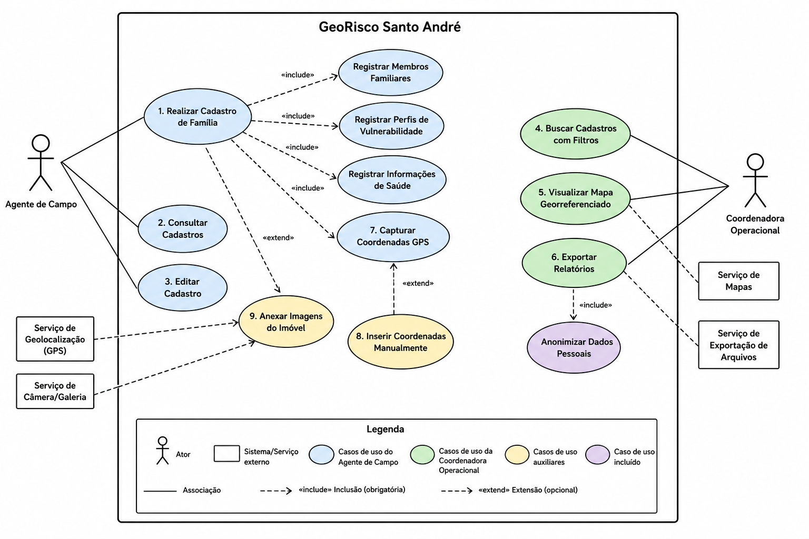

Fonte: Autoral (2026)

### 3.2.3. Diagrama de Classes do Domínio (sprint 2)


```plantuml
enum TipoResponsavel {
  Responsavel
  Membro
}


enum TipoNecessidade {
  Nenhuma
  Fisica
  Auditiva
  Visual
  Intelectual
  Psicossocial
  Neurodivergencia
}


class Pessoa {
  id: UUID
  nome: string
  nomeSocial: string
  cpf: string
  dataNascimento: date
  rg: string
  uf: string
  estadoCivil: string
  genero: string
  corRaca: string
  escolaridade: string
  profissao: string
  situacaoOcupacional: string
  nomeMae: string
  nomePai: string
  localNascimento: string
  gestante: boolean
  tipoResponsavel: TipoResponsavel
  responsavel_id: UUID
  dataCadastro: datetime
}


class Moradia {
  id: UUID
  endereco: string
  numero: string
  bairro: string
  cidade: string
  cep: string
  tipoConstrucao: string
  tempoResidencia: string
  historico: string
  usoImovel: string
  condicao: string
  numeroPavimentos: string
  sinaisAlertas: string
  complemento: string
  numeroFicha: string
  latitude: double
  longitude: double
  deletedAt: datetime
}


class Imagem {
  id: UUID
  arquivo: string
  nomeOriginal: string
  tipoArquivo: string
  tamanho: int
}


class Necessidade {
  id: UUID
  idosos: boolean
  criancas: boolean
  gestantesLactantes: boolean
  tipoNecessidade: TipoNecessidade
  mobilidadeReduzida: boolean
  doencasCronicas: boolean
  medicamentosContinuos: boolean
}


class InformacoesSociais {
  id: UUID
  vinculoProgramas: string
  veiculo: string
  animais: string
  meioAlertas: string
  destinoEvacuacao: string
  contatoEmergencia: string
}

Responsavel "1" -- "0..*" InformaçõesSociais : poussui
Responsavel "1" -- "0..*" Necessidade : poussui
Responsavel "1" -- "1..*" MembroFamiliar : possui
Responsavel"1" -- "1" Moradia : possui
Moradia"1" -- "0..*" Imagem : possui
```

Explicação dos Relacionamentos:


#### Responsavel ---> Necessidade


Tipo: Associação


Responsavel vai possuir uma necessidade


#### Responsável ---> Membro Familiar


Tipo: Associação


Responsável vai possuir uma membros


#### Responsável ---> Moradia


Tipo: Associação


Responsável vai possuir uma moradia


#### Moradia ---> Imagem


Tipo: Associação


Moradia vai possuir uma imagem

### 3.2.3.1 Diagrama de Classes Arquiteturial

O Diagrama de Classes Arquitetural é uma representação visual de alto nível da estrutura de um sistema de software, com foco nos principais componentes que o compõem e nos relacionamentos estabelecidos entre eles. Seu objetivo é comunicar, de forma clara e objetiva, como o sistema está organizado em camadas — Controller, Service, Repository e Model —, evidenciando as responsabilidades de cada componente e as dependências existentes entre eles. Por abstrair detalhes de implementação e concentrar-se na organização estrutural do sistema, esse diagrama serve como referência tanto para decisões de design quanto para a manutenção e evolução da aplicação ao longo do tempo.

<!-- PNG antigo diagramaDeClasseArquitetural.png substituído por Mermaid; remover de assets -->
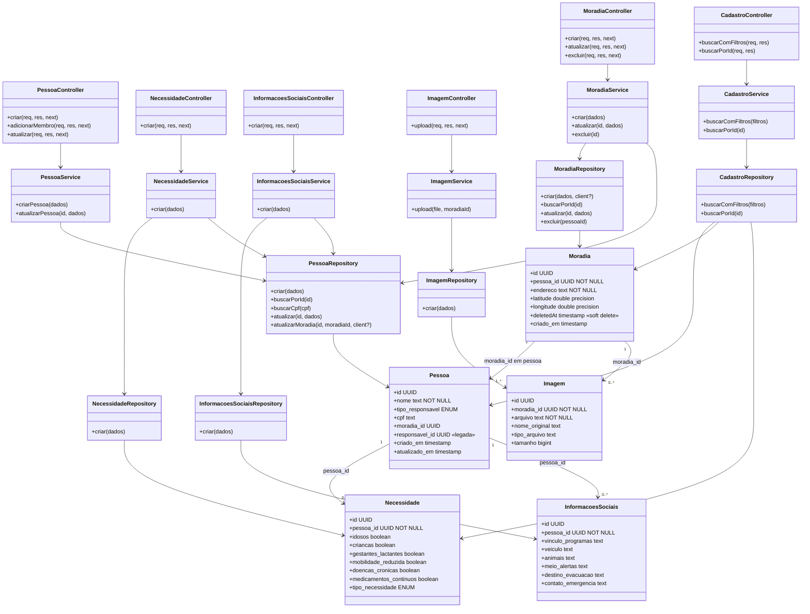
```mermaid
classDiagram
    direction TB

    %% ── Camada Controller ──────────────────────────────────────────
    class PessoaController {
        +criar(req, res, next)
        +adicionarMembro(req, res, next)
        +atualizar(req, res, next)
    }
    class MoradiaController {
        +criar(req, res, next)
        +atualizar(req, res, next)
        +excluir(req, res, next)
    }
    class NecessidadeController {
        +criar(req, res, next)
    }
    class InformacoesSociaisController {
        +criar(req, res, next)
    }
    class ImagemController {
        +upload(req, res, next)
    }
    class CadastroController {
        +buscarComFiltros(req, res)
        +buscarPorId(req, res)
    }

    %% ── Camada Service ─────────────────────────────────────────────
    class PessoaService {
        +criarPessoa(dados)
        +atualizarPessoa(id, dados)
    }
    class MoradiaService {
        +criar(dados)
        +atualizar(id, dados)
        +excluir(id)
    }
    class NecessidadeService {
        +criar(dados)
    }
    class InformacoesSociaisService {
        +criar(dados)
    }
    class ImagemService {
        +upload(file, moradiaId)
    }
    class CadastroService {
        +buscarComFiltros(filtros)
        +buscarPorId(id)
    }

    %% ── Camada Repository ──────────────────────────────────────────
    class PessoaRepository {
        +criar(dados)
        +buscarPorId(id)
        +buscarCpf(cpf)
        +atualizar(id, dados)
        +atualizarMoradia(id, moradiaId, client?)
    }
    class MoradiaRepository {
        +criar(dados, client?)
        +buscarPorId(id)
        +atualizar(id, dados)
        +excluir(pessoaId)
    }
    class NecessidadeRepository {
        +criar(dados)
    }
    class InformacoesSociaisRepository {
        +criar(dados)
    }
    class ImagemRepository {
        +criar(dados)
    }
    class CadastroRepository {
        +buscarComFiltros(filtros)
        +buscarPorId(id)
    }

    %% ── Camada Model (STI — tabela única pessoa) ───────────────────
    class Pessoa {
        +id UUID
        +nome text NOT NULL
        +tipo_responsavel ENUM
        +cpf text
        +moradia_id UUID
        +responsavel_id UUID «legada»
        +criado_em timestamp
        +atualizado_em timestamp
    }
    class Moradia {
        +id UUID
        +pessoa_id UUID NOT NULL
        +endereco text NOT NULL
        +latitude double precision
        +longitude double precision
        +deletedAt timestamp «soft delete»
        +criado_em timestamp
    }
    class Necessidade {
        +id UUID
        +pessoa_id UUID NOT NULL
        +idosos boolean
        +criancas boolean
        +gestantes_lactantes boolean
        +mobilidade_reduzida boolean
        +doencas_cronicas boolean
        +medicamentos_continuos boolean
        +tipo_necessidade ENUM
    }
    class InformacoesSociais {
        +id UUID
        +pessoa_id UUID NOT NULL
        +vinculo_programas text
        +veiculo text
        +animais text
        +meio_alertas text
        +destino_evacuacao text
        +contato_emergencia text
    }
    class Imagem {
        +id UUID
        +moradia_id UUID NOT NULL
        +arquivo text NOT NULL
        +nome_original text
        +tipo_arquivo text
        +tamanho bigint
    }

    %% ── Dependências Controller → Service ──────────────────────────
    PessoaController --> PessoaService
    MoradiaController --> MoradiaService
    NecessidadeController --> NecessidadeService
    InformacoesSociaisController --> InformacoesSociaisService
    ImagemController --> ImagemService
    CadastroController --> CadastroService

    %% ── Dependências Service → Repository ──────────────────────────
    PessoaService --> PessoaRepository
    MoradiaService --> MoradiaRepository
    MoradiaService --> PessoaRepository
    NecessidadeService --> NecessidadeRepository
    NecessidadeService --> PessoaRepository
    InformacoesSociaisService --> InformacoesSociaisRepository
    InformacoesSociaisService --> PessoaRepository
    ImagemService --> ImagemRepository
    CadastroService --> CadastroRepository

    %% ── Dependências Repository → Model ────────────────────────────
    PessoaRepository --> Pessoa
    MoradiaRepository --> Moradia
    NecessidadeRepository --> Necessidade
    InformacoesSociaisRepository --> InformacoesSociais
    ImagemRepository --> Imagem
    CadastroRepository --> Pessoa
    CadastroRepository --> Moradia
    CadastroRepository --> Necessidade

    %% ── Relacionamentos entre entidades (FKs reais) ────────────────
    Moradia "1" --> "1..*" Pessoa : moradia_id em pessoa
    Pessoa "1" --> "0..*" Necessidade : pessoa_id
    Pessoa "1" --> "0..*" InformacoesSociais : pessoa_id
    Moradia "1" --> "0..*" Imagem : moradia_id
```

Fonte: Autoral (2026)

O Diagrama de Classes Arquitetural do GeoRisco Santo André organiza a aplicação em quatro camadas. A camada **Controller** (seis controladores) recebe as requisições HTTP e as delega às camadas inferiores, sem conter regras de negócio — os controllers de escrita passam erros ao `errorHandler` via `next(error)`, enquanto `CadastroController` trata erros internamente. A camada **Service** centraliza a lógica da aplicação: verificação de unicidade do CPF (RN03), validação de existência de pessoa antes de criar moradia/necessidade/imagem, transação BEGIN/COMMIT/ROLLBACK no `MoradiaService.criar()` (RN24), e ordenação de prioridade por vulnerabilidade no `CadastroRepository` (RN09). A camada **Repository** abstrai o acesso ao PostgreSQL via `pool.query`, construindo dinamicamente os critérios de consulta SQL. A camada **Model** define as cinco entidades reais do banco: `pessoa` (Single Table Inheritance, discriminada por `tipo_responsavel` = `'Responsavel'` ou `'Membro'`), `moradia`, `necessidade`, `informacoes_sociais` e `imagem` — não existem tabelas separadas `responsavel` e `membro_familiar`.


### 3.2.4. Diagrama de Sequência UML 
Os diagramas de sequência UML apresentados nesta seção
formalizam a interação entre os componentes do GeoRisco Santo
André durante a execução dos fluxos prioritários do MVP,
evidenciando a passagem de mensagens entre o agente de campo (ou
a coordenadora operacional), a interface web, a camada de Controller,
a camada de Service, a camada de Repository e o banco de dados
PostgreSQL. A arquitetura segue o padrão em camadas Controller →
Service → Repository, no qual o Controller atua exclusivamente como
tradutor entre o protocolo HTTP e o domínio da aplicação, o Service
concentra as regras de negócio (RN01 a RN24) e o Repository
encapsula o acesso ao banco, garantindo o desacoplamento entre as
responsabilidades e a testabilidade individual de cada camada.  

A notação adotada segue o padrão UML 2.5 (OMG, 2017): linhas de
vida verticais representam a existência temporal de cada participante;
barras de ativação indicam o período em que o participante está
executando uma operação; setas sólidas com ponta cheia denotam
mensagens síncronas, nas quais o emissor aguarda o retorno antes de
prosseguir; setas tracejadas representam o retorno de uma mensagem
síncrona; e fragmentos combinados (alt, opt e loop) delimitam,
respectivamente, blocos condicionais com alternativas mutuamente
exclusivas, blocos opcionais com condição única e blocos iterativos do
fluxo. Foram modelados três fluxos representativos do MVP, conforme
detalhado nas subseções a seguir.
Cada fluxo modelado nesta seção possui correspondência direta com
telas e elementos dos wireframes desenvolvidos na seção 3.3. Essa
correspondência é indicada ao longo das subseções, conectando as
decisões arquiteturais às escolhas de interface que as materializam na
experiência do usuário.

#### 3.2.4.1. Fluxo 1 — Cadastro de família em área de risco com captura de geolocalização (US01 + US02)

Este diagrama representa o fluxo de maior valor operacional do sistema, no qual o agente de campo realiza o cadastro de uma família em área de risco com captura automática das coordenadas GPS. O fluxo cobre os requisitos funcionais RF002 (dados do responsável), RF006 (membros da família), RF018/RF019 (endereço com coordenadas) e RF030 (registro automático de data/hora de criação), bem como as regras de negócio RN01 (campos obrigatórios), RN02/RN03 (validação e unicidade do CPF), RN04 (captura de GPS), RN05 (fallback de preenchimento manual quando GPS indisponível) e RN06/RN24 (vínculo coordenada-família e integridade referencial).

Figura 1 — Diagrama de sequência UML: cadastro de família com captura de geolocalização

<!-- PNG antigo diagramaDeSequenciaUML_1.png substituído por Mermaid; remover de assets -->
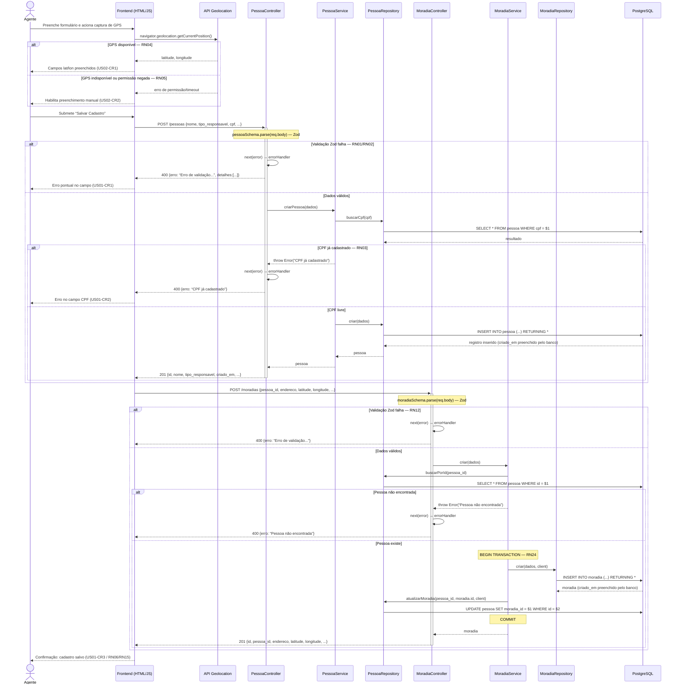
```mermaid
sequenceDiagram
    actor Agente
    participant FE as Frontend (HTML/JS)
    participant GPS as API Geolocation
    participant PC as PessoaController
    participant PS as PessoaService
    participant PR as PessoaRepository
    participant MC as MoradiaController
    participant MS as MoradiaService
    participant MR as MoradiaRepository
    participant DB as PostgreSQL

    Agente->>FE: Preenche formulário e aciona captura de GPS
    FE->>GPS: navigator.geolocation.getCurrentPosition()
    alt GPS disponível — RN04
        GPS-->>FE: latitude, longitude
        FE-->>Agente: Campos lat/lon preenchidos (US02-CR1)
    else GPS indisponível ou permissão negada — RN05
        GPS-->>FE: erro de permissão/timeout
        FE-->>Agente: Habilita preenchimento manual (US02-CR2)
    end

    Agente->>FE: Submete “Salvar Cadastro”
    FE->>+PC: POST /pessoas {nome, tipo_responsavel, cpf, ...}
    Note over PC: pessoaSchema.parse(req.body) — Zod
    alt Validação Zod falha — RN01/RN02
        PC->>PC: next(error) → errorHandler
        PC-->>FE: 400 {erro: “Erro de validação...”, detalhes:[...]}
        FE-->>Agente: Erro pontual no campo (US01-CR1)
    else Dados válidos
        PC->>PS: criarPessoa(dados)
        PS->>PR: buscarCpf(cpf)
        PR->>DB: SELECT * FROM pessoa WHERE cpf = $1
        DB-->>PR: resultado
        alt CPF já cadastrado — RN03
            PS-->>PC: throw Error(“CPF já cadastrado”)
            PC->>PC: next(error) → errorHandler
            PC-->>FE: 400 {erro: “CPF já cadastrado”}
            FE-->>Agente: Erro no campo CPF (US01-CR2)
        else CPF livre
            PS->>PR: criar(dados)
            PR->>DB: INSERT INTO pessoa (...) RETURNING *
            DB-->>PR: registro inserido (criado_em preenchido pelo banco)
            PR-->>PS: pessoa
            PS-->>PC: pessoa
            PC-->>-FE: 201 {id, nome, tipo_responsavel, criado_em, ...}
        end
    end

    FE->>+MC: POST /moradias {pessoa_id, endereco, latitude, longitude, ...}
    Note over MC: moradiaSchema.parse(req.body) — Zod
    alt Validação Zod falha — RN12
        MC->>MC: next(error) → errorHandler
        MC-->>FE: 400 {erro: “Erro de validação...”}
    else Dados válidos
        MC->>MS: criar(dados)
        MS->>PR: buscarPorId(pessoa_id)
        PR->>DB: SELECT * FROM pessoa WHERE id = $1
        alt Pessoa não encontrada
            MS-->>MC: throw Error(“Pessoa não encontrada”)
            MC->>MC: next(error) → errorHandler
            MC-->>FE: 400 {erro: “Pessoa não encontrada”}
        else Pessoa existe
            Note over MS: BEGIN TRANSACTION — RN24
            MS->>MR: criar(dados, client)
            MR->>DB: INSERT INTO moradia (...) RETURNING *
            DB-->>MR: moradia (criado_em preenchido pelo banco)
            MS->>PR: atualizarMoradia(pessoa_id, moradia.id, client)
            PR->>DB: UPDATE pessoa SET moradia_id = $1 WHERE id = $2
            Note over MS: COMMIT
            MS-->>MC: moradia
            MC-->>-FE: 201 {id, pessoa_id, endereco, latitude, longitude, ...}
        end
    end
    FE-->>Agente: Confirmação: cadastro salvo (US01-CR3 / RN06/RN15)
```

Fonte: Autoral (2026)

O agente preenche o formulário e aciona a captura de GPS por meio da API Geolocation do navegador. O fragmento `alt` modela os dois desfechos possíveis: sucesso (campos lat/lon preenchidos automaticamente, US02-CR1) ou falha por indisponibilidade/negação (habilitação do preenchimento manual, US02-CR2/RN05). Quando o cadastro é submetido, o `PessoaController` valida o corpo com `pessoaSchema.parse()` (Zod) e repassa ao `PessoaService`, que verifica unicidade de CPF (RN03). Toda falha resulta em `400 Bad Request` via `errorHandler` — não há 422 nem 409 no back-end. A persistência da moradia ocorre em transação explícita (`BEGIN`/`COMMIT`/`ROLLBACK`) no `MoradiaService.criar()`, que atualiza atomicamente `moradia` e `pessoa.moradia_id`, garantindo a integridade exigida pela RN24. As tabelas reais são `pessoa` e `moradia` — não existem `tb_responsavel` nem `tb_membro_familiar`.

> **Etapas adicionais não modeladas no diagrama:** após criar `pessoa` e `moradia` (núcleo crítico acima), `salvarCadastro()` (`frontend/src/api.js`) executa sequencialmente mais quatro chamadas HTTP, cada uma com `try/catch` independente no front-end — uma falha aqui **não** desfaz `pessoa`/`moradia` já persistidos (sem `ROLLBACK` cruzado):
> - `POST /necessidades` → `NecessidadeController.criar` → `NecessidadeService.criar` (valida `PessoaRepository.buscarPorId`) → `NecessidadeRepository.criar` → `INSERT INTO necessidade` (RF011, RF012, RF013, RF015, RF017).
> - `POST /informacoes-sociais` → `InformacoesSociaisController.criar` → `InformacoesSociaisService.criar` (mesma validação) → `InformacoesSociaisRepository.criar` → `INSERT INTO informacoes_sociais` (RF010).
> - Para cada item de `data.membros`: `POST /pessoas/:responsavelId/membros` → `PessoaController.adicionarMembro` (valida `PessoaRepository.buscarPorId(responsavelId)`) → `PessoaService.criarPessoa` → `PessoaRepository.criar` com `tipo_responsavel = 'Membro'` (RF006). Erros individuais são acumulados em `membroErrors` e exibidos ao agente, sem abortar o cadastro.
> - Para cada arquivo em `data.fotos` (fachada/entorno): `POST /imagens/:moradiaId` (multipart) → `ImagemController.upload` → `ImagemService.upload` (grava no bucket `imagens` do Supabase Storage com nome `${Date.now()}-${originalname}`) → `ImagemRepository.criar` → `INSERT INTO imagem` (RF028).
>
> Todas seguem o padrão Controller → Service → Repository da seção 3.2.3.1, omitidas do diagrama acima por foco no caminho crítico pessoa+moradia (US01/US02).


#### 3.2.4.2. Fluxo 2 — Busca de cadastros com múltiplos filtros (US04)

Este diagrama representa o fluxo executado pela coordenadora operacional ao buscar cadastros aplicando filtros combinados por bairro, faixa etária e tipo de deficiência. O fluxo atende à US04 e às regras RN20 (combinação simultânea de filtros), RN21 (mensagem informativa para resultado vazio) e RN09 (ordenação automática de famílias prioritárias). Os filtros disponíveis no back-end são: `bairro` (ILIKE parcial), `faixa_etaria` (`crianca` / `adolescente` / `adulto` / `idoso`, calculada via `data_nascimento`) e `deficiencias` (valor do ENUM `tipo_necessidade`).

Figura 2 — Diagrama de sequência UML: busca de cadastros com múltiplos filtros

<!-- PNG antigo diagramaDeSequenciaUML_2.png substituído por Mermaid; remover de assets -->
```mermaid
sequenceDiagram
    actor Coord as Coordenadora
    participant FE as Frontend (HTML/JS)
    participant CC as CadastroController
    participant CS as CadastroService
    participant CR as CadastroRepository
    participant DB as PostgreSQL

    Coord->>FE: Seleciona filtros (bairro, faixa_etaria, deficiencias)
    Coord->>FE: Aciona “Aplicar Filtros”
    FE->>+CC: GET /cadastros/filtros?bairro=...&faixa_etaria=...&deficiencias=...
    Note over CC: Extrai query params — sem validação Zod
    CC->>CS: buscarComFiltros({bairro, faixa_etaria, deficiencias})
    CS->>CR: buscarComFiltros(filtros)
    CR->>DB: SELECT m.id, m.bairro, m.endereco,\np.id AS responsavel_id, p.nome AS responsavel_nome,\nCASE WHEN EXISTS(...necessidade...) THEN 0 ELSE 1 END AS prioridade\nFROM moradia m\nJOIN pessoa p ON p.moradia_id = m.id AND p.tipo_responsavel = 'Responsavel'\nWHERE m.”deletedAt” IS NULL AND [filtros]\nORDER BY prioridade ASC
    DB-->>CR: rows
    CR-->>CS: rows
    CS-->>CC: dados
    alt Nenhum resultado — RN21 (US04-CR3)
        CC-->>-FE: 200 {mensagem: “Nenhum cadastro encontrado...”, dados: []}
        FE-->>Coord: Exibe mensagem informativa
    else Com resultados — RN09
        CC-->>-FE: 200 {dados: [{moradia_id, bairro, endereco, responsavel_nome, prioridade 0|1, ...}]}
        FE-->>Coord: Lista com famílias prioritárias (prioridade=0) no topo (US04-CR1/CR2)
    end
    Note over CC: Erros de banco tratados internamente (sem next(error)) → 500
```

Fonte: Autoral (2026)

A coordenadora seleciona os filtros e aciona “Aplicar Filtros”, disparando uma requisição `GET /cadastros/filtros` com os parâmetros como query strings (US04-CR2). O `CadastroRepository` constrói dinamicamente a cláusula `WHERE`, aplicando apenas os filtros informados, e implementa a RN09 via subquery `CASE/EXISTS` que calcula o campo `prioridade` (0 = vulnerável, 1 = sem perfil especial) — a ordenação `ORDER BY prioridade ASC` garante que famílias prioritárias apareçam no topo. Registros com `moradia.”deletedAt” IS NOT NULL` são sempre excluídos. O fragmento `alt` modela os dois desfechos: resultado vazio com mensagem amigável (RN21/US04-CR3) ou lista ordenada. Erros internos retornam `500` — este é o único endpoint da API que pode retornar 500, pois o `CadastroController` trata erros internamente sem usar o `errorHandler`.


#### 3.2.4.3. Fluxo 3 — Edição de cadastro existente (US05)

Este diagrama representa o fluxo de edição de um cadastro previamente realizado, executado pelo agente de campo após localizá-lo na lista de resultados. O fluxo atende à US05 e às regras RN16 (revalidação completa na edição) e RN17 (registro de timestamp de atualização). A edição de dados pessoais usa `PATCH /pessoas/:id`; a edição de dados de moradia usa `PATCH /moradias/:id`; a inativação usa `DELETE /cadastros/:id` (soft delete via `moradia.”deletedAt”`).

> **Nota de pendência de bug:** `pessoaRepository.atualizar()` referencia `data_atualizacao = NOW()` em SQL, mas a coluna real no banco é `atualizado_em`. O endpoint `PATCH /pessoas/:id` falha em produção com `ERROR: column “data_atualizacao” does not exist`. RN17 não está efetivamente implementada para dados pessoais.

Figura 3 — Diagrama de sequência UML: edição de cadastro existente

<!-- PNG antigo diagramaDeSequenciaUML_3.png substituído por Mermaid; remover de assets -->
```mermaid
sequenceDiagram
    actor Agente
    participant FE as Frontend (HTML/JS)
    participant CC as CadastroController
    participant CS as CadastroService
    participant CR as CadastroRepository
    participant PC as PessoaController
    participant PS as PessoaService
    participant PR as PessoaRepository
    participant MC as MoradiaController
    participant MS as MoradiaService
    participant MR as MoradiaRepository
    participant DB as PostgreSQL

    Agente->>FE: Clica em “Editar” num cadastro da lista
    FE->>+CC: GET /cadastros/:id (id = pessoa.id do responsável)
    CC->>CS: buscarPorId(id)
    CS->>CR: buscarPorId(id)
    CR->>DB: SELECT * FROM pessoa WHERE id = $1
    CR->>DB: SELECT * FROM moradia WHERE id = (SELECT moradia_id FROM pessoa WHERE id = $1)
    CR->>DB: SELECT * FROM necessidade WHERE pessoa_id = $1
    DB-->>CR: {pessoa, moradia, necessidades}
    alt Cadastro não encontrado ou moradia.deletedAt IS NOT NULL — RN21
        CC-->>-FE: 404 {mensagem: “Cadastro não encontrado ou já foi excluído.”}
        FE-->>Agente: Mensagem de erro
    else Cadastro encontrado
        CC-->>-FE: 200 {pessoa, moradia, necessidades}
        FE-->>Agente: Formulário pré-preenchido (US05-CR1)
    end

    Agente->>FE: Altera dados pessoais e submete
    FE->>+PC: PATCH /pessoas/:id {campos alterados}
    Note over PC: pessoaUpdateSchema.parse(req.body) — todos os campos opcionais
    alt Validação Zod falha
        PC->>PC: next(error) → errorHandler
        PC-->>FE: 400 {erro: “Erro de validação...”}
    else Dados válidos
        PC->>PS: atualizarPessoa(id, dados)
        PS->>PR: buscarPorId(id)
        alt Pessoa não encontrada
            PS-->>PC: throw Error(“Pessoa não encontrada”)
            PC->>PC: next(error) → errorHandler
            PC-->>-FE: 400 {erro: “Pessoa não encontrada”}
        else Pessoa existe
            PS->>PR: atualizar(id, dados)
            PR->>DB: UPDATE pessoa SET ... WHERE id = $1 RETURNING *
            Note over PR: ⚠️ Bug: SET data_atualizacao = NOW() mas coluna real é atualizado_em
            DB-->>PR: erro em produção (coluna inexistente)
            PR-->>PS: resultado
            PS-->>PC: pessoaAtualizada
            PC-->>-FE: 200 {pessoa atualizada} (quando bug for corrigido — US05-CR2)
        end
    end

    opt Alterar dados de moradia
        Agente->>FE: Altera endereço/coordenadas e submete
        FE->>+MC: PATCH /moradias/:id {campos alterados}
        Note over MC: moradiaUpdateSchema.parse() — valida coordenadas (RN04/RN05)
        MC->>MS: atualizar(id, dados)
        MS->>MR: buscarPorId(id)
        alt Moradia não encontrada ou deletedAt não nulo
            MS-->>MC: throw Error
            MC->>MC: next(error) → errorHandler
            MC-->>FE: 400 {erro: “...”}
        else OK
            MS->>MR: atualizar(id, dados)
            MR->>DB: UPDATE moradia SET ... WHERE id = $1 RETURNING *
            DB-->>MR: moradia atualizada
            MC-->>-FE: 200 {moradia atualizada} (US05-CR2/CR3 — RN17 implementada para moradia)
        end
    end
    FE-->>Agente: Confirmação de edição concluída
```

Fonte: Autoral (2026)

O fluxo de edição começa com a leitura agregada via `GET /cadastros/:id`, que retorna `{pessoa, moradia, necessidades}` — `informacoes_sociais` não é incluída nesta resposta (omissão do `buscarPorId` atual). A edição de dados pessoais (`PATCH /pessoas/:id`) usa `pessoaUpdateSchema` (todos os campos opcionais); a edição de moradia (`PATCH /moradias/:id`) usa `moradiaUpdateSchema`, que aplica validações de coordenadas (≠ 0, dentro do território brasileiro) previstas nas RN04/RN05. Toda falha retorna `400` via `errorHandler` centralizado — não há `422` nem `409`. O `GET /cadastros/:id` retorna `500` em caso de erro interno (trata erros internamente, sem `next(error)`).


#### 3.2.4.4. Considerações arquiteturais

A modelagem dos três fluxos evidencia três decisões arquiteturais centrais do projeto. Primeiro, o Controller permanece como camada estritamente fina: ele traduz HTTP em chamadas de domínio sem aplicar regras de negócio. Segundo, o Service concentra as validações de negócio (verificação de CPF, existência de pessoa, integridade de moradia) e lança erros que o `errorHandler` centralizado converte uniformemente em `400 Bad Request` — não há `422`, `409` nem `500` nos endpoints de escrita. O `CadastroController` é a única exceção: trata erros internamente e pode retornar `500`. Terceiro, o Repository encapsula o acesso ao banco e gerencia transações explícitas (`BEGIN`/`COMMIT`/`ROLLBACK`) em `MoradiaService.criar()`, que afeta atomicamente as tabelas `moradia` e `pessoa`, em conformidade com a RN24. As tabelas reais do banco são `pessoa`, `moradia`, `necessidade`, `informacoes_sociais` e `imagem` — não existem `tb_responsavel`, `tb_moradia`, `tb_membro_familiar` nem `tb_necessidade`. Essas decisões fundamentam a adoção dos padrões de projeto Repository, Service Layer e Schema Validation, detalhados na seção 3.2.7.


### 3.2.5. Diagrama de Atividades ou Estados (sprint 3)

*Ao menos um fluxo relevante em UML ou BPMN. Use a notação da ferramenta escolhida de forma consistente (sem misturar convenções).*

### 3.2.6. Diagrama de Implantação (sprints 4 e 5)

*Diagrama UML de deployment mostrando nós físicos, artefatos e canais de comunicação. Representa a visão Engineering + Technology do RM-ODP.*

### 3.2.7. Padrões de Projeto Aplicados (sprints 3 a 5)

# 3.2.7 Padrões de Projeto aplicados


### Visão geral dos padrões identificados


| Padrão | Aplicação no projeto | Necessidade atendida | Estado da implementação |
| --- | --- | --- | --- |
| MVC em camadas | Separação entre rotas, controllers, services, repositories e estruturas de dados validadas por schemas | Organizar o backend para receber requisições, aplicar regras e persistir dados sem misturar responsabilidades | Parcial e em evolução |
| Controller | Classes em `src/controllers`: `PessoaController`, `MoradiaController`, `NecessidadeController`, `InformacoesSociaisController`, `ImagemController` e `CadastroController` | Traduzir requisições HTTP em chamadas da aplicação, mantendo a entrada da API separada das regras de negócio | Consolidado para os módulos atuais |
| Service Layer | Classes em `src/services`: `PessoaService`, `MoradiaService`, `NecessidadeService`, `InformacoesSociaisService`, `ImagemService` e `CadastroService` | Centralizar validações e regras antes de gravar dados sensíveis sobre pessoas, moradias, necessidades e imagens | Parcial e em evolução |
| Repository Pattern | Classes em `src/repositories`: `PessoaRepository`, `MoradiaRepository`, `NecessidadeRepository`, `InformacoesSociaisRepository`, `ImagemRepository` e `CadastroRepository` | Isolar o acesso ao PostgreSQL e evitar SQL espalhado pelos controllers e services | Consolidado para operações de cadastro atuais |
| Middleware | Uso de `express.json`, `cors`, `multer` e `errorHandler` no fluxo de requisições | Padronizar tratamento de entrada, upload de arquivos e erros da API | Consolidado para o fluxo atual |
| Chain of Responsibility | Encadeamento de middlewares do Express em `src/app.ts` e uso de `next(error)` nos controllers | Permitir que requisições e erros passem por etapas sucessivas de tratamento | Aplicado de forma emergente pelo próprio Express |
| Schema Validation | Schemas Zod em `src/schemas`, como `pessoaSchema`, `moradiaSchema`, `necessidadeSchema`, `informacoesSociaisSchema` e `imagemSchema` | Validar dados vindos do formulário digital antes de persistir no banco | Consolidado para os endpoints atuais |
| DTO por schemas de entrada | Objetos validados pelos schemas antes de serem enviados aos services e repositories | Definir o formato esperado dos dados trafegados entre entrada HTTP, regra de negócio e persistência | Parcial, pois não há classes ou tipos DTO próprios |
| Singleton por módulo | Instâncias compartilhadas exportadas em `src/config/database.ts` e `src/config/supabase.ts` | Reutilizar a conexão com PostgreSQL e o cliente Supabase sem recriá-los a cada requisição | Aplicado de forma simples e suficiente para o estágio atual |
| Separation of Concerns | Organização em `routes`, `controllers`, `services`, `repositories`, `schemas`, `middlewares` e `config` | Facilitar manutenção em um sistema que tende a crescer com módulos de famílias, moradias, imagens, vulnerabilidades, abrigos e doações | Consolidado como direção arquitetural, ainda em evolução |

## Descrição dos padrões aplicados

### MVC em camadas


A estrutura do backend segue o padrão em camadas, com separação clara entre roteamento, controle de requisições, lógica de negócio e persistência. Isso facilita a manutenção e a evolução do sistema, em linha com a arquitetura proposta no WAD.


### Controller

#### Onde aparece no projeto

O padrão aparece nos arquivos:

- `src/controllers/pessoaController.ts`
- `src/controllers/moradiaController.ts`
- `src/controllers/necessidadeController.ts`
- `src/controllers/informacoesSociaisController.ts`
- `src/controllers/imagemController.ts`
- `src/controllers/cadastroController.ts`

Esses controllers são chamados pelas rotas em `src/routes`.

#### Como foi aplicado

Cada controller recebe `Request`, `Response` e `NextFunction` do Express. A função do controller é tratar a requisição, validar o corpo com o schema correspondente, chamar o service e devolver a resposta HTTP. Por exemplo, `PessoaController` usa `pessoaSchema.parse(req.body)` e depois chama `PessoaService.criarPessoa`. O mesmo padrão se repete em moradia, necessidade e informações sociais.

No caso de imagens, `ImagemController` recebe o arquivo processado pelo `multer`, verifica se ele existe e encaminha o upload para `ImagemService`.

#### Necessidade real do projeto

O formulário digital do GeoRisco recebe dados variados, como dados pessoais, endereço, características da moradia, vulnerabilidades e arquivos de imagem. Os controllers ajudam a transformar essas entradas HTTP em chamadas organizadas para o backend, sem deixar que as rotas carreguem regra de negócio.

#### Justificativa da adoção

O uso de controllers faz sentido porque o sistema precisa expor endpoints para diferentes partes do cadastro. Separar o controller evita que o endpoint `/pessoas`, por exemplo, conheça detalhes de SQL ou de armazenamento de imagens. Isso deixa o código mais próximo da estrutura descrita no WAD e facilita a criação de novos endpoints futuramente.

#### Benefícios para o desenvolvimento

Os controllers tornam o fluxo mais legível: rota chama controller, controller valida e chama service. Isso reduz duplicação e facilita testes de integração com Supertest, que já aparecem em `src/tests`. Também ajuda a padronizar respostas HTTP, como o uso de status `201` em cadastros criados.

#### Observação sobre o estágio atual

O padrão está bem definido nos módulos implementados. Ainda pode evoluir com respostas de erro mais específicas e com menor repetição entre controllers, mas a responsabilidade principal da camada já está clara.

### Service Layer

#### Onde aparece no projeto

O padrão aparece nos arquivos:

- `src/services/pessoaService.ts`
- `src/services/moradiaService.ts`
- `src/services/necessidadeService.ts`
- `src/services/informacoesSociaisService.ts`
- `src/services/imagemService.ts`
- `src/services/cadastroService.ts`

#### Como foi aplicado

Os services ficam entre os controllers e os repositories. Eles recebem os dados já validados pelos schemas e aplicam regras antes de chamar o banco. Em `PessoaService`, por exemplo, há validação de nome obrigatório, verificação de CPF já cadastrado e conferência de existência do responsável ao cadastrar um membro. Em `MoradiaService`, `NecessidadeService` e `InformacoesSociaisService`, existe validação para garantir que a pessoa vinculada existe antes de criar registros relacionados. Em `ImagemService`, o serviço valida a presença do arquivo, envia a imagem ao Supabase Storage e registra os metadados no banco.

#### Necessidade real do projeto

O GeoRisco precisa garantir que os dados cadastrados sejam minimamente consistentes. Não basta gravar qualquer informação enviada pelo formulário, porque esses registros podem apoiar decisões de evacuação, priorização de atendimento e acompanhamento de famílias em áreas de risco. A camada de service concentra essas validações para evitar que dados relacionados sejam criados sem vínculo correto.

#### Justificativa da adoção

A adoção do Service Layer é adequada porque as regras do domínio tendem a crescer. O WAD prevê validações de CPF, vínculo entre cadastro e moradia, registro de vulnerabilidades, controle de imagens e futuras regras de abrigos e logística. Manter essas decisões nos services evita que controllers e repositories assumam responsabilidades que não são deles.

#### Benefícios para o desenvolvimento

O principal benefício é facilitar a evolução das regras de negócio. Se futuramente a equipe precisar implementar classificação automática de prioridade por vulnerabilidade, validação mais completa de coordenadas ou regras de edição de cadastro, o lugar natural para isso será a camada de service. Isso também melhora a testabilidade, pois a regra pode ser testada sem depender diretamente da camada HTTP.

#### Observação sobre o estágio atual

O padrão aparece de forma parcial e em evolução. A camada existe e já concentra algumas regras importantes, mas nem todas as regras previstas no WAD estão implementadas. Também ainda há uso amplo de `any`, o que reduz a segurança de tipos e pode ser refinado com tipos ou DTOs mais explícitos.

### Repository Pattern

#### Onde aparece no projeto

O padrão aparece nos arquivos:

- `src/repositories/pessoaRepository.ts`
- `src/repositories/moradiaRepository.ts`
- `src/repositories/necessidadeRepository.ts`
- `src/repositories/informacoesSociaisRepository.ts`
- `src/repositories/imagemRepository.ts`
- `src/repositories/cadastroRepository.ts`

Também depende da configuração de banco em:

- `src/config/database.ts`

#### Como foi aplicado

Cada repository encapsula as operações SQL de uma entidade ou módulo. `PessoaRepository` possui métodos como `criar`, `buscarPorId` e `buscarCpf`. `MoradiaRepository`, `NecessidadeRepository`, `InformacoesSociaisRepository` e `ImagemRepository` possuem métodos de criação que montam queries `INSERT INTO` e retornam o registro criado com `RETURNING *`.

Os services não executam SQL diretamente. Eles chamam métodos dos repositories, que por sua vez usam o `pool` do PostgreSQL configurado em `src/config/database.ts`.

#### Necessidade real do projeto

A aplicação precisa persistir dados que antes ficavam em papel ou em sistemas isolados. Como esses dados se relacionam entre si, é importante que o acesso ao banco fique concentrado em uma camada própria. Isso reduz o risco de espalhar consultas SQL por várias partes do backend e facilita a manutenção da estrutura de dados.

#### Justificativa da adoção

O Repository Pattern combina bem com o projeto porque o WAD mostra uma modelagem relacional com entidades como pessoa, moradia, necessidade, informações sociais e imagem. Separar o acesso a essas tabelas em repositories deixa o backend preparado para mudanças no banco, como ajustes de campos, novas consultas ou expansão dos módulos.

#### Benefícios para o desenvolvimento

O padrão melhora a manutenção e reduz acoplamento entre regra de negócio e persistência. Também facilita encontrar onde uma query precisa ser alterada. Se o cadastro de moradia ganhar novos campos ou se a busca por famílias for implementada com filtros mais complexos, a tendência é que essa lógica de consulta fique no repository correspondente.

#### Observação sobre o estágio atual

O padrão está consolidado para as operações de cadastro já implementadas. Ainda pode evoluir com interfaces, tipos de retorno, métodos de atualização, métodos de busca filtrada e transações para operações que envolvam múltiplas tabelas, como já é previsto no WAD.

### Middleware


O uso de middlewares no Express permite tratar CORS, JSON, upload de arquivos e erros de forma transversal e consistente.


### Schema Validation


A validação dos dados de entrada é feita com Zod. Cada schema define o formato esperado para um tipo de cadastro. `pessoaSchema`, por exemplo, exige `nome` e define que o CPF, quando informado, deve ter 11 dígitos. `moradiaSchema` exige `pessoa_id` em formato UUID e `endereco`. `necessidadeSchema` define campos booleanos de vulnerabilidade e restringe `tipo_necessidade` a valores permitidos.

Quando os dados não seguem o schema, o Zod lança um erro que é tratado pelo middleware `errorHandler`.

> **Observação:** `imagemSchema.ts` existe no repositório, mas não é importado por nenhum controller — `ImagemController.upload` valida apenas a presença de `req.file` diretamente, sem chamar `imagemSchema.parse()`. É um schema definido porém não utilizado (dead code); o upload de imagem não passa pela validação Zod descrita nesta seção.

#### Necessidade real do projeto

O projeto nasceu para substituir fichas físicas por um cadastro digital mais consistente. Se o sistema aceitar dados incompletos ou fora do formato esperado, ele apenas troca o papel por uma base digital desorganizada. A validação por schema ajuda a evitar esse problema já na entrada da API.

#### Justificativa da adoção

O uso de schemas é adequado porque o formulário possui muitos campos e precisa manter consistência entre frontend, backend e banco. Como o WAD aponta a validação automática como critério do MVP, colocar essa validação no backend é importante para que a regra não dependa apenas da interface.

#### Benefícios para o desenvolvimento

Os schemas tornam explícito o que cada endpoint espera receber. Isso facilita manutenção, reduz erros de cadastro e melhora a segurança dos dados persistidos. Também ajuda nos testes, porque os cenários podem ser montados com base nas regras do schema.

#### Observação sobre o estágio atual

O padrão está consolidado para os endpoints atuais. Ainda pode ser refinado com validações mais específicas, como formato real de CPF, limites de latitude e longitude, tipos aceitos de imagem e mensagens de erro mais alinhadas ao vocabulário usado pelos agentes da Defesa Civil.

### DTO por schemas de entrada


Os objetos resultantes da validação por schemas funcionam como contratos de entrada para a camada de serviço. Ainda não existem DTOs formais, mas a abordagem já organiza e controla os dados recebidos pelo backend.


### Singleton por módulo


As instâncias de conexão com PostgreSQL e Supabase são exportadas como objetos únicos em `src/config`, evitando a criação repetida de conexões e simplificando a configuração.


### Separation of Concerns


O projeto distribui responsabilidades em pastas distintas, reduzindo acoplamento e permitindo que cada camada evolua sem misturar lógica de apresentação, negócio e persistência.


### Observações finais


A arquitetura do GeoRisco Santo André está alinhada ao WAD e ao código atualmente implementado. Ela oferece base suficiente para os fluxos de cadastro, edição, busca com filtros e upload de imagens, ao mesmo tempo em que mantém espaço para evolução em mapas, exportação e novos módulos.


## 3.3. Wireframes (sprint 2)

Esta seção apresenta os wireframes elaborados para a aplicação GeoRisco Santo André, com foco nas User Stories priorizadas em conjunto com a orientação (US01 a US05). Os wireframes foram desenvolvidos em baixa fidelidade, com o objetivo de validar rapidamente a estrutura das telas,  o posicionamento dos elementos visuais e o fluxo de navegação entre as principais funcionalidades do MVP, sem investir em definições estéticas finais de paleta cromática, tipografia ou microinterações — esses elementos são tratados no protótipo de alta fidelidade (seção 3.5).

A organização das telas seguiu um **sistema de grid de 12 colunas**, padrão amplamente adotado em interfaces web, garantindo o alinhamento consistente dos elementos e a responsividade aos dispositivos móveis utilizados pelos agentes de campo. Os componentes principais — cabeçalho de navegação, formulários seccionados, botões de ação primária e listagens — foram posicionados de modo a refletir hierarquia visual e familiaridade com padrões consagrados de usabilidade.

Os arquivos editáveis dos wireframes estão disponíveis publicamente em: [https://canva.link/hvjilxt2xccbkyt].

### Visão geral do fluxo de navegação

O fluxo principal foi modelado a partir das duas personas envolvidas nas User Stories priorizadas: o agente de campo **Marcelo Tavares** (US01, US02, US03 e US05), que acessa o sistema preferencialmente por dispositivos móveis em operações de campo, e a coordenadora operacional **Cintia Aparecida Rossati** (US04), que atua a partir de estações de trabalho fixas na sede da Defesa Civil. A partir da tela inicial, ambos os perfis acessam dois caminhos principais: o cadastro de nova família (porta de entrada de dados, fluxo do agente) e o painel de busca com filtros (porta de consulta, fluxo da coordenadora). Os dois fluxos convergem na tela de detalhes do cadastro, que funciona como ponto de consolidação entre cadastro e consulta.

**Figura 10:** Fluxo de navegação 

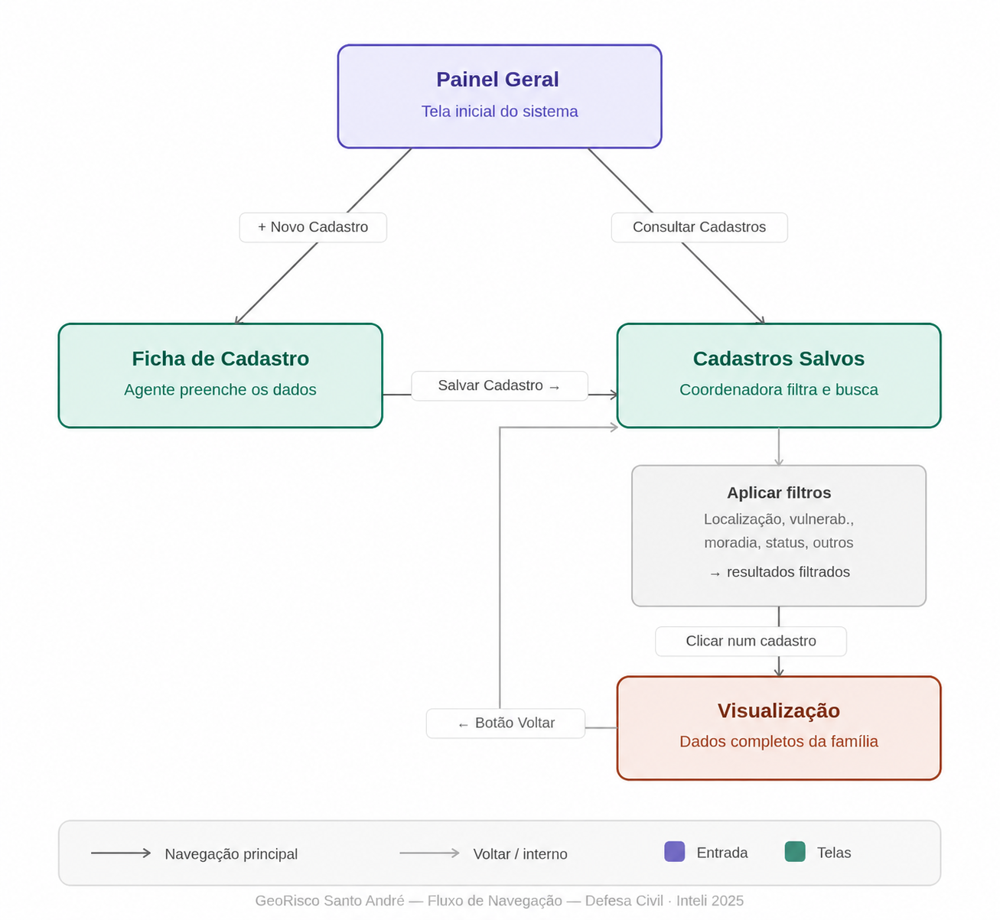

Fonte: Autoral (2026)

---

### 3.3.1. Tela Inicial
A tela inicial é o ponto de partida do sistema e funciona como hub de navegação entre os dois fluxos centrais do MVP — cadastrar uma nova família e buscar cadastros existentes. Foram priorizados dois botões de ação primária com igual peso visual, alinhados às operações mais frequentes das duas personas, sem distrações que comprometam a tomada de decisão rápida em situações de campo. O cabeçalho fixo identifica o sistema e o módulo ativo, mantendo o usuário sempre orientado durante a navegação.

**Figura 11:** Wireframe — Tela Inicial
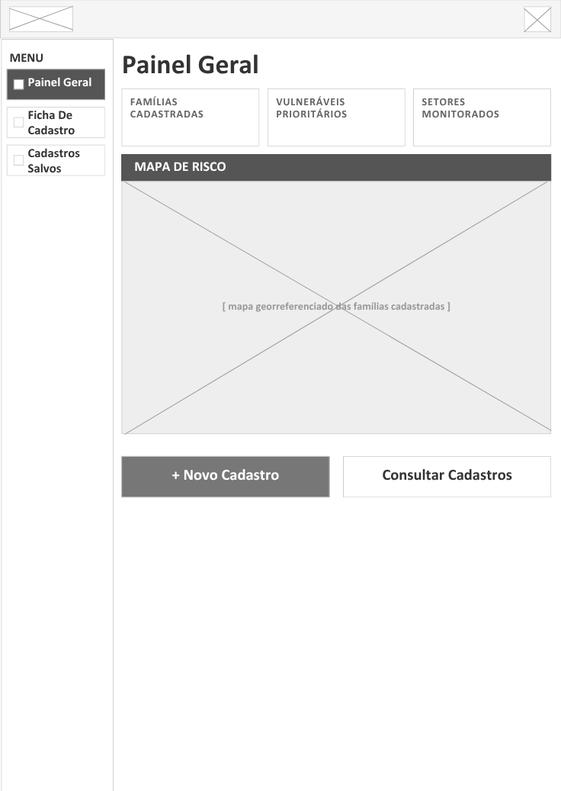
Fonte: Autoral (2026)
A partir desta tela, o agente de campo direciona-se ao formulário de cadastro (seção 3.3.2, atendendo US01, US02 e US03), enquanto a coordenadora operacional acessa o painel de busca (seção 3.3.3, atendendo US04).

---

### 3.3.2. Tela de Cadastro de Família (US01, US02, US03)
A tela de cadastro consolida três User Stories priorizadas em um único fluxo seccionado verticalmente, escolha que reduz a carga cognitiva do agente em campo e segue a sequência natural de coleta presencial. As seções foram dispostas na seguinte ordem: (i) dados do responsável familiar com validação de CPF; (ii) endereço com captura de geolocalização (US02); (iii) composição familiar e perfis de vulnerabilidade (US03); (iv) caracterização do imóvel; e (v) anexação de imagens. O botão **"Capturar GPS"** foi posicionado adjacente aos campos de latitude e longitude, com possibilidade de preenchimento manual como fallback em caso de indisponibilidade do GPS ou negação de permissão, conforme CR2 da US02.

**Figura 12:** Wireframe — Tela de Cadastro de Família
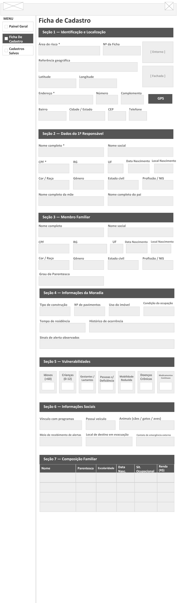
Fonte: Autoral (2026)
Mensagens de erro inline junto aos campos sinalizam falhas de validação (CR1 da US01) e impedem o envio do formulário enquanto houver campos obrigatórios em branco ou CPF em formato inválido (CR2 da US01). Os perfis de vulnerabilidade são marcados por checkboxes simples e serão posteriormente traduzidos em destaque visual nas listas de busca (CR3 da US03). Após salvar com sucesso, o sistema persiste o cadastro no banco e retorna à tela inicial com mensagem de confirmação (CR3 da US01).

---

### 3.3.3. Tela de Busca com Filtros (US04)
Esta tela atende à User Story 04 e constitui o principal recurso da coordenadora operacional para localizar rapidamente perfis específicos durante o planejamento e a resposta a eventos. A interface foi dividida em duas regiões principais usando o grid de 12 colunas: à esquerda (4 colunas), um painel lateral de filtros — setor de risco, bairro, faixa etária, chefe de família e deficiência (CR1 da US04); à direita (8 colunas), a listagem de resultados em cards, com badge visual destacando cadastros prioritários (CR3 da US03).
**Figura 13:** Wireframe — Painel de Busca com Filtros

Fonte: Autoral (2026)
Os filtros podem ser aplicados de forma combinada, retornando apenas os registros que atendam simultaneamente a todas as condições selecionadas (CR2 da US04). Quando nenhum registro atende aos critérios, o sistema exibe uma mensagem informativa de "nenhum cadastro encontrado" no lugar da listagem (CR3 da US04), evitando a interpretação equivocada de tela vazia. Ao clicar em qualquer item da listagem, o usuário é conduzido à tela de detalhes do cadastro (seção 3.3.4).

---

### 3.3.4. Tela de Detalhes do Cadastro (US05 — visualização)

A tela de detalhes apresenta a visão consolidada de uma família cadastrada, exibindo todos os campos previamente preenchidos no fluxo de cadastro (CR1 da US05). Os dados foram agrupados visualmente nas **mesmas seções** da tela de cadastro, decisão deliberada para reduzir a curva de aprendizado e facilitar a memorização do layout pelos agentes. Um botão **"Editar"** no topo direito conduz à tela de edição (seção 3.3.5).

**Figura 14:** Wireframe — Tela de Detalhes do Cadastro

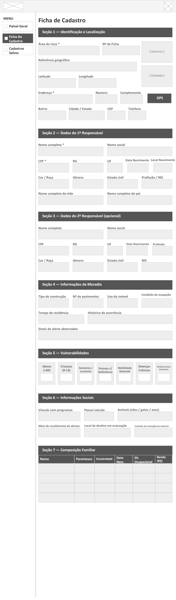

Fonte: Autoral (2026)

A tela também exibe a galeria de imagens anexadas (fachada e entorno) e a data/hora da última atualização do cadastro, em alinhamento com a CR3 da US05. O acesso a esta tela ocorre tanto a partir da listagem de busca quanto após a confirmação de um novo cadastro.

---

### 3.3.5. Tela de Edição do Cadastro (US05 — edição)

A tela de edição reaproveita integralmente a estrutura visual da tela de cadastro (seção 3.3.2), preenchida automaticamente com os dados existentes da família. As **mesmas regras de validação** utilizadas no cadastro inicial são reaplicadas durante a edição (CR2 da US05), garantindo que dados inconsistentes não sejam persistidos. Ao salvar com sucesso, o sistema registra automaticamente o timestamp da última alteração (CR3 da US05) e retorna à tela de detalhes atualizada.

**Figura 15:** Wireframe — Tela de Edição do Cadastro

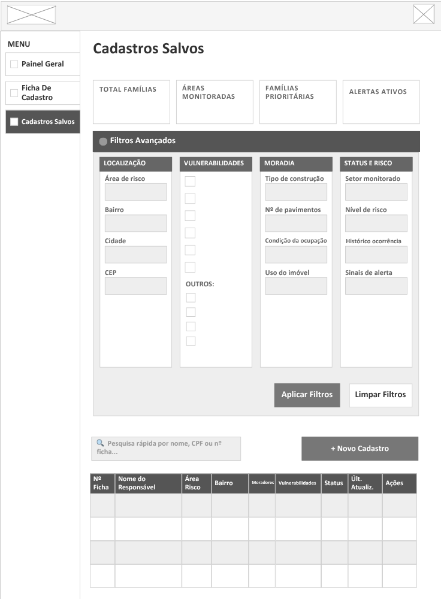

Fonte: Autoral (2026)


### 3.3.4. Tela de Visualização do Cadastro

User Stories atendidas: US05, US06, US07, US08, US09
Tela de consulta completa, sem campos editáveis. Acessada ao clicar em "visualizar" na Tela 3.
O topo exibe número da ficha, data da última atualização, status e área de risco, seguido pelos botões de ação — Editar, Imprimir, Exportar PDF e Voltar.
Os cards de resumo rápido mostram de forma escaneável: responsável, quantidade de moradores, vulnerabilidades, nível de risco, presença de crianças, idosos, PCDs e gestantes (US03 — CR2).
As seções seguintes exibem na íntegra todos os dados registrados: localização com mapa e fotos (US08 — CR3), dados pessoais dos responsáveis, informações da moradia com histórico de ocorrências e sinais de alerta (US06 — CR3), vulnerabilidades e saúde (US07 — CR3), informações sociais e logística de evacuação (US09 — CR3), e tabela de composição familiar.

**Sequência de navegação:**

Botão "Editar" redireciona à Tela 2 com campos preenchidos (US05 — CR2)
Botão "Voltar" retorna à Tela 3 com os filtros mantidos (US05 — CR1)
Data e hora da última edição registrada automaticamente (US05 — CR3)

**Figura 14:** Wireframe — Tela de Visualização do Cadastro

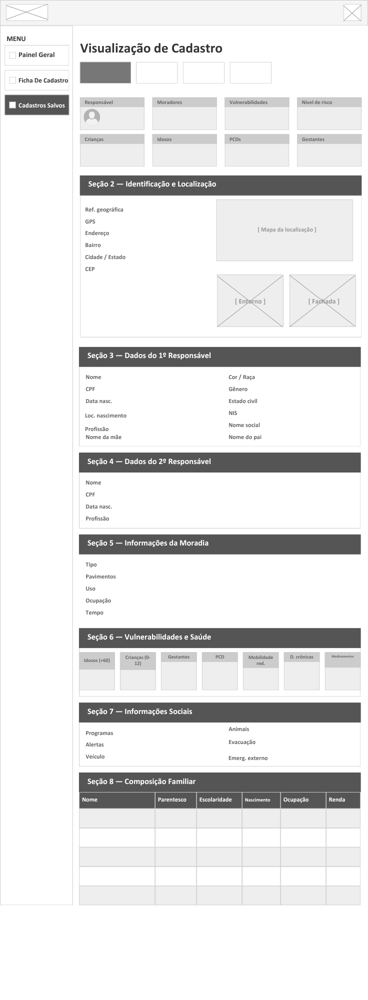

Fonte: Autoral (2026)

---

## 3.4. Guia de estilos (sprint 3)

O Guia de Estilos do GeoRisco Santo André reúne as decisões visuais da plataforma de apoio à operação de campo da Defesa Civil. Sua construção foi inspirada em guias de estilos de grandes empresas como GitLab e Coca-Cola, que tratam design como sistema e não como conjunto de preferências estéticas. Cada escolha parte de três premissas práticas: em campo, sob estresse e luz solar, toda informação precisa ser lida em um segundo; cada cor carrega semântica funcional (risco, atenção, segurança) e não aparece fora do seu contexto; e agentes treinados reconhecem padrões, então qualquer exceção ao sistema exige justificativa documentada antes de ser implementada.

As seções a seguir detalham a paleta de cores com tokens e contrastes WCAG 2.1, a escala tipográfica com DM Sans e DM Mono, e o conjunto de ícones da biblioteca Tabler Icons no estilo outline.

### 3.4.1 Cores
A paleta opera em três camadas funcionais: marca (laranja e azul-marinho com suas variações de escala), semântica (estados operacionais de risco, atenção, segurança e neutralidade) e superfície (escala de cinzas quentes para fundos e bordas). Todas as combinações de cor e texto foram verificadas segundo os critérios WCAG 2.1, atingindo no mínimo o nível AA para texto de tamanho normal.

### Cores primárias de marca

As cores de marca são utilizadas exclusivamente em elementos de navegação, ação primária e estrutura da interface. Aplicação fora desses contextos é vedada para preservar a semântica operacional do sistema.

Figura 15 — Paleta de cores primárias de marca: escala laranja e escala marinho com tokens CSS.

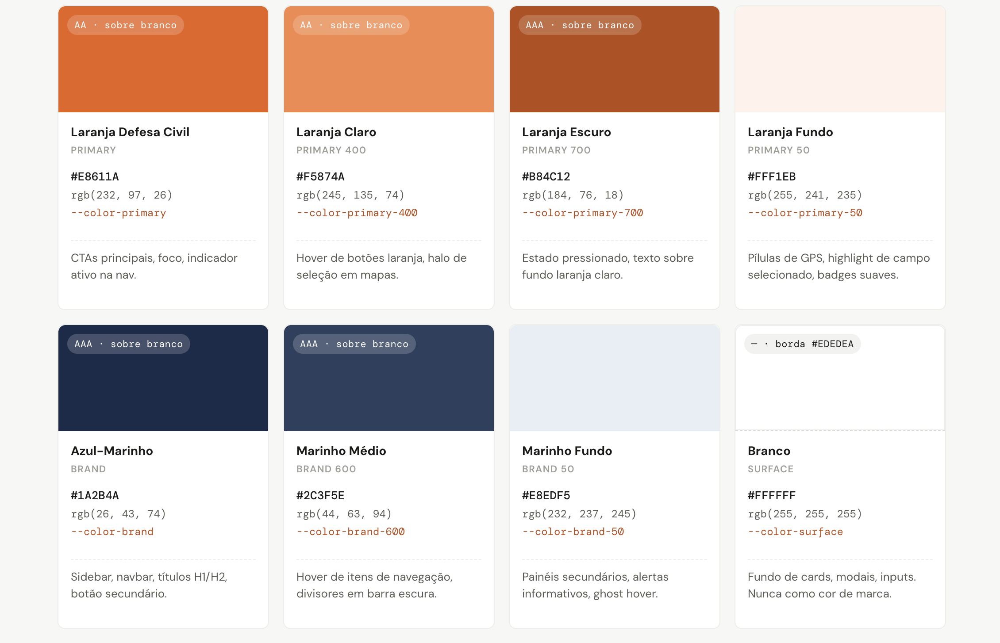

Fonte: autoral (2026).

A escala laranja parte do #E8611A, cor institucional da Defesa Civil de Santo André, garantindo alinhamento com o Manual de Identidade Visual do parceiro.

| Token CSS | Hex | Uso |
|-----------|-----|-----|
| `--color-primary` | `#E8611A` | CTAs principais, foco, indicador ativo na nav |
| `--color-primary-400` | `#F5874A` | Hover de botões laranja, halo de seleção em mapas |
| `--color-primary-700` | `#B84C12` | Estado pressionado, texto sobre fundo laranja claro |
| `--color-primary-50` | `#FFF1EB` | Pílulas de GPS, highlight de campo selecionado, badges suaves |

A escala marinho parte do #1A2B4A e estrutura navegação e hierarquia, transmitindo estabilidade adequada ao contexto de gestão de emergências.

| Token CSS | Hex | Uso |
|-----------|-----|-----|
| `--color-brand` | `#1A2B4A` | Sidebar, navbar, títulos H1/H2, botão secundário |
| `--color-brand-600` | `#2C3F5E` | Hover de itens de navegação, divisores em barra escura |
| `--color-brand-50` | `#E8EDF5` | Painéis secundários, alertas informativos, ghost hover |
| `--color-surface` | `#FFFFFF` | Fundo de cards, modais, inputs. Nunca como cor de marca |

### Cores semânticas

As cores semânticas comunicam estado operacional. Ver vermelho na tela significa risco real; ver verde significa dado confirmado. Nenhuma cor semântica é utilizada como elemento decorativo.

Figura 16 — Paleta de cores semânticas: danger, warning, success e neutral com fundos correspondentes.

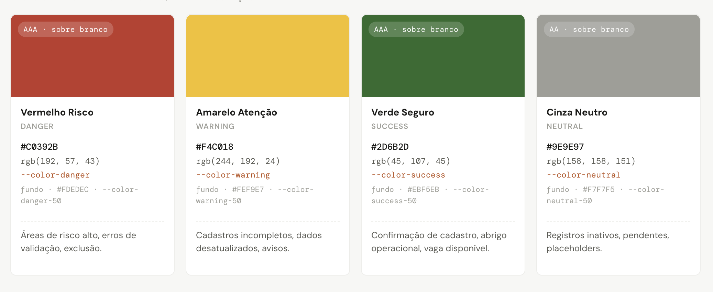

Fonte: autoral (2026).

| Token CSS | Hex (ícone/texto) | Fundo | Uso |
|-----------|-------------------|-------|-----|
| `--color-danger` | `#C0392B` | `#FDEDEC` | Áreas de risco alto, erros de validação, exclusão |
| `--color-warning` | `#F4C018` | `#FEF9E7` | Cadastros incompletos, dados desatualizados, avisos |
| `--color-success` | `#2D6B2D` | `#EBF5EB` | Confirmação de cadastro, abrigo operacional, vaga disponível |
| `--color-neutral` | `#9E9E97` | `#F7F7F5` | Registros inativos, pendentes, placeholders |

O amarelo #F4C018 nunca é utilizado como cor de texto. Sua função é exclusivamente de fundo ou ícone de estado. Para texto sobre fundos amarelos, utiliza-se #5C4509 em títulos e #A07010 em dados técnicos.

### Escala de cinzas

Os cinzas têm tom levemente esverdeado para combinar com a paleta laranja sem competir. O preto puro e o branco puro não são utilizados como cor de texto sobre fundo cinza.

Figura 17 — Escala de cinzas com funções de interface.


Fonte: autoral (2026).

| Hex | Função |
|-----|--------|
| `#F7F7F5` | Fundo da página |
| `#EDEDEA` | Divisor, borda de card |
| `#D8D8D3` | Borda de input inativo |
| `#9E9E97` | Placeholder, hint |
| `#5C5C55` | Corpo, descrições |
| `#1A1A18` | Texto principal |

### Combinações verificadas — WCAG 2.1

Todas as combinações de cor e texto listadas abaixo foram testadas segundo o padrão WCAG 2.1, que é o critério internacional de acessibilidade visual para interfaces digitais. O nível AA, atingido por todas as combinações da tabela, garante que o texto seja legível para a maioria das pessoas, incluindo quem tem baixa acuidade visual ou utiliza a tela em condições adversas de iluminação, como sol direto em campo. Qualquer combinação de cor que não esteja nesta lista não foi validada e precisa passar por verificação manual antes de ser aplicada na interface.

| Fundo | Texto principal | Dado técnico | Apoio/Hint | Contraste mínimo |
|-------|----------------|--------------|------------|-----------------|
| `#1A2B4A` Marinho | `#FFFFFF` | `#FFD9C2` | `#9DB0CC` | AAA 13,81 |
| `#E8611A` Laranja | `#FFFFFF` | `#FFFFFF` | `#FFE6D6` | AA 3,33 (texto grande e UI) |
| `#FDEDEC` Danger | `#7E1C13` | `#C0392B` | `#A8463C` | AA 4,91 |
| `#FEF9E7` Warning | `#5C4509` | `#A07010` | `#806000` | AA 4,71 |
| `#EBF5EB` Success | `#1E4A1E` | `#2D6B2D` | `#3F6E3F` | AAA 7,34 |
| `#F7F7F5` Neutro | `#1A1A18` | `#B84C12` | `#9E9E97` | AAA 18,62 |

---

### 3.4.2 Tipografia

A interface é construída com duas famílias tipográficas de papéis distintos e complementares: DM Sans para toda a interface e DM Mono para dados técnicos brutos.

DM Sans é uma sans-serif geométrica com terminais humanizados e boa legibilidade em telas pequenas sob luz solar, condição de uso frequente pelos agentes de campo. É utilizada em três pesos: 400 (Regular), 600 (Semibold) e 700 (Bold).

DM Mono é reservada para dados técnicos onde cada caractere precisa ser inequívoco: coordenadas GPS, CPF, RG, timestamps e códigos de cadastro. Sua natureza monoespaçada garante alinhamento e leitura precisa de dígitos, nos pesos 400 (Regular) e 500 (Medium).

Figura 18 — Specimen tipográfico das famílias DM Sans e DM Mono com pesos disponíveis.

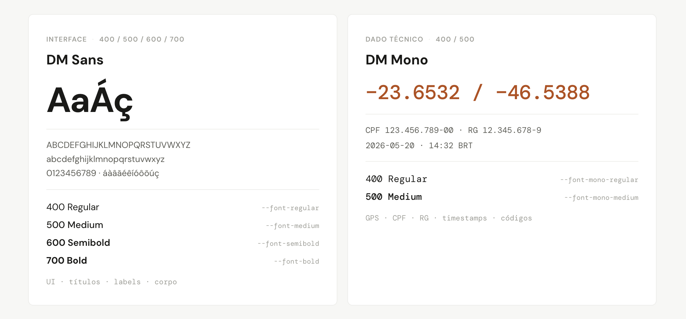

Fonte: autoral (2026).

### Escala tipográfica

Oito níveis cobrem toda a aplicação, cada um com papel funcional definido. Apenas os pesos declarados para cada nível são utilizados.

Figura 19 — Escala tipográfica com oito níveis hierárquicos aplicados à interface.

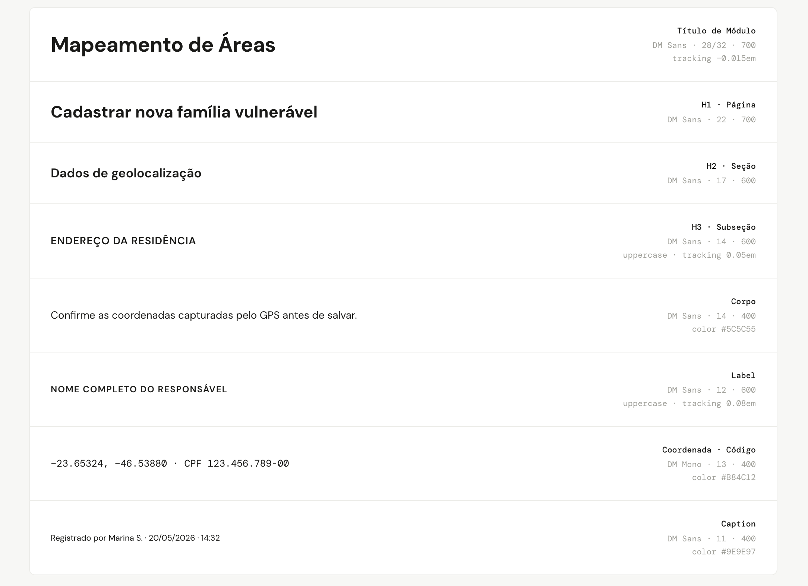

Fonte: autoral (2026).

| Nível | Família | Tamanho | Peso | Observações | Cor padrão |
|-------|---------|---------|------|-------------|------------|
| Título de Módulo | DM Sans | 28px / lh 32 | 700 | tracking −0,015em | `#1A1A18` |
| H1 Página | DM Sans | 22px | 700 | — | `#1A1A18` |
| H2 Seção | DM Sans | 17px | 600 | — | `#1A1A18` |
| H3 Subseção | DM Sans | 14px | 600 | uppercase, tracking 0,05em | `#1A1A18` |
| Corpo | DM Sans | 14px | 400 | — | `#5C5C55` |
| Label | DM Sans | 12px | 600 | uppercase, tracking 0,08em | `#1A1A18` |
| Coordenada / Código | DM Mono | 13px | 400 | — | `#B84C12` |
| Caption | DM Sans | 11px | 400 | — | `#9E9E97` |

### Tipografia sobre fundos coloridos

As regras de peso, tamanho e espaçamento de DM Sans e DM Mono permanecem idênticas em todos os fundos. O que muda é apenas a cor do glifo, seguindo as combinações verificadas na seção 3.4.1.

**Sobre fundo marinho #1A2B4A** (sidebar, navbar, botão secundário): texto principal em #FFFFFF, dado técnico em #FFD9C2 e caption em #9DB0CC. Contraste AAA 13,81.

**Sobre laranja #E8611A** (CTA, botão primário): texto em #FFFFFF, apoio em #FFE6D6. Aplicável exclusivamente em rótulos curtos de ação. Parágrafos longos são vedados sobre esse fundo. Contraste AA 3,33 (texto grande e UI).

**Sobre fundo Danger #FDEDEC** (alerta crítico, erro de validação): título em #7E1C13, dado forte em #C0392B. Contraste AA 4,91.

**Sobre fundo Warning #FEF9E7** (cadastro pendente): título em #5C4509, dado em #A07010. O amarelo #F4C018 não é utilizado como cor de texto em nenhum contexto. Contraste AA 4,71.

**Sobre fundo Success #EBF5EB** (confirmação, cadastro completo): título em #1E4A1E, dado em #2D6B2D. Contraste AAA 7,34.

**Sobre cinza neutro #F7F7F5** (conteúdo principal, listagens, formulários): principal em #1A1A18, corpo em #5C5C55, hint em #9E9E97. Contraste AAA 18,62.

---

### 3.4.3 Iconografia e imagens 

### Biblioteca e estilo

Ícones são elementos gráficos que representam ações, estados ou categorias de forma visual e imediata, reduzindo a dependência de texto na interface. Em um sistema operacional como o GeoRisco, onde o agente precisa identificar informações rapidamente em campo, ícones bem escolhidos aceleram a leitura e diminuem erros de interpretação.

Toda a iconografia da plataforma utiliza a biblioteca Tabler Icons, disponível em tabler.io/icons, no estilo outline. A biblioteca é gratuita, com licença MIT, e reúne mais de 5.000 ícones com traço e raio de canto consistentes entre si, o que garante homogeneidade visual sem precisar de nenhum ícone customizado. Os ícones foram exportados em SVG diretamente pelo nome (ti-map-pin, ti-camera, ti-user-plus e assim por diante).

A versão filled é vedada em toda a interface. O preenchimento sólido compete com a cor de marca e sobrecarrega a leitura visual em situações de campo. Cada ícone herda a cor do elemento em que está inserido e não carrega cor própria.

### Tamanhos canônicos

Figura 20 — Tamanhos canônicos de ícone e seus respectivos contextos de uso.

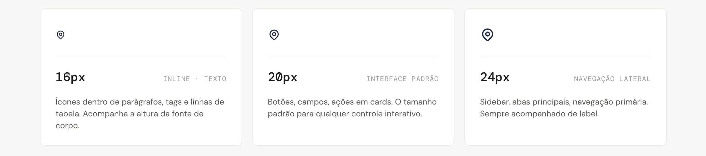

Fonte: autoral (2026).

| Tamanho | Contexto | Uso |
|---------|----------|-----|
| 16px | Inline Texto | Ícones dentro de parágrafos, tags e linhas de tabela. Acompanha a altura da fonte de corpo |
| 20px | Interface padrão | Botões, campos, ações em cards. Tamanho padrão para qualquer controle interativo |
| 24px | Navegação lateral | Sidebar, abas principais, navegação primária. Sempre acompanhado de label |

Qualquer tamanho fora desta escala exige justificativa. Ícones não são redimensionados por escalonamento CSS sem ajuste do viewBox.

### Mapeamento por módulo

Figura 21 — Mapeamento de ícones canônicos por módulo operacional.

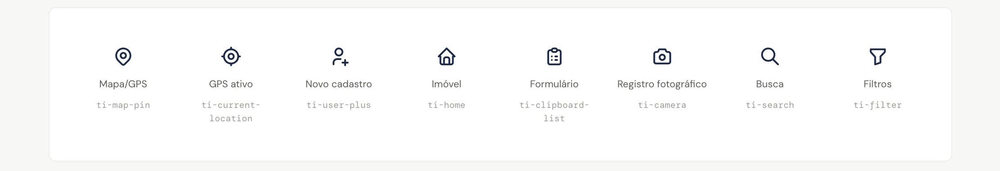

Fonte: autoral (2026).

Figura 22 — Ícones de categorias de vulnerabilidade em estilo outline.

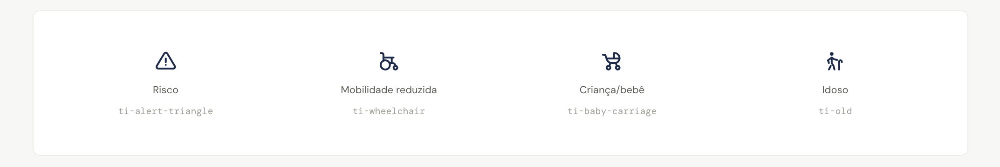

Fonte: autoral (2026).

Cada módulo e categoria de vulnerabilidade possui um ícone canônico da Tabler Icons outline. A mesma família é utilizada em todas as sub-funções.

| Função | Ícone |
|--------|-------|
| Mapa/GPS | `ti-map-pin` |
| GPS ativo | `ti-current-location` |
| Novo cadastro | `ti-user-plus` |
| Imóvel | `ti-home` |
| Formulário | `ti-clipboard-list` |
| Registro fotográfico | `ti-camera` |
| Busca | `ti-search` |
| Filtros | `ti-filter` |
| Risco | `ti-alert-triangle` |
| Mobilidade reduzida | `ti-wheelchair` |
| Criança/bebê | `ti-baby-carriage` |
| Idoso | `ti-walk` |

### Estados semânticos com ícone

Quando o ícone comunica estado operacional, é envelopado em um quadrado arredondado com a cor de fundo semântica correspondente. O par ícone mais cor de fundo forma um pictograma de leitura imediata em campo.

Figura 23 — Estados semânticos com ícone e cor de fundo correspondente.

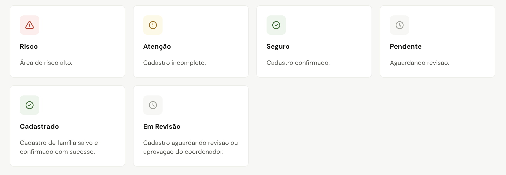

Fonte: autoral (2026).

| Estado | Ícone | Cor do ícone (fg) | Fundo (bg) | Uso |
|--------|-------|-------------------|------------|-----|
| Risco | `ti-alert-triangle` | `#C0392B` | `#FDEDEC` | Área de risco alto, imóvel R3/R4 |
| Atenção | `ti-alert-circle` | `#A07010` | `#FEF9E7` | Cadastro incompleto, prazo se aproximando |
| Seguro | `ti-circle-check` | `#2D6B2D` | `#EBF5EB` | Cadastro confirmado |
| Pendente | `ti-clock` | `#9E9E97` | `#F7F7F5` | Aguardando revisão de coordenador |
| Em campo | `ti-compass` | `#B84C12` | `#FFF1EB` | Cadastro em andamento, agente no local |
| Inativo | `ti-circle-dashed` | `#9E9E97` | `#F7F7F5` | Registro arquivado, família remanejada |

### Imagens e fotografia

As imagens exibidas na plataforma são exclusivamente registros operacionais capturados pelos agentes em campo: fachadas de imóveis e áreas afetadas. O uso de fotografia stock decorativa é vedado.

Toda foto exibida no sistema origina-se da função ti-camera de cadastro e deve ser acompanhada de metadado visível em DM Mono abaixo da imagem: autor, timestamp e coordenadas GPS do ponto de captura, no formato: `Registrado por [Nome] · DD/MM/AAAA · HH:MM BRT · [lat], [lon]`.

### Regras de uso

**Cor comunica estado, não marca.** O laranja #E8611A é exclusivo para ação primária; o vermelho é exclusivo para risco real. Usar vermelho como CTA dilui o sinal de alerta e em campo o agente para de reagir a vermelho, o que representa risco operacional concreto.

**DM Sans e DM Mono, nenhuma outra família.** Misturar serifas ou fontes genéricas monoespaçadas rompe a identidade tipográfica e compromete a legibilidade de dados técnicos.

**Tabler Icons outline, sempre.** Versões filled ou pictogramas sólidos competem com a cor de marca e sobrecarregam a leitura visual. Sem gradientes e sem sombras decorativas: a hierarquia é construída por tipografia e espaço, não por efeitos visuais.


## 3.5 Protótipo de alta fidelidade (sprint 3)

*posicione aqui algumas imagens demonstrativas de seu protótipo de alta fidelidade e o link para acesso ao protótipo completo (mantenha o link sempre público para visualização)*

Os arquivos editáveis dos protótipo de alta fidelidade estão disponíveis publicamente em: [https://www.figma.com/design/sVMrCUMiZb4dqMT4uhzkqC/prototipo-2?m=dev&t=lwjHtXQXomymgcsr-1].

**Figura X:** Tela 1 — Protótipo de alta fidelidade


Fonte: Autoral (2026)

**Figura X:** Tela 2 — Protótipo de alta fidelidade

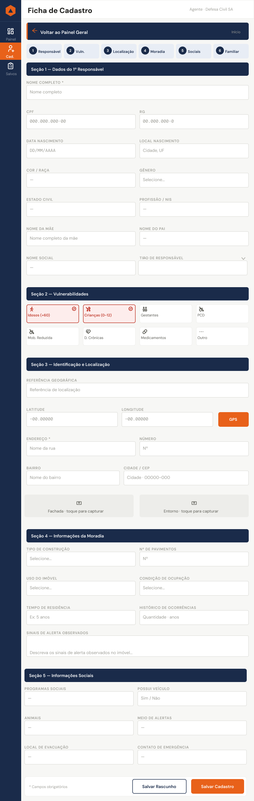

Fonte: Autoral (2026)

**Figura X:** Tela 2.2 — Protótipo de alta fidelidade


Fonte: Autoral (2026)

**Figura X:** Tela 2.3 — Protótipo de alta fidelidade

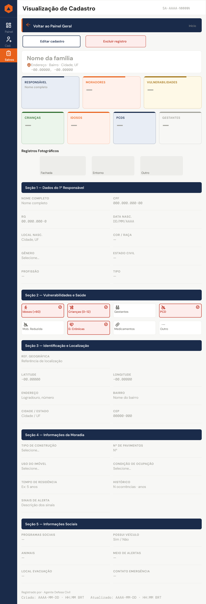

Fonte: Autoral (2026)


## 3.6. Modelagem do banco de dados (sprints 2 e 4)

Esta seção apresenta a estrutura do banco de dados do sistema, descrevendo as entidades, seus atributos e os relacionamentos entre elas. A modelagem foi construída com base nos requisitos definidos anteriormente, garantindo integridade dos dados e alinhamento com as regras de negócio. Um diagrama entidade-relacionamento (DER) é incluído para ilustrar essa estrutura de forma visual.

### 3.6.1. Modelo Entidade-Relacionamento (ER) 

O Modelo Entidade-Relacionamento (ER) é uma representação conceitual utilizada para organizar e estruturar os dados de um sistema. Esse modelo identifica as principais entidades do sistema, seus atributos e os relacionamentos existentes entre elas. No sistema GeoRisco Santo André, as entidades reais são: **Pessoa** (implementada via Single Table Inheritance, com `tipo_responsavel` discriminando responsável ou membro), **Moradia**, **Necessidade**, **Informacoes_Sociais** e **Imagem**. Não existem entidades separadas para "Responsável" e "Membro Familiar" — ambos os papéis são registros da mesma tabela `pessoa`, diferenciados pelo campo `tipo_responsavel`.

**Figura 8:** Modelo Entidade-Relacionamento

<!-- PNG antigo modeloEntidade.png substituído por Mermaid; remover de assets -->
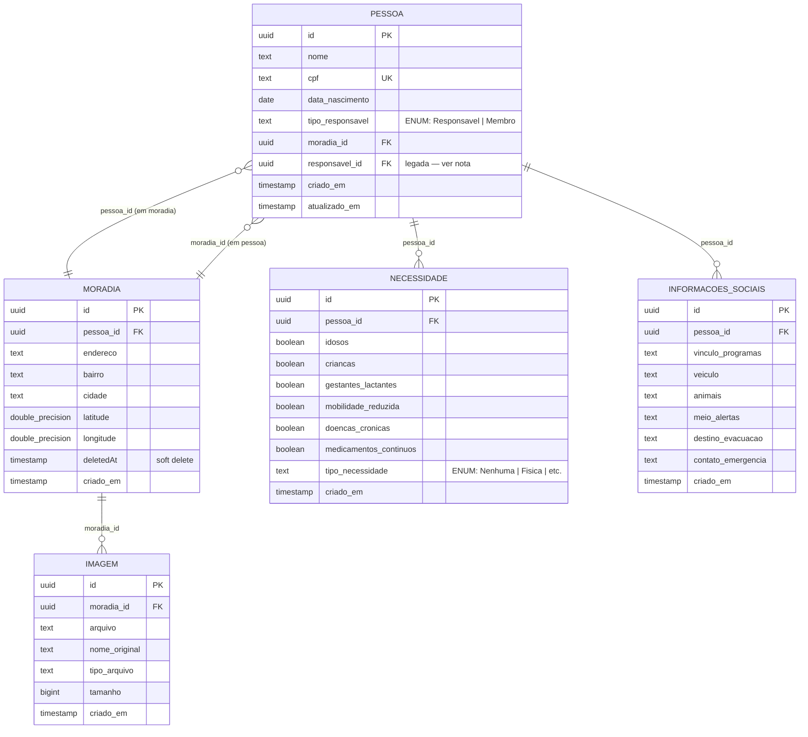
```mermaid
erDiagram
    PESSOA {
        uuid id PK
        text nome
        text cpf UK
        date data_nascimento
        text tipo_responsavel "ENUM: Responsavel | Membro"
        uuid moradia_id FK
        uuid responsavel_id FK "legada — ver nota"
        timestamp criado_em
        timestamp atualizado_em
    }
    MORADIA {
        uuid id PK
        uuid pessoa_id FK
        text endereco
        text bairro
        text cidade
        double_precision latitude
        double_precision longitude
        timestamp deletedAt "soft delete"
        timestamp criado_em
    }
    NECESSIDADE {
        uuid id PK
        uuid pessoa_id FK
        boolean idosos
        boolean criancas
        boolean gestantes_lactantes
        boolean mobilidade_reduzida
        boolean doencas_cronicas
        boolean medicamentos_continuos
        text tipo_necessidade "ENUM: Nenhuma | Fisica | etc."
        timestamp criado_em
    }
    INFORMACOES_SOCIAIS {
        uuid id PK
        uuid pessoa_id FK
        text vinculo_programas
        text veiculo
        text animais
        text meio_alertas
        text destino_evacuacao
        text contato_emergencia
        timestamp criado_em
    }
    IMAGEM {
        uuid id PK
        uuid moradia_id FK
        text arquivo
        text nome_original
        text tipo_arquivo
        bigint tamanho
        timestamp criado_em
    }

    MORADIA ||--o{ PESSOA : "moradia_id (em pessoa)"
    PESSOA ||--o{ NECESSIDADE : "pessoa_id"
    PESSOA ||--o{ INFORMACOES_SOCIAIS : "pessoa_id"
    MORADIA ||--o{ IMAGEM : "moradia_id"
    PESSOA }o--|| MORADIA : "pessoa_id (em moradia)"
```

Fonte: Autoral (2026)

> **Nota sobre `responsavel_id` (legada):** A migration `01_sti_pessoa.sql` previa o `DROP COLUMN responsavel_id`, mas essa instrução não foi executada no banco Supabase. A coluna ainda existe com FK auto-referência `pessoa → pessoa` ON DELETE SET NULL. O modelo STI vigente usa `moradia_id` para vincular membros ao mesmo núcleo familiar — `responsavel_id` não é mais usada pelo código.
>
> **Nota sobre FK `pessoa.moradia_id`:** A constraint formal `fk_pessoa_moradia` declarada na migration não foi aplicada no banco. A integridade desse vínculo é garantida apenas na camada de aplicação (`MoradiaService.criar()`).

> **Nota sobre relacionamento bidirecional:** O banco possui duas referências cruzadas entre `pessoa` e `moradia`: `moradia.pessoa_id` (FK formal, ON DELETE CASCADE, via `moradia_pessoa_id_fkey`) e `pessoa.moradia_id` (coluna sem FK formal no banco). O `CadastroRepository` identifica o responsável via `JOIN pessoa p ON p.moradia_id = m.id AND p.tipo_responsavel = 'Responsavel'`.

### 3.6.2. Diagrama Entidade-Relacionamento (DER) 

O Diagrama Entidade-Relacionamento (DER) é a representação gráfica do Modelo ER, utilizada para visualizar de maneira organizada as entidades, seus atributos e os relacionamentos entre elas, com as cardinalidades indicadas. O DER do GeoRisco Santo André reflete o estado real do banco de dados PostgreSQL (Supabase), com as cinco tabelas efetivamente existentes e as chaves estrangeiras confirmadas via `information_schema`.

**Figura 9:** Diagrama Entidade-Relacionamento

<!-- PNG antigo DiagramaEntidadeRelacionamento.png substituído por Mermaid; remover de assets -->
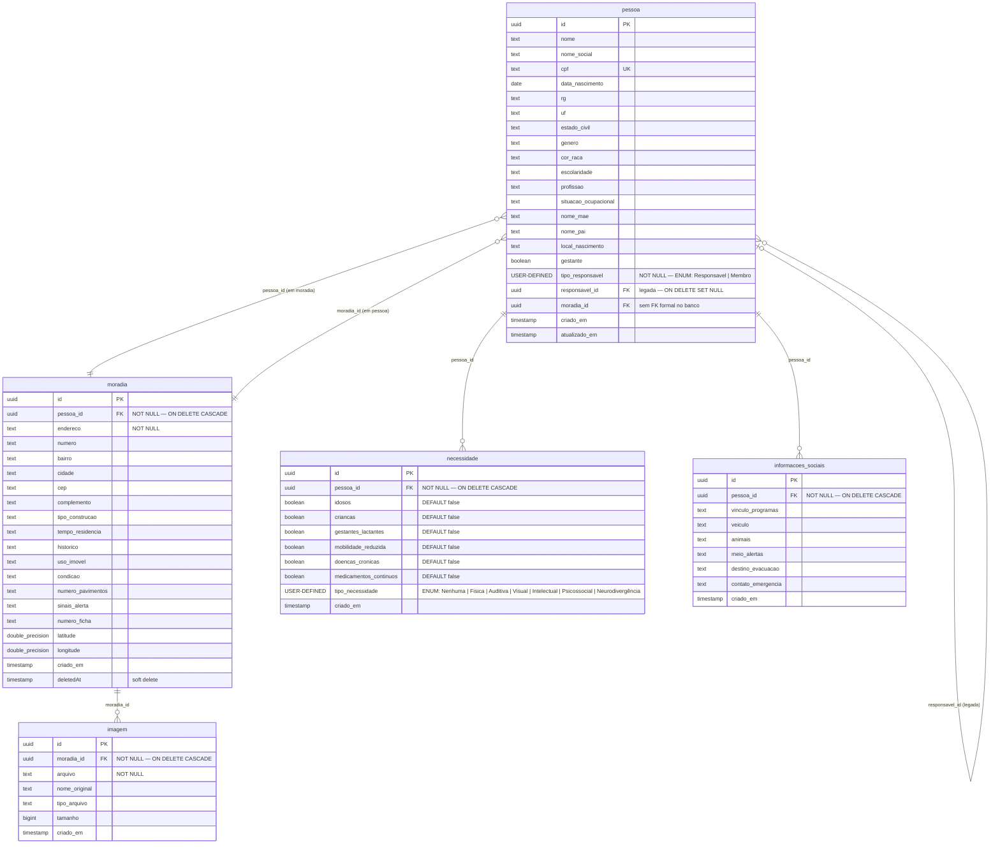
```mermaid
erDiagram
    pessoa {
        uuid id PK
        text nome
        text nome_social
        text cpf UK
        date data_nascimento
        text rg
        text uf
        text estado_civil
        text genero
        text cor_raca
        text escolaridade
        text profissao
        text situacao_ocupacional
        text nome_mae
        text nome_pai
        text local_nascimento
        boolean gestante
        USER-DEFINED tipo_responsavel "NOT NULL — ENUM: Responsavel | Membro"
        uuid responsavel_id FK "legada — ON DELETE SET NULL"
        uuid moradia_id FK "sem FK formal no banco"
        timestamp criado_em
        timestamp atualizado_em
    }
    moradia {
        uuid id PK
        uuid pessoa_id FK "NOT NULL — ON DELETE CASCADE"
        text endereco "NOT NULL"
        text numero
        text bairro
        text cidade
        text cep
        text complemento
        text tipo_construcao
        text tempo_residencia
        text historico
        text uso_imovel
        text condicao
        text numero_pavimentos
        text sinais_alerta
        text numero_ficha
        double_precision latitude
        double_precision longitude
        timestamp criado_em
        timestamp deletedAt "soft delete"
    }
    necessidade {
        uuid id PK
        uuid pessoa_id FK "NOT NULL — ON DELETE CASCADE"
        boolean idosos "DEFAULT false"
        boolean criancas "DEFAULT false"
        boolean gestantes_lactantes "DEFAULT false"
        boolean mobilidade_reduzida "DEFAULT false"
        boolean doencas_cronicas "DEFAULT false"
        boolean medicamentos_continuos "DEFAULT false"
        USER-DEFINED tipo_necessidade "ENUM: Nenhuma | Fisica | Auditiva | Visual | Intelectual | Psicossocial | Neurodivergência"
        timestamp criado_em
    }
    informacoes_sociais {
        uuid id PK
        uuid pessoa_id FK "NOT NULL — ON DELETE CASCADE"
        text vinculo_programas
        text veiculo
        text animais
        text meio_alertas
        text destino_evacuacao
        text contato_emergencia
        timestamp criado_em
    }
    imagem {
        uuid id PK
        uuid moradia_id FK "NOT NULL — ON DELETE CASCADE"
        text arquivo "NOT NULL"
        text nome_original
        text tipo_arquivo
        bigint tamanho
        timestamp criado_em
    }

    moradia ||--o{ pessoa : "moradia_id (em pessoa)"
    pessoa ||--o{ necessidade : "pessoa_id"
    pessoa ||--o{ informacoes_sociais : "pessoa_id"
    moradia ||--o{ imagem : "moradia_id"
    pessoa }o--|| moradia : "pessoa_id (em moradia)"
    pessoa |o--o{ pessoa : "responsavel_id (legada)"
```

Fonte: Autoral (2026)

O DER apresenta as cinco tabelas reais do banco: `pessoa` (Single Table Inheritance — campo `tipo_responsavel` discrimina responsável de membro, não há tabelas separadas `tb_responsavel` ou `tb_membro_familiar`), `moradia`, `necessidade`, `informacoes_sociais` e `imagem`. Todos os identificadores são UUIDs com `DEFAULT gen_random_uuid()`. As FKs confirmadas no banco são: `moradia.pessoa_id → pessoa.id` (CASCADE, `moradia_pessoa_id_fkey`), `necessidade.pessoa_id → pessoa.id` (CASCADE, `necessidade_pessoa_id_fkey`), `informacoes_sociais.pessoa_id → pessoa.id` (CASCADE, `informacoes_sociais_pessoa_id_fkey`), `imagem.moradia_id → moradia.id` (CASCADE, `imagem_moradia_id_fkey`) e `pessoa.responsavel_id → pessoa.id` (SET NULL, `pessoa_responsavel_id_fkey`, coluna legada). A FK `pessoa.moradia_id → moradia.id` foi declarada na migration mas não existe formalmente no banco. A coluna `pessoa.cpf` possui constraint `UNIQUE` (`pessoa_cpf_key`), indicada como `UK` no diagrama.

### 3.6.3. Modelo Relacional, Modelo Físico e Migrations DDL (sprints 2 e 4)

### Modelo Relacional

O modelo relacional do GeoRisco Santo André foi derivado do DER apresentado na seção 3.6.2, convertendo cada entidade em uma tabela, os atributos em colunas e os relacionamentos em chaves estrangeiras. A hierarquia de papéis (responsável / membro) foi implementada via **Single Table Inheritance (STI)**: uma única tabela `pessoa` armazena ambos os papéis, diferenciados pelo campo `tipo_responsavel` (ENUM com valores `'Responsavel'` e `'Membro'`). Não há tabelas separadas `responsavel` ou `membro_familiar`; não existe herança por CPF como chave primária/estrangeira.

Os relacionamentos 1:N foram implementados com FK na tabela do lado N, com `ON DELETE CASCADE` nas tabelas filhas: `necessidade.pessoa_id → pessoa.id`, `informacoes_sociais.pessoa_id → pessoa.id`, `imagem.moradia_id → moradia.id` e `moradia.pessoa_id → pessoa.id`. O vínculo família–moradia para membros é feito via `pessoa.moradia_id`, que aponta para a moradia do responsável (sem FK formal no banco — ver nota abaixo). Os campos `latitude` e `longitude` são opcionais, permitindo que o agente finalize o cadastro sem GPS e complemente depois via `PATCH /moradias/:id` (RN04/RN05).

> **Nota de pendência — migration parcialmente aplicada:** A migration `01_sti_pessoa.sql` declarou três operações sobre `pessoa`: (1) `ADD COLUMN moradia_id UUID` ✅ aplicada; (2) `ADD CONSTRAINT fk_pessoa_moradia FOREIGN KEY (moradia_id) REFERENCES moradia(id) ON DELETE CASCADE` ❌ **não aplicada no banco**; (3) `DROP COLUMN responsavel_id` ❌ **não aplicada no banco** — a coluna `responsavel_id` ainda existe com FK auto-referência `pessoa → pessoa` ON DELETE SET NULL. O DDL as-built abaixo reflete o estado real do banco, não o estado pretendido pela migration.

**Figura 10 — Modelo Relacional do GeoRisco Santo André**

<!-- PNG antigo modeloRelacional.png substituído por Mermaid; remover de assets -->
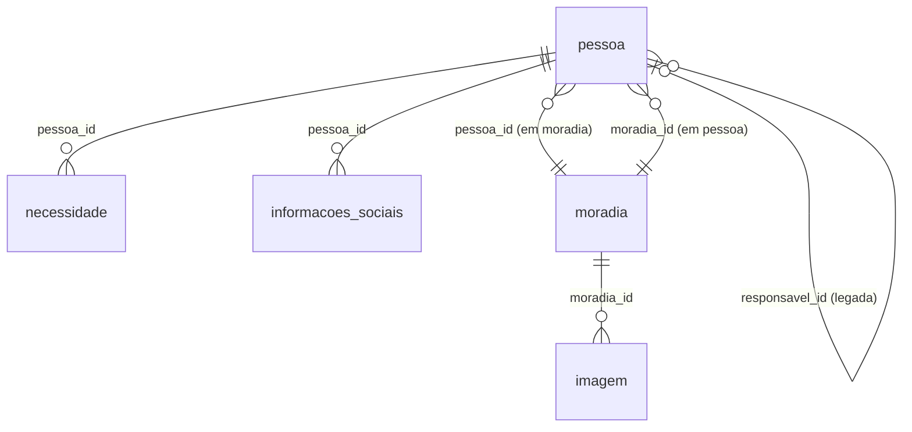
```mermaid
erDiagram
    pessoa ||--o{ necessidade : "pessoa_id"
    pessoa ||--o{ informacoes_sociais : "pessoa_id"
    moradia ||--o{ imagem : "moradia_id"
    moradia ||--o{ pessoa : "moradia_id (em pessoa)"
    pessoa }o--|| moradia : "pessoa_id (em moradia)"
    pessoa |o--o{ pessoa : "responsavel_id (legada)"
```

**Fonte:** Autoral (2026)

---

**Tabela de rastreabilidade: Entidade → Tabela → RFs atendidos**

| Entidade (DER) | Tabela real no banco | RFs Suportados | RNs relacionadas |
|---|---|---|---|
| PESSOA (STI: Responsavel + Membro) | `pessoa` | RF002, RF003, RF004, RF005, RF006, RF007, RF008, RF012 | RN01, RN02, RN03, RN07, RN08, RN15, RN16, RN17 |
| MORADIA | `moradia` | RF018, RF019, RF020, RF021 | RN04, RN05, RN06, RN12, RN25 |
| NECESSIDADE | `necessidade` | RF011, RF012, RF013, RF015, RF017 | RN08, RN09, RN24 |
| INFORMACOES_SOCIAIS | `informacoes_sociais` | RF010 | RN24 |
| IMAGEM | `imagem` | RF028 | RN18, RN19, RN24 |

---

### Modelo Físico — Scripts DDL (as-built)

> **Atenção:** o banco real é **PostgreSQL** (hospedado no Supabase). As tabelas existentes são `pessoa`, `moradia`, `necessidade`, `informacoes_sociais` e `imagem`. Não existem as tabelas `responsavel` e `membro_familiar`. Os tipos `tipo_responsavel` e `tipo_necessidade` são ENUMs PostgreSQL criados no banco (USER-DEFINED); os scripts DDL abaixo os declaram com `CREATE TYPE`.
>
> Os `CREATE TABLE` originais não estão no repositório (foram aplicados diretamente no Supabase). Apenas duas migrations estão versionadas em `src/database/migrations/`, ambas do tipo `ALTER TABLE` — copiadas verbatim abaixo. A estrutura completa foi validada via `information_schema.columns` e `information_schema.referential_constraints` executados diretamente no banco em 2026-06-12.

#### Migrations versionadas (verbatim — `src/database/migrations/`)

##### `01_sti_pessoa.sql` — refatoração de `pessoa` para STI

```sql
-- Adiciona o vínculo com a moradia na tabela pessoa
ALTER TABLE pessoa ADD COLUMN moradia_id UUID;

-- Garante a integridade referencial aplicando ON DELETE CASCADE
ALTER TABLE pessoa ADD CONSTRAINT fk_pessoa_moradia FOREIGN KEY (moradia_id) REFERENCES moradia(id) ON DELETE CASCADE;

-- Remove qualquer dependência da tabela legada ou da coluna antiga
ALTER TABLE pessoa DROP COLUMN responsavel_id;
```

> **Nota de pendência:** as operações 2 e 3 acima **não foram executadas** no banco Supabase. A constraint `fk_pessoa_moradia` não existe; a coluna `responsavel_id` ainda está presente.

##### `02_soft_delete_moradia.sql` — soft delete de `moradia`

```sql
-- Adiciona a coluna para exclusão lógica
ALTER TABLE moradia ADD COLUMN "deletedAt" TIMESTAMP DEFAULT NULL;
```

#### DDL completo as-built (estado real do banco em 2026-06-12)

```sql
-- ENUMs PostgreSQL (USER-DEFINED) confirmados no banco
CREATE TYPE tipo_responsavel AS ENUM ('Responsavel', 'Membro');
CREATE TYPE tipo_necessidade  AS ENUM (
  'Nenhuma', 'Fisica', 'Auditiva', 'Visual',
  'Intelectual', 'Psicossocial', 'Neurodivergência'
);

-- Tabela pessoa (STI: responsável e membros na mesma tabela)
CREATE TABLE pessoa (
  id                   uuid        PRIMARY KEY DEFAULT gen_random_uuid(),
  nome                 text        NOT NULL,
  nome_social          text,
  cpf                  text        UNIQUE,
  data_nascimento      date,
  rg                   text,
  uf                   text,
  estado_civil         text,
  genero               text,
  cor_raca             text,
  escolaridade         text,
  profissao            text,
  situacao_ocupacional text,
  nome_mae             text,
  nome_pai             text,
  local_nascimento     text,
  gestante             boolean DEFAULT false,
  tipo_responsavel     tipo_responsavel NOT NULL,
  responsavel_id       uuid,       -- legada (STI antigo); migration 01 manda dropar, mas ainda existe no banco
  moradia_id           uuid,       -- vínculo família→moradia; FK declarada na migration 01, mas AUSENTE no banco
  criado_em            timestamp   DEFAULT now(),
  atualizado_em        timestamp   DEFAULT now(),
  CONSTRAINT pessoa_responsavel_id_fkey
    FOREIGN KEY (responsavel_id) REFERENCES pessoa(id) ON DELETE SET NULL
  -- fk_pessoa_moradia: declarada na migration 01, porém NÃO existe no banco
  -- CONSTRAINT fk_pessoa_moradia FOREIGN KEY (moradia_id) REFERENCES moradia(id) ON DELETE CASCADE
);

-- Tabela moradia
CREATE TABLE moradia (
  id                uuid             PRIMARY KEY DEFAULT gen_random_uuid(),
  pessoa_id         uuid             NOT NULL,
  endereco          text             NOT NULL,
  numero            text,
  bairro            text,
  cidade            text,
  cep               text,
  complemento       text,
  tipo_construcao   text,
  tempo_residencia  text,
  historico         text,
  uso_imovel        text,
  condicao          text,
  numero_pavimentos text,
  sinais_alerta     text,
  numero_ficha      text,
  latitude          double precision,
  longitude         double precision,
  criado_em         timestamp        DEFAULT now(),
  "deletedAt"       timestamp,       -- soft delete; nome case-sensitive (requer aspas no SQL)
  CONSTRAINT moradia_pessoa_id_fkey
    FOREIGN KEY (pessoa_id) REFERENCES pessoa(id) ON DELETE CASCADE
);

-- Tabela necessidade
CREATE TABLE necessidade (
  id                     uuid            PRIMARY KEY DEFAULT gen_random_uuid(),
  pessoa_id              uuid            NOT NULL,
  idosos                 boolean         DEFAULT false,
  criancas               boolean         DEFAULT false,
  gestantes_lactantes    boolean         DEFAULT false,
  mobilidade_reduzida    boolean         DEFAULT false,
  doencas_cronicas       boolean         DEFAULT false,
  medicamentos_continuos boolean         DEFAULT false,
  tipo_necessidade       tipo_necessidade,
  criado_em              timestamp       DEFAULT now(),
  CONSTRAINT necessidade_pessoa_id_fkey
    FOREIGN KEY (pessoa_id) REFERENCES pessoa(id) ON DELETE CASCADE
);

-- Tabela informacoes_sociais
CREATE TABLE informacoes_sociais (
  id                 uuid      PRIMARY KEY DEFAULT gen_random_uuid(),
  pessoa_id          uuid      NOT NULL,
  vinculo_programas  text,
  veiculo            text,
  animais            text,
  meio_alertas       text,
  destino_evacuacao  text,
  contato_emergencia text,
  criado_em          timestamp DEFAULT now(),
  CONSTRAINT informacoes_sociais_pessoa_id_fkey
    FOREIGN KEY (pessoa_id) REFERENCES pessoa(id) ON DELETE CASCADE
);

-- Tabela imagem
CREATE TABLE imagem (
  id            uuid      PRIMARY KEY DEFAULT gen_random_uuid(),
  moradia_id    uuid      NOT NULL,
  arquivo       text      NOT NULL,
  nome_original text,
  tipo_arquivo  text,
  tamanho       bigint,   -- bytes; tipo confirmado como bigint no banco
  criado_em     timestamp DEFAULT now(),
  CONSTRAINT imagem_moradia_id_fkey
    FOREIGN KEY (moradia_id) REFERENCES moradia(id) ON DELETE CASCADE
);
```

> **Nota sobre `criado_em` / `atualizado_em`:** Todas as tabelas possuem `criado_em timestamp DEFAULT now()`. Nenhum `INSERT` dos repositories inclui esse campo — é preenchido pelo `DEFAULT` do banco. A tabela `pessoa` também possui `atualizado_em timestamp DEFAULT now()`, mas `pessoaRepository.atualizar()` referencia a coluna com o nome errado (`data_atualizacao = NOW()`), causando falha em produção no `PATCH /pessoas/:id`. A unicidade de CPF (RN03) é garantida em duas camadas: `PessoaService.criarPessoa`/`atualizarPessoa` verificam duplicidade via `PessoaRepository.buscarCpf` **e** o banco possui a constraint `pessoa_cpf_key UNIQUE (cpf)`, confirmada via `information_schema.table_constraints`.

---

**Resumo de constraints implementadas por RN (PostgreSQL real):**

| RN | Descrição | Implementação real no banco |
|----|-----------|---------------------------|
| RN01 | Campos obrigatórios | `NOT NULL` em `pessoa.nome`, `pessoa.tipo_responsavel`, `moradia.pessoa_id`, `moradia.endereco`, `necessidade.pessoa_id`, `informacoes_sociais.pessoa_id`, `imagem.moradia_id`, `imagem.arquivo` |
| RN02 | CPF com formato válido (11 dígitos) | Validação somente na camada Service + schema Zod (`z.string().length(11)`); sem `CHECK` no banco |
| RN03 | CPF único por responsável | Verificação via `PessoaRepository.buscarCpf` em `PessoaService` **e** constraint `pessoa_cpf_key UNIQUE (cpf)` no banco |
| RN04/RN05 | Coordenadas opcionais (GPS ou manual) | `latitude` e `longitude` em `moradia` são nullable; validação de bounds (≠ 0, território BR) aplicada no schema Zod `moradiaUpdateSchema` |
| RN06 | Coordenadas vinculadas ao cadastro | Via `moradia.pessoa_id` (FK CASCADE) e `pessoa.moradia_id` (sem FK formal, garantido em transação no Service) |
| RN08/RN09 | Perfis de vulnerabilidade + prioridade automática | Colunas `boolean DEFAULT false` em `necessidade`; prioridade calculada dinamicamente via `CASE/EXISTS` em `CadastroRepository.buscarComFiltros()` |
| RN12 | Endereço obrigatório | `moradia.endereco TEXT NOT NULL` |
| RN17 | Timestamp de atualização | `pessoa.atualizado_em timestamp DEFAULT now()` (atualização automática **não funcional** — bug em `pessoaRepository.atualizar()`: usa `data_atualizacao` em vez de `atualizado_em`) |
| RN18/RN24 | Imagem vinculada a cadastro / sem órfãos | `imagem.moradia_id NOT NULL` + `CONSTRAINT imagem_moradia_id_fkey … ON DELETE CASCADE` |
| RN19 | Formato de imagem | Sem `CHECK` no banco; `multer` não aplica `fileFilter` — qualquer MIME type é aceito (restrição não implementada) |
| RN21 | Integridade referencial | FKs com `ON DELETE CASCADE` em todas as tabelas filhas (`moradia`, `necessidade`, `informacoes_sociais`, `imagem`) |
| RN24 | Nenhum registro órfão | `FOREIGN KEY … ON DELETE CASCADE` nas quatro tabelas dependentes + transação explícita no `MoradiaService.criar()` |
| RN25 | Integridade referencial geral | PKs `UUID DEFAULT gen_random_uuid()` em todas as tabelas; FKs confirmadas no banco via `information_schema` |


### 3.6.4. Consultas SQL e lógica proposicional 

Esta seção apresenta as principais consultas SQL compostas utilizadas pelo back-end do GeoRisco Santo André, acompanhadas de suas respectivas representações em lógica proposicional e tabelas verdade. As consultas foram corrigidas para refletir as tabelas e colunas reais do banco — não existem `responsavel`, `tb_membro_familiar`, `possuiDeficiencia`, `mobilidadeReduzida`, `sinaisAlertas` nem `dataCadastro`.

#1 | ---
--- | ---
**Descrição** | Esta consulta busca todos os responsáveis cujas moradias estejam no bairro 'Jardim Santo André' e que possuam ao menos um perfil de vulnerabilidade registrado (deficiência ou mobilidade reduzida). O objetivo é apoiar a coordenadora operacional na priorização de atendimentos emergenciais em regiões específicas, conforme previsto na US04 e na regra de negócio RN09.
**Expressão SQL** | SELECT p.id, p.nome, p.cpf, m.bairro FROM pessoa p INNER JOIN moradia m ON p.moradia_id = m.id INNER JOIN necessidade n ON n.pessoa_id = p.id WHERE p.tipo_responsavel = 'Responsavel' AND m.bairro = 'Jardim Santo André' AND (n.mobilidade_reduzida = TRUE OR (n.tipo_necessidade IS NOT NULL AND n.tipo_necessidade <> 'Nenhuma'));
**Proposições lógicas** | $A$: O bairro da moradia é 'Jardim Santo André' (bairro = 'Jardim Santo André') <br> $B$: O responsável possui tipo de deficiência registrado (tipo_necessidade IS NOT NULL AND <> 'Nenhuma') <br> $C$: O responsável possui mobilidade reduzida (mobilidade_reduzida = TRUE)
**Expressão lógica proposicional** | $A \land (B \lor C)$
**Tabela Verdade** | <table> <thead> <tr> <th>$A$</th> <th>$B$</th> <th>$C$</th> <th>$(B \lor C)$</th> <th>$A \land (B \lor C)$</th> </tr> </thead> <tbody> <tr> <td>F</td> <td>F</td> <td>F</td> <td>F</td> <td>F</td> </tr> <tr> <td>F</td> <td>F</td> <td>V</td> <td>V</td> <td>F</td> </tr> <tr> <td>F</td> <td>V</td> <td>F</td> <td>V</td> <td>F</td> </tr> <tr> <td>F</td> <td>V</td> <td>V</td> <td>V</td> <td>F</td> </tr> <tr> <td>V</td> <td>F</td> <td>F</td> <td>F</td> <td>F</td> </tr> <tr> <td>V</td> <td>F</td> <td>V</td> <td>V</td> <td>V</td> </tr> <tr> <td>V</td> <td>V</td> <td>F</td> <td>V</td> <td>V</td> </tr> <tr> <td>V</td> <td>V</td> <td>V</td> <td>V</td> <td>V</td> </tr> </tbody> </table>
<!-- bloco orfão #3 removido; conteúdo correto aparece como #3 abaixo -->

---

#2 | Buscar famílias sem necessidades registradas cujo responsável contenha 'Silva' no nome (US03, RN08)
--- | ---
**Descrição** | Esta consulta busca responsáveis cujo nome contenha o termo 'Silva' e que não possuam nenhuma necessidade especial registrada. ILIKE realiza busca parcial case-insensitive; NOT EXISTS exclui responsáveis já vinculados à tabela de necessidades. O objetivo é identificar famílias cujos perfis de vulnerabilidade ainda não foram avaliados pelo agente de campo, conforme US03 e RN08.
**Expressão SQL** | SELECT p.id, p.nome, p.cpf FROM pessoa p WHERE p.tipo_responsavel = 'Responsavel' AND p.nome ILIKE '%Silva%' AND NOT EXISTS (SELECT 1 FROM necessidade n WHERE n.pessoa_id = p.id);
**Proposições lógicas** | $A$: O nome do responsável contém o termo 'Silva' (nome ILIKE '%Silva%') <br> $B$: O responsável possui registros na tabela de necessidades (EXISTS na subquery)
**Expressão lógica proposicional** | $A \land \neg B$
**Tabela Verdade** | <table> <thead> <tr> <th>$A$</th> <th>$B$</th> <th>$\neg B$</th> <th>$A \land \neg B$</th> </tr> </thead> <tbody> <tr> <td>F</td> <td>F</td> <td>V</td> <td>F</td> </tr> <tr> <td>F</td> <td>V</td> <td>F</td> <td>F</td> </tr> <tr> <td>V</td> <td>F</td> <td>V</td> <td>V</td> </tr> <tr> <td>V</td> <td>V</td> <td>F</td> <td>F</td> </tr> </tbody> </table>

#3 | ---
--- | ---
**Descrição** | Esta consulta atualiza o campo de sinais de alerta da moradia para todos os cadastros localizados nos bairros 'Vila Luzita' ou 'Jardim Santo André' que ainda não possuam sinais de alerta registrados. O objetivo é permitir que a coordenadora operacional sinalize preventivamente moradias em áreas de risco conhecidas, conforme previsto na US06 e nas regras de negócio RN16 e RN17, que exigem a revalidação dos dados e o registro automático de timestamp em toda atualização.
**Expressão SQL** | UPDATE moradia SET sinais_alerta = 'Área sujeita a deslizamento' WHERE bairro IN ('Vila Luzita', 'Jardim Santo André') AND sinais_alerta IS NULL;
**Proposições lógicas** | $A$: O bairro da moradia pertence à lista de bairros críticos (bairro IN ('Vila Luzita', 'Jardim Santo André')) <br> $B$: A moradia já possui sinais de alerta registrados (sinais_alerta IS NOT NULL)
**Expressão lógica proposicional** | $A \land \neg B$
**Tabela Verdade** | <table> <thead> <tr> <th>$A$</th> <th>$B$</th> <th>$\neg B$</th> <th>$A \land \neg B$</th> </tr> </thead> <tbody> <tr> <td>F</td> <td>F</td> <td>V</td> <td>F</td> </tr> <tr> <td>F</td> <td>V</td> <td>F</td> <td>F</td> </tr> <tr> <td>V</td> <td>F</td> <td>V</td> <td>V</td> </tr> <tr> <td>V</td> <td>V</td> <td>F</td> <td>F</td> </tr> </tbody> </table>

#4 | ---
--- | ---
**Descrição** | Esta consulta remove imagens órfãs do sistema, ou seja, registros da tabela de imagens cujo tipo_arquivo (MIME type gravado pelo `ImagemService.upload` a partir de `file.mimetype`, ex.: `image/jpeg`) não seja JPEG nem PNG, ou que não estejam vinculados a nenhuma moradia cadastrada. O objetivo é manter a integridade do banco de dados conforme as regras de negócio RN18 (toda imagem deve estar vinculada a um cadastro), RN19 (apenas formatos JPG e PNG são aceitos) e RN24 (proibição de registros órfãos).
**Expressão SQL** | DELETE FROM imagem WHERE tipo_arquivo NOT IN ('image/jpeg', 'image/png') OR moradia_id NOT IN (SELECT id FROM moradia);
**Proposições lógicas** | $A$: O tipo_arquivo da imagem é um formato válido (tipo_arquivo IN ('image/jpeg', 'image/png')) <br> $B$: A imagem está vinculada a uma moradia existente (moradia_id IN (SELECT id FROM moradia))
**Expressão lógica proposicional** | $\neg A \lor \neg B$
**Tabela Verdade** | <table> <thead> <tr> <th>$A$</th> <th>$B$</th> <th>$\neg A$</th> <th>$\neg B$</th> <th>$\neg A \lor \neg B$</th> </tr> </thead> <tbody> <tr> <td>F</td> <td>F</td> <td>V</td> <td>V</td> <td>V</td> </tr> <tr> <td>F</td> <td>V</td> <td>V</td> <td>F</td> <td>V</td> </tr> <tr> <td>V</td> <td>F</td> <td>F</td> <td>V</td> <td>V</td> </tr> <tr> <td>V</td> <td>V</td> <td>F</td> <td>F</td> <td>F</td> </tr> </tbody> </table>

#5 | ---
--- | ---
**Descrição** | Esta consulta busca cadastros realizados a partir de 2026 que possuam geolocalização pendente (latitude ou longitude nula) e cuja moradia esteja localizada na cidade de Santo André. O objetivo é gerar uma lista de cadastros que necessitam de retorno do agente de campo para complementação das coordenadas GPS, conforme previsto na US02 e nas regras de negócio RN04 (captura automática de GPS) e RN05 (preenchimento manual quando GPS indisponível).
**Expressão SQL** | SELECT p.id, p.nome, p.cpf, m.endereco, p.criado_em FROM pessoa p INNER JOIN moradia m ON p.moradia_id = m.id WHERE p.tipo_responsavel = 'Responsavel' AND m.cidade = 'Santo André' AND (m.latitude IS NULL OR m.longitude IS NULL) AND p.criado_em >= '2026-01-01';
**Proposições lógicas** | $A$: A cidade da moradia é 'Santo André' (cidade = 'Santo André') <br> $B$: A latitude da moradia é nula (latitude IS NULL) <br> $C$: A longitude da moradia é nula (longitude IS NULL) <br> $D$: A data de criação do responsável é a partir de 2026 (criado_em >= '2026-01-01')
**Expressão lógica proposicional** | $A \land (B \lor C) \land D$
**Tabela Verdade** | <table> <thead> <tr> <th>$A$</th> <th>$B$</th> <th>$C$</th> <th>$D$</th> <th>$(B \lor C)$</th> <th>$A \land (B \lor C) \land D$</th> </tr> </thead> <tbody> <tr> <td>F</td> <td>F</td> <td>F</td> <td>F</td> <td>F</td> <td>F</td> </tr> <tr> <td>F</td> <td>F</td> <td>F</td> <td>V</td> <td>F</td> <td>F</td> </tr> <tr> <td>F</td> <td>F</td> <td>V</td> <td>F</td> <td>V</td> <td>F</td> </tr> <tr> <td>F</td> <td>F</td> <td>V</td> <td>V</td> <td>V</td> <td>F</td> </tr> <tr> <td>F</td> <td>V</td> <td>F</td> <td>F</td> <td>V</td> <td>F</td> </tr> <tr> <td>F</td> <td>V</td> <td>F</td> <td>V</td> <td>V</td> <td>F</td> </tr> <tr> <td>F</td> <td>V</td> <td>V</td> <td>F</td> <td>V</td> <td>F</td> </tr> <tr> <td>F</td> <td>V</td> <td>V</td> <td>V</td> <td>V</td> <td>F</td> </tr> <tr> <td>V</td> <td>F</td> <td>F</td> <td>F</td> <td>F</td> <td>F</td> </tr> <tr> <td>V</td> <td>F</td> <td>F</td> <td>V</td> <td>F</td> <td>F</td> </tr> <tr> <td>V</td> <td>F</td> <td>V</td> <td>F</td> <td>V</td> <td>F</td> </tr> <tr> <td>V</td> <td>F</td> <td>V</td> <td>V</td> <td>V</td> <td>V</td> </tr> <tr> <td>V</td> <td>V</td> <td>F</td> <td>F</td> <td>V</td> <td>F</td> </tr> <tr> <td>V</td> <td>V</td> <td>F</td> <td>V</td> <td>V</td> <td>V</td> </tr> <tr> <td>V</td> <td>V</td> <td>V</td> <td>F</td> <td>V</td> <td>F</td> </tr> <tr> <td>V</td> <td>V</td> <td>V</td> <td>V</td> <td>V</td> <td>V</td> </tr> </tbody> </table>


---

## 3.7. WebAPI e endpoints (sprints 3 e 4)

A WebAPI do sistema GeoRisco Santo André é a camada de serviços (back-end em Express) responsável por centralizar as regras de negócio da Defesa Civil, validar e tratar as requisições do front-end e gerenciar a persistência no banco de dados PostgreSQL (hospedado no Supabase). Esta seção mapeia, para cada endpoint efetivamente implementado, o método HTTP, os headers relevantes, o payload de entrada, os códigos de estado (status codes) e os Requisitos Funcionais (RF) atendidos.

Características transversais do back-end, válidas para todos os endpoints abaixo:

● **Evolução entre sprints.** Na sprint 3, o back-end expôs apenas endpoints POST para criação de registros, e a leitura de dados era feita pelo front-end diretamente via API REST do Supabase. Na sprint 4 foram adicionados ao back-end Express endpoints GET (busca com filtros e carregamento para edição), PATCH (atualização de pessoas e moradias) e DELETE (inativação lógica). A listagem inicial do painel (frontend/src/api.js → listarCadastros) continua lendo os cadastros diretamente do Supabase; já o filtro combinado de cadastros.html ("Aplicar Filtros") passou a consumir GET /cadastros/filtros via buscarCadastrosFiltrados. O GET /cadastros/:id está implementado, porém ainda não é consumido pelo painel — ver observações em 3.7.7 e 3.7.8.

● **Validação por schema Zod.** Cada endpoint de escrita valida o corpo da requisição com um schema dedicado antes de persistir; campos não declarados no schema são ignorados.

● **Tratamento de erros — dois comportamentos distintos.** Os endpoints de escrita (POST e PATCH) passam erros para o errorHandler centralizado (src/middlewares/errorHandler.ts), que responde 400 Bad Request para todas as falhas — incluindo violações de unicidade e erros de banco; não há retorno 409 nem 500 nesses endpoints. Os endpoints do CadastroController (GET /cadastros/filtros, GET /cadastros/:id) tratam erros internamente e podem retornar 500 Internal Server Error; o DELETE /cadastros/:id usa next(error) e responde 400.

**Visão geral dos endpoints (fonte única de verdade)**

| Método | Rota | Descrição | Tabela / recurso | RF / RN atendido |
|---|---|---|---|---|
| GET | / | Verificação de disponibilidade da API | — | — |
| POST | /pessoas | Cadastro de pessoa (responsável ou membro) | pessoa | RF002, RF003, RF004, RF008, RF012 |
| POST | /pessoas/:id/membros | Adiciona membro vinculado a um responsável | pessoa | RF005, RF006, RF007 |
| POST | /moradias | Cadastro de endereço, imóvel e geolocalização | moradia | RF018, RF019, RF020, RF021 |
| POST | /necessidades | Triagem de vulnerabilidades e saúde | necessidade | RF011, RF012, RF013, RF015, RF017 |
| POST | /informacoes-sociais | Vínculos sociais e logística de emergência | informacoes_sociais | RF010 |
| POST | /imagens/:id | Upload de registro fotográfico da moradia | imagem + Supabase Storage | RF028 |
| GET | /cadastros/filtros | Busca dinâmica com filtros combinados | pessoa + moradia + necessidade | RF031, RF032 |
| GET | /cadastros/:id | Carrega dados agregados para edição | pessoa + moradia + necessidade | RF030 |
| PATCH | /pessoas/:id | Atualiza dados pessoais de uma pessoa | pessoa | RF030 |
| PATCH | /moradias/:id | Atualiza dados de endereço e moradia | moradia | RF021 |
| DELETE | /cadastros/:id | Inativa cadastro por exclusão lógica (soft delete) | moradia (deletedAt) | RN21 |

---

### 3.7.1. Endpoint: Cadastro de Pessoas (Responsável ou Membro)

| Atributo | Valor |
|---|---|
| Endereço | /pessoas |
| Método HTTP | POST |
| Headers | Content-Type: application/json |
| Caminho no código | pessoaRoutes.ts → PessoaController.criar → pessoaSchema (Zod) → PessoaService.criarPessoa → PessoaRepository.criar |
| Tabela tocada | pessoa |
| RF atendido | RF002, RF003, RF004, RF008 (e RF012 pela flag gestante) |

Descrição. Cria o registro de uma pessoa do núcleo familiar. Com tipo_responsavel = "Responsavel", registra o chefe da família; com "Membro", registra um integrante. O vínculo familiar é feito pela moradia compartilhada (campo moradia_id, que referencia moradia.id — sem constraint de FK formal no banco, ver observação abaixo) — não existe campo responsavel_id na tabela pessoa. O corpo é validado por schema Zod antes da persistência; o PessoaService.criarPessoa verifica duplicidade de CPF (PessoaRepository.buscarCpf) antes de inserir.

Parâmetros de entrada (Body — JSON). Apenas nome e tipo_responsavel são obrigatórios; os demais são opcionais.

| Campo | Tipo | Obrigatório | Regra |
|---|---|---|---|
| nome | string | Sim | mínimo 1 caractere |
| tipo_responsavel | string (enum) | Sim | "Responsavel" ou "Membro" |
| cpf | string | Não | exatamente 11 dígitos, se informado |
| moradia_id | string (UUID) | Não | moradia à qual a pessoa pertence (FK → moradia.id) |
| nome_social, data_nascimento, rg, uf, estado_civil, genero, cor_raca, escolaridade, profissao, situacao_ocupacional, nome_mae, nome_pai, local_nascimento | string | Não | — |
| gestante | boolean | Não | — |

```json
{
  "nome": "João da Silva",
  "tipo_responsavel": "Responsavel",
  "cpf": "12345678901",
  "data_nascimento": "1990-05-15",
  "uf": "SP",
  "cor_raca": "Parda",
  "escolaridade": "Ensino Médio Completo",
  "profissao": "Autônomo",
  "situacao_ocupacional": "Autônomo",
  "nome_mae": "Maria da Silva",
  "gestante": false,
  "moradia_id": null
}
```

Resposta de sucesso (201 Created). Retorna o registro completo inserido (RETURNING *):

```json
{
  "id": "c6e84886-250f-4a4f-b515-7edc5e517fab",
  "nome": "João da Silva",
  "tipo_responsavel": "Responsavel",
  "cpf": "12345678901",
  "data_nascimento": "1990-05-15",
  "moradia_id": null,
  "criado_em": "2026-06-08T14:32:00.000Z"
}
```

O id é um UUID gerado pelo banco. A coluna criado_em é retornada automaticamente pelo RETURNING *.

Status codes.

| Código | Quando ocorre |
|---|---|
| 201 Created | Registro inserido; retorna o objeto completo com o id gerado. |
| 400 Bad Request | Validação Zod falha (campo obrigatório ausente, cpf sem 11 dígitos, tipo_responsavel fora do enum, moradia_id não-UUID); ou CPF já cadastrado ({ "erro": "CPF já cadastrado" }); ou qualquer outra falha. |

> Observação. O errorHandler responde 400 para todas as condições de erro. Não há 409 nem 500 neste endpoint.
>
> Observação sobre moradia_id. Como não existe FK formal `pessoa.moradia_id → moradia.id` no banco (ver nota em 3.6.1), um `moradia_id` com UUID válido mas inexistente na tabela `moradia` NÃO é rejeitado — o registro é inserido normalmente (201) com uma referência órfã.

### 3.7.2. Endpoint: Adição de Membro ao Núcleo Familiar

| Atributo | Valor |
|---|---|
| Endereço | /pessoas/:id/membros |
| Método HTTP | POST |
| Headers | Content-Type: application/json |
| Parâmetro de rota | :id — pessoa.id do responsável ao qual o membro será vinculado |
| Caminho no código | pessoaRoutes.ts → PessoaController.adicionarMembro → pessoaSchema (Zod) → PessoaRepository.buscarPorId (verifica responsável) → PessoaService.criarPessoa → PessoaRepository.criar |
| Tabela tocada | pessoa |
| RF atendido | RF005, RF006, RF007 |

Descrição. Cadastra um integrante do núcleo familiar vinculando-o à mesma moradia do responsável. Fluxo: o controller instancia PessoaRepository diretamente e busca o responsável pelo :id (buscarPorId), verifica que ele existe e que possui moradia_id; em seguida define no novo registro moradia_id = moradia_id do responsável e tipo_responsavel = "Membro", e delega a criação a PessoaService.criarPessoa (mesmo serviço da seção 3.7.1, incluindo a verificação de CPF duplicado). Membro e responsável ficam vinculados por compartilharem o mesmo moradia_id — não há campo responsavel_id.

Parâmetros de entrada (Body — JSON). Mesmos campos da seção 3.7.1. Obrigatórios na validação: nome e tipo_responsavel. Os campos moradia_id e tipo_responsavel enviados no body não têm efeito — são definidos pelo servidor (moradia_id recebe a moradia do responsável; tipo_responsavel é fixado em "Membro").

```json
{
  "nome": "Ana da Silva",
  "tipo_responsavel": "Membro",
  "data_nascimento": "2015-03-10",
  "cor_raca": "Parda"
}
```

Resposta de sucesso (201 Created). Retorna o registro completo do membro inserido (RETURNING *), com moradia_id igual ao do responsável e tipo_responsavel igual a "Membro".

Status codes.

| Código | Quando ocorre |
|---|---|
| 201 Created | Membro criado e vinculado à moradia do responsável. |
| 400 Bad Request | Validação Zod falha; ou CPF já cadastrado; ou responsável (:id) não encontrado ou sem moradia vinculada ({ "error": "Responsável não encontrado ou não possui moradia vinculada" }); ou qualquer outra falha. |

> Observação. Sem 409 nem 500. O corpo desse erro usa a chave error (em inglês), diferente do erro/mensagem dos demais endpoints — inconsistência presente no próprio código.

### 3.7.3. Endpoint: Cadastro de Endereço, Imóvel e Geolocalização

| Atributo | Valor |
|---|---|
| Endereço | /moradias |
| Método HTTP | POST |
| Headers | Content-Type: application/json |
| Caminho no código | moradiaRoutes.ts → MoradiaController.criar → moradiaSchema (Zod) → MoradiaService.criar → MoradiaRepository.criar + PessoaRepository.atualizarMoradia (transação) |
| Tabela tocada | moradia (e pessoa, via atualização de moradia_id) |
| RF atendido | RF018, RF019, RF020, RF021 |

Descrição. Registra o endereço, as características do imóvel e as coordenadas geográficas vinculadas a uma pessoa cadastrada. As coordenadas são opcionais, permitindo finalizar o cadastro sem GPS e completá-las manualmente depois via PATCH /moradias/:id (seção 3.7.10). O MoradiaService.criar() primeiro confirma que pessoa_id existe (PessoaRepository.buscarPorId) — caso contrário lança "Pessoa não encontrada" (400) antes de tocar o banco. Em seguida, dentro de uma transação explícita (BEGIN/COMMIT/ROLLBACK, RN24), insere o registro em moradia (já com pessoa_id) e atualiza pessoa.moradia_id para o id da moradia recém-criada (PessoaRepository.atualizarMoradia), estabelecendo o vínculo bidirecional entre as duas tabelas (ver 3.2.4.4).

Parâmetros de entrada (Body — JSON). Obrigatórios: pessoa_id e endereco.

| Campo | Tipo | Obrigatório | Regra |
|---|---|---|---|
| pessoa_id | string (UUID) | Sim | identifica a pessoa dona da moradia |
| endereco | string | Sim | mínimo 1 caractere |
| numero, bairro, cidade, cep, complemento, tipo_construcao, tempo_residencia, historico, uso_imovel, condicao, numero_pavimentos, sinais_alerta, numero_ficha | string | Não | — |
| latitude | number | Não | — |
| longitude | number | Não | — |

```json
{
  "pessoa_id": "c6e84886-250f-4a4f-b515-7edc5e517fab",
  "endereco": "Rua das Flores",
  "numero": "123",
  "bairro": "Jardim Santo André",
  "cidade": "Santo André",
  "cep": "09000000",
  "uso_imovel": "Residencial",
  "condicao": "Própria",
  "numero_pavimentos": "2",
  "sinais_alerta": "Trinca na parede dos fundos",
  "latitude": -23.65,
  "longitude": -46.53
}
```

Resposta de sucesso (201 Created). Retorna o registro de moradia criado (RETURNING *), vinculado ao pessoa_id informado. Campos omitidos no body chegam como null na resposta.

Status codes.

| Código | Quando ocorre |
|---|---|
| 201 Created | Moradia registrada e vinculada à pessoa. |
| 400 Bad Request | Validação Zod falha (ex.: pessoa_id não-UUID, endereco ausente); ou pessoa não encontrada ("Pessoa não encontrada"); ou qualquer outra falha. |

> Observação. Sem 409 nem 500.

---

### 3.7.4. Endpoint: Triagem de Vulnerabilidades e Necessidades de Saúde

| Atributo | Valor |
|---|---|
| Endereço | /necessidades |
| Método HTTP | POST |
| Headers | Content-Type: application/json |
| Caminho no código | necessidadeRoutes.ts → NecessidadeController.criar → necessidadeSchema (Zod) → NecessidadeService.criar → NecessidadeRepository.criar |
| Tabela tocada | necessidade |
| RF atendido | RF011, RF012, RF013, RF015, RF017 |

Descrição. Registra os marcadores de vulnerabilidade e necessidades de saúde associados a uma pessoa do núcleo familiar. O NecessidadeService.criar() confirma que pessoa_id existe (PessoaRepository.buscarPorId) antes de inserir; caso contrário lança "Pessoa não encontrada" (400).

Parâmetros de entrada (Body — JSON). Obrigatório: pessoa_id.

| Campo | Tipo | Obrigatório | Regra |
|---|---|---|---|
| pessoa_id | string (UUID) | Sim | identifica a pessoa avaliada |
| idosos, criancas, gestantes_lactantes, mobilidade_reduzida, doencas_cronicas, medicamentos_continuos | boolean | Não | — |
| tipo_necessidade | string (enum) | Não | "Nenhuma", "Fisica", "Auditiva", "Visual", "Intelectual", "Psicossocial" ou "Neurodivergência" — o valor "Fisica" não tem acento, exatamente como definido no schema |

```json
{
  "pessoa_id": "c6e84886-250f-4a4f-b515-7edc5e517fab",
  "idosos": true,
  "criancas": false,
  "gestantes_lactantes": false,
  "mobilidade_reduzida": true,
  "doencas_cronicas": true,
  "medicamentos_continuos": true,
  "tipo_necessidade": "Fisica"
}
```

Resposta de sucesso (201 Created). Retorna o registro de necessidade criado (RETURNING *). Campos booleanos omitidos chegam como null (o schema não define default).

Status codes.

| Código | Quando ocorre |
|---|---|
| 201 Created | Triagem registrada com sucesso. |
| 400 Bad Request | Validação Zod falha (ex.: tipo_necessidade fora do enum, pessoa_id não-UUID); ou pessoa não encontrada; ou qualquer outra falha. |

> Observação. Sem 409 nem 500.

---

### 3.7.5. Endpoint: Informações Sociais e Logística de Emergência

| Atributo | Valor |
|---|---|
| Endereço | /informacoes-sociais |
| Método HTTP | POST |
| Headers | Content-Type: application/json |
| Caminho no código | informacoesSociaisRoutes.ts → InformacoesSociaisController.criar → informacoesSociaisSchema (Zod) → InformacoesSociaisService.criar → InformacoesSociaisRepository.criar |
| Tabela tocada | informacoes_sociais |
| RF atendido | RF010 (e logística de emergência — veículo, animais, destino de evacuação, contato de emergência) |

Descrição. Registra os vínculos sociais e os dados de logística de emergência de uma pessoa: programas sociais, posse de veículo, animais, meio preferido para recebimento de alertas, local de destino em caso de evacuação e contato de emergência. O InformacoesSociaisService.criar() confirma que pessoa_id existe (PessoaRepository.buscarPorId) antes de inserir; caso contrário lança "Pessoa não encontrada" (400).

Parâmetros de entrada (Body — JSON). Obrigatório: pessoa_id.

| Campo | Tipo | Obrigatório | Regra |
|---|---|---|---|
| pessoa_id | string (UUID) | Sim | identifica a pessoa |
| vinculo_programas, veiculo, animais, meio_alertas, destino_evacuacao, contato_emergencia | string | Não | — |

```json
{
  "pessoa_id": "c6e84886-250f-4a4f-b515-7edc5e517fab",
  "vinculo_programas": "Bolsa Família",
  "veiculo": "Não possui",
  "animais": "1 cão de pequeno porte",
  "meio_alertas": "WhatsApp",
  "destino_evacuacao": "Casa de parente - Vila Luzita",
  "contato_emergencia": "(11) 99999-9999"
}
```

Resposta de sucesso (201 Created). Retorna o registro criado (RETURNING *). Campos omitidos chegam como null na resposta.

Status codes.

| Código | Quando ocorre |
|---|---|
| 201 Created | Informações sociais registradas com sucesso. |
| 400 Bad Request | Validação Zod falha (ex.: pessoa_id não-UUID); ou pessoa não encontrada; ou qualquer outra falha. |

> Observação. Sem 409 nem 500.

---

### 3.7.6. Endpoint: Upload de Registro Fotográfico da Moradia

| Atributo | Valor |
|---|---|
| Endereço | /imagens/:id |
| Método HTTP | POST |
| Headers | Content-Type: multipart/form-data |
| Parâmetro de rota | :id — identificador da moradia (gravado em imagem.moradia_id) |
| Caminho no código | imagemRoutes.ts → multer().single("arquivo") → ImagemController.upload → imagemService / imagemRepository |
| Tabela / recurso | tabela imagem + Supabase Storage (bucket imagens) |
| RF atendido | RF028 |

Descrição. Recebe um arquivo de imagem via multipart/form-data e o persiste em dois lugares: o binário é enviado ao bucket imagens do Supabase Storage e os metadados são gravados na tabela imagem, vinculados à moradia indicada na URL.

Parâmetros de entrada (Multipart / FormData).

- Campo do arquivo: arquivo (multer().single("arquivo"), armazenamento em memória — req.file.buffer).
- Parâmetro de rota: :id, gravado como moradia_id na tabela imagem.

Persistência.

- Supabase Storage: bucket imagens; nome do arquivo gerado como ${Date.now()}-${nomeOriginal}.
- Tabela imagem: colunas moradia_id, arquivo (nome gerado), nome_original, tipo_arquivo, tamanho.

Resposta de sucesso (201 Created).

```json
{
  "id": "<uuid gerado pelo banco>",
  "moradia_id": "<uuid da moradia, igual ao :id da URL>",
  "arquivo": "1718400000000-foto_fachada.jpg",
  "nome_original": "foto_fachada.jpg",
  "tipo_arquivo": "image/jpeg",
  "tamanho": 204800
}
```

Status codes.

| Código | Quando ocorre |
|---|---|
| 201 Created | Upload no Storage e gravação dos metadados concluídos. |
| 400 Bad Request | Arquivo ausente ("Imagem obrigatória"); ou erro retornado pelo Supabase Storage; ou qualquer outra falha. |

> Observações de implementação.
> - O código atual não valida o formato do arquivo — não há fileFilter no multer, e o imagemSchema existe mas não é aplicado pelo controller. Qualquer tipo de arquivo é aceito (a restrição a JPG/PNG prevista no RF028 não está implementada).
> - Não há verificação de que a moradia indicada em :id existe, diferentemente dos demais endpoints que validam a existência do registro relacionado.
> - Sem 409 nem 500.

---

### 3.7.7. Endpoint: Busca Dinâmica com Filtros Combinados

| Atributo | Valor |
|---|---|
| Endereço | /cadastros/filtros |
| Método HTTP | GET |
| Headers | Content-Type: application/json |
| Caminho no código | cadastroRoutes.ts → CadastroController.buscarComFiltros → CadastroService.buscarComFiltros → CadastroRepository |
| RF atendido | RF031 (busca e filtragem de cadastros) e RF032 (mensagem amigável quando não há resultados) |

Descrição. Retorna a lista de cadastros do painel principal, aplicando filtros opcionais e combinados. Os resultados são ordenados por nível de vulnerabilidade (RN09). Registros com deletedAt IS NOT NULL são automaticamente excluídos da consulta.

Parâmetros de entrada (Query Strings — todos opcionais).

| Parâmetro | Tipo | Valores aceitos |
|---|---|---|
| bairro | string | Filtro parcial, case-insensitive |
| faixa_etaria | string (enum) | crianca \| adolescente \| adulto \| idoso — calculada via data_nascimento |
| deficiencias | string (enum) | Fisica \| Auditiva \| Visual \| Intelectual \| Psicossocial \| Neurodivergência — filtra por necessidade especial de qualquer membro da família |

Resposta de sucesso (200 OK) — com resultados.

```json
{
  "dados": [
    {
      "moradia_id": "c6e84886-250f-4a4f-b515-7edc5e517fab",
      "bairro": "Jardim Santo André",
      "endereco": "Rua das Flores",
      "numero": "123",
      "cidade": "Santo André",
      "cep": "09210000",
      "latitude": -23.65,
      "longitude": -46.53,
      "responsavel_id": "a1b2c3d4-e5f6-7890-abcd-ef1234567890",
      "responsavel_nome": "João da Silva",
      "data_nascimento": "1990-05-15",
      "prioridade": 1
    }
  ]
}
```

Resposta de sucesso (200 OK) — sem resultados (RF032).

```json
{
  "mensagem": "Nenhum cadastro encontrado para os filtros aplicados.",
  "dados": []
}
```

Status codes.

| Código | Quando ocorre |
|---|---|
| 200 OK | Lista retornada (pode ser array vazio com mensagem amigável). |
| 500 Internal Server Error | Erro interno no banco; o CadastroController trata este erro internamente (não usa o errorHandler). |

> Observação sobre o consumo no front-end. O endpoint GET /cadastros/filtros é consumido pelo painel: frontend/src/api.js → buscarCadastrosFiltrados faz fetch para `${API_BASE}/cadastros/filtros?...` e é chamada em cadastros.html ao clicar em "Aplicar filtro" (envia bairro, faixa_etaria e deficiencias; cada linha retornada — responsavel_id, responsavel_nome, endereco, numero, bairro, cidade — é mapeada para o formato da tabela). Já a listagem inicial (index.html e o carregamento de cadastros.html) usa listarCadastros, que NÃO chama o backend Express: faz uma leitura direta no Supabase com .select('id, nome, cpf, moradia (id, endereco, numero, bairro, cidade)') filtrando tipo_responsavel = 'Responsavel', sem selecionar nem ordenar por created_at — a tabela pessoa não possui essa coluna (há um comentário no código explicando essa limitação). Existe ainda buscarCadastro(pessoaId) em api.js, usada em visualizacao.html para exibir o cadastro; ela também lê diretamente do Supabase (.select('*, moradia (*), necessidade (*), informacoes_sociais (*))').eq('id', pessoaId).single()) e não chama o GET /cadastros/:id do Express (ver observação em 3.7.8).

---

### 3.7.8. Endpoint: Carregamento de Cadastro para Edição

| Atributo | Valor |
|---|---|
| Endereço | /cadastros/:id |
| Método HTTP | GET |
| Headers | Content-Type: application/json |
| Parâmetro de rota | :id — UUID da pessoa (responsável) |
| Caminho no código | cadastroRoutes.ts → CadastroController.buscarPorId → CadastroService.buscarPorId → CadastroRepository |
| RF / RN atendido | RF030 (edição de cadastro existente) e RN21 (integridade na exclusão lógica) |

Descrição. Retorna os dados agregados de pessoa, moradia e necessidades especiais para pré-carregar o formulário de edição. Implementa a RN21: se o cadastro não existe ou se moradia.deletedAt IS NOT NULL, retorna 404.

> Atenção à ordem das rotas. Em cadastroRoutes.ts, a rota /cadastros/filtros é registrada antes de /cadastros/:id, garantindo que a string filtros não seja interpretada como um :id. Alterações na ordem das rotas neste arquivo podem causar conflito de roteamento.

> Observação. Diferente de GET /cadastros/filtros (consumido via buscarCadastrosFiltrados, ver 3.7.7), este endpoint GET /cadastros/:id não tem consumidor no painel atual: a tela de visualização (visualizacao.html) usa buscarCadastro(pessoaId), que faz sua própria leitura agregada via Supabase em vez de chamar este endpoint.

Resposta de sucesso (200 OK).

```json
{
  "pessoa": { "id": "...", "nome": "João da Silva", "cpf": "12345678901", "...": "..." },
  "moradia": { "id": "...", "endereco": "Rua das Flores", "latitude": -23.65, "...": "..." },
  "necessidades": [
    { "id": "...", "pessoa_id": "...", "idosos": true, "mobilidade_reduzida": true, "tipo_necessidade": "Fisica", "...": "..." }
  ]
}
```

> Observação. `necessidades` é sempre um array (`resultNecessidade.rows`), podendo ser vazio (`[]`) caso a pessoa não possua registro em `necessidade`. `moradia` pode ser `null` caso `pessoa.moradia_id` seja nulo ou não corresponda a um registro existente.

Status codes.

| Código | Quando ocorre |
|---|---|
| 200 OK | Dados agregados retornados com sucesso. |
| 404 Not Found | Cadastro não encontrado, ou moradia.deletedAt IS NOT NULL ("Cadastro não encontrado ou já foi excluído."). |
| 500 Internal Server Error | Erro interno no banco; tratado internamente pelo CadastroController. |

---

### 3.7.9. Endpoint: Atualização de Dados Pessoais

| Atributo | Valor |
|---|---|
| Endereço | /pessoas/:id |
| Método HTTP | PATCH |
| Headers | Content-Type: application/json |
| Parâmetro de rota | :id — UUID da pessoa |
| Caminho no código | pessoaRoutes.ts → PessoaController.atualizar → pessoaUpdateSchema (Zod) → PessoaService.atualizarPessoa |
| Tabela tocada | pessoa |
| RF atendido | RF030 (edição de cadastro existente) |

Descrição. Atualiza parcialmente os dados pessoais de uma pessoa já cadastrada. O body é validado pelo pessoaUpdateSchema (variante parcial do pessoaSchema), aceitando qualquer subconjunto de campos.

Parâmetros de entrada (Body — JSON parcial). Qualquer campo editável do schema de pessoa; apenas os campos enviados são atualizados.

```json
{
  "estado_civil": "Divorciado(a)",
  "profissao": "Funcionário Público",
  "situacao_ocupacional": "Empregado"
}
```

> **Nota de pendência de bug (ver 3.2.4.3).** `PessoaRepository.atualizar()` monta `UPDATE pessoa SET ..., data_atualizacao = NOW() WHERE id = $1 RETURNING *`, mas a coluna real da tabela `pessoa` é `atualizado_em` (ver 3.6.3). Assim, sempre que o body contém ao menos um campo presente em COLUNAS_PERMITIDAS, a query falha com `column "data_atualizacao" does not exist`; o `PessoaController.atualizar` propaga o erro via `next(error)` ao errorHandler, retornando `400 Bad Request` em vez de `200 OK`. RN17 (registro de timestamp de atualização) não está efetivamente implementada para dados pessoais.

Resposta de sucesso (200 OK). Retorna o registro da pessoa, sem alterações — ocorre apenas quando nenhum campo do body está em COLUNAS_PERMITIDAS, caso em que `atualizar()` não executa UPDATE e devolve `buscarPorId(id)`.

Status codes.

| Código | Quando ocorre |
|---|---|
| 200 OK | Nenhum campo do body é uma coluna editável (COLUNAS_PERMITIDAS); retorna a pessoa sem alterações, sem executar UPDATE. |
| 400 Bad Request | Validação Zod falha; pessoa não encontrada; CPF duplicado; ou — caso mais comum quando há ao menos um campo válido — falha de SQL por `data_atualizacao` (ver nota de pendência acima). |

---

### 3.7.10. Endpoint: Atualização de Dados de Moradia

| Atributo | Valor |
|---|---|
| Endereço | /moradias/:id |
| Método HTTP | PATCH |
| Headers | Content-Type: application/json |
| Parâmetro de rota | :id — identificador da moradia (chave primária, moradia.id) |
| Caminho no código | moradiaRoutes.ts → MoradiaController.atualizar → moradiaUpdateSchema (Zod) → MoradiaService.atualizar |
| Tabela tocada | moradia |
| RF atendido | RF021 (informar situação da moradia) |

Descrição. Atualiza parcialmente os dados de endereço, características do imóvel e coordenadas geográficas de uma moradia existente. O moradiaUpdateSchema valida apenas os campos presentes no body; campos ausentes não são alterados.

Parâmetros de entrada (Body — JSON parcial). Qualquer subconjunto dos campos do schema de moradia.

```json
{
  "latitude": -23.6521,
  "longitude": -46.5312,
  "sinais_alerta": "Nova trinca detectada na laje"
}
```

Resposta de sucesso (200 OK). Retorna o registro de moradia após a atualização.

Status codes.

| Código | Quando ocorre |
|---|---|
| 200 OK | Dados de moradia atualizados com sucesso. |
| 400 Bad Request | Validação Zod falha (ex.: coordenadas fora do range, campo fora do schema); ou moradia não encontrada; ou qualquer outra falha (via errorHandler). |

---

### 3.7.11. Endpoint: Inativação de Cadastro (Soft Delete)

| Atributo | Valor |
|---|---|
| Endereço | /cadastros/:id |
| Método HTTP | DELETE |
| Headers | — |
| Parâmetro de rota | :id — UUID da pessoa (responsável). O mesmo identificador usado pelo GET /cadastros/:id. |
| Caminho no código | moradiaRoutes.ts → MoradiaController.excluir → MoradiaService.excluir |
| Tabela tocada | moradia (campo deletedAt) |
| RN atendida | RN21 (integridade referencial na exclusão lógica) |

Descrição. Realiza a inativação lógica de um cadastro preenchendo o campo deletedAt da moradia com o timestamp atual. Nenhum dado é removido fisicamente do banco. O soft delete é aplicado na moradia cujo pessoa_id corresponde ao :id informado (UPDATE moradia SET "deletedAt" = NOW() WHERE pessoa_id = :id). Após a operação, GET /cadastros/:id passa a retornar 404 para esse registro (RN21), e GET /cadastros/filtros o exclui automaticamente dos resultados.

> Atenção à semântica do :id. Apesar de a rota estar definida em moradiaRoutes.ts, o :id NÃO é a chave primária da moradia (moradia.id) — é o pessoa.id do responsável, usado internamente contra moradia.pessoa_id (o parâmetro chama-se pessoaId no repositório). Ou seja, é o mesmo :id do GET /cadastros/:id. Isso difere do PATCH /moradias/:id (seção 3.7.10), onde o :id é a chave primária da moradia (moradia.id). Há, portanto, duas semânticas distintas de "id" entre essas rotas — confira qual identificador usar ao chamar cada uma.

Resposta de sucesso (204 No Content). Sem corpo de resposta.

Status codes.

| Código | Quando ocorre |
|---|---|
| 204 No Content | Soft delete realizado; deletedAt preenchido na moradia. |
| 400 Bad Request | Cadastro não encontrado; ou qualquer outra falha (via errorHandler). |

## 3.8. Autenticação, Autorização e Resiliência (sprint 5)

### 3.8.1. Autenticação 

*Descreva o fluxo de autenticação implementado: persistência de senha com hash bcrypt/argon2 (parâmetros de custo explícitos e justificados), validação de credenciais e criação de sessão. Senhas em texto plano no banco não são aceitas.*

### 3.8.2. Controle de sessão

*Descreva o controle de sessão baseado em `session id` persistido em tabela própria, com expiração. Se optar por JWT, justifique a escolha explicando os trade-offs (stateless, não revogável, payload exposto).*

### 3.8.3. Autorização

*Descreva as regras de autorização por rota e por operação, baseadas no perfil do usuário autenticado. A verificação deve ocorrer no backend — o frontend nunca é fonte de verdade para autorização.*

### 3.8.4. Estratégias de Resiliência

*Descreva as estratégias aplicadas no tratamento de falhas de rede: timeout, retry com backoff exponencial, circuit breaker e idempotência em operações críticas (`PUT`, `DELETE`, operações de pagamento etc.).*

## 3.9. Matriz de Rastreabilidade (RTM) (sprints 3 a 5)

A Matriz de Rastreabilidade tem como finalidade assegurar a conexão entre os requisitos funcionais, regras de negócio, endpoints, interfaces, testes e evidências relacionadas ao sistema GeoRisco Defesa Civil.
Essa seção possibilita o acompanhamento detalhado dos elementos desenvolvidos durante as sprints, garantindo que todos os requisitos especificados tenham sido implementados, testados e validados corretamente. Além disso, a RTM contribui para a identificação de falhas, inconsistências e possíveis impactos causados por alterações ao longo do processo de desenvolvimento do projeto.
Entre as sprints 3 e 5, a matriz passou a centralizar os principais fluxos do sistema, contemplando funcionalidades como cadastro de famílias afetadas, geolocalização, registro de vulnerabilidades, gerenciamento de necessidades emergenciais, auditoria e exportação de informações.

| Persona | RF | RN | Endpoint | Tela | Teste | Evidência |
|---|---|---|---|---|---|---|
| Agente da Defesa Civil | RF001 – Informar município e UF da ocorrência | RN01 | Não implementado nesta versão | Cadastro Inicial | CT01 | Print do formulário preenchido e resposta HTTP 201 |
| Agente da Defesa Civil | RF002 – Cadastro do responsável familiar | RN01, RN15 | `POST /pessoas` | Dados do Responsável | CT02 | Log da API e registro salvo no banco |
| Agente da Defesa Civil | RF003 – Validação de CPF | RN01, RN02, RN03, RN23 | `POST /pessoas` | Dados do Responsável | CT03 | Validação de CPF inválido e bloqueio de duplicidade |
| Agente da Defesa Civil | RF004 – Identificar respondente da família | — | `POST /pessoas` | Dados do Responsável | CT04 | Print do campo selecionado |
| Agente da Defesa Civil | RF005 – Cadastro de referência familiar | RN01 | `POST /pessoas/:id/membros` | Referência Familiar | CT05 | Registro persistido no banco |
| Agente da Defesa Civil | RF006 – Adicionar membros da família | RN07, RN24, RN25 | `POST /pessoas/:id/membros` | Composição Familiar | CT06 | Cadastro de múltiplos membros realizado |
| Agente da Defesa Civil | RF007 – Inserir dados dos membros | RN07, RN10, RN25, RN26 | `POST /pessoas/:id/membros` | Composição Familiar | CT07 | Evidência de validação dos dados obrigatórios |
| Agente da Defesa Civil | RF008 – Dados socioeconômicos | — | `POST /pessoas` | Perfil Socioeconômico | CT08 | Atualização registrada corretamente |
| Agente da Defesa Civil | RF009 – Cadastro de telefone | — | Não implementado nesta versão | Contato Familiar | CT09 | Print do telefone salvo |
| Agente da Defesa Civil | RF010 – Benefícios sociais | — | `POST /informacoes-sociais` | Benefícios Sociais | CT10 | Dados persistidos no banco |
| Agente da Defesa Civil | RF011 – Identificar pessoas com deficiência | RN08, RN09, RN26 | `POST /necessidades` | Vulnerabilidades | CT11 | Classificação automática de prioridade |
| Agente da Defesa Civil | RF012 – Identificar gestantes ou nutrizes | RN08, RN09 | `POST /pessoas` e `POST /necessidades` | Vulnerabilidades | CT12 | Registro salvo e prioridade atualizada |
| Agente da Defesa Civil | RF013 – Identificar mobilidade reduzida | RN08 | `POST /necessidades` | Vulnerabilidades | CT13 | Print do cadastro concluído |
| Agente da Defesa Civil | RF014 – Restrições alimentares | RN11 | Não implementado nesta versão | Informações de Saúde | CT14 | Registro médico salvo |
| Agente da Defesa Civil | RF015 – Medicamentos contínuos | RN11 | `POST /necessidades` | Informações de Saúde | CT15 | Evidência no banco de dados |
| Agente da Defesa Civil | RF016 – Necessidade de cuidados especiais | RN11 | Não implementado nesta versão | Informações de Saúde | CT16 | Dados vinculados corretamente |
| Agente da Defesa Civil | RF017 – Grupos populacionais específicos | RN08 | `POST /necessidades` | Vulnerabilidades Sociais | CT17 | Print do grupo registrado |
| Agente da Defesa Civil | RF018 – Cadastro de endereço | RN01, RN12 | `POST /moradias` | Endereço da Família | CT18 | Validação de endereço obrigatória |
| Agente da Defesa Civil | RF019 – Captura automática de GPS | RN04, RN06 | `POST /moradias` | Geolocalização | CT19 | Coordenadas registradas automaticamente |
| Agente da Defesa Civil | RF020 – Inserção manual de coordenadas | RN05, RN06 | `POST /moradias` | Geolocalização | CT20 | Evidência da entrada manual validada |
| Agente da Defesa Civil | RF021 – Informar situação da moradia | — | `POST /moradias` | Situação Habitacional | CT21 | Atualização realizada com sucesso |
| Agente da Defesa Civil | RF022 – Informar abastecimento de água | — | Não implementado nesta versão | Situação Habitacional | CT22 | Dados persistidos corretamente |
| Agente da Defesa Civil | RF023 – Situação atual da família | RN13 | Não implementado nesta versão | Situação Emergencial | CT23 | Classificação salva corretamente |
| Agente da Defesa Civil | RF024 – Registrar endereço atual | — | Não implementado nesta versão | Endereço Atual | CT24 | Registro alternativo salvo |
| Agente da Defesa Civil | RF025 – Necessidades imediatas | RN14 | Não implementado nesta versão | Necessidades Emergenciais | CT25 | Necessidades registradas |
| Agente da Defesa Civil | RF026 – Necessidades específicas | RN14 | Não implementado nesta versão | Necessidades Emergenciais | CT26 | Evidência de persistência dos dados |
| Agente da Defesa Civil | RF027 – Observações adicionais | — | Não implementado nesta versão | Observações | CT27 | Texto salvo corretamente |
| Agente da Defesa Civil | RF028 – Upload de imagens | RN18, RN19, RN24 | `POST /imagens/:id` | Upload de Imagens | CT28 | Upload JPG/PNG validado |
| Agente da Defesa Civil | RF029 – Dados do responsável pelo preenchimento | RN15 | Não implementado nesta versão | Auditoria do Cadastro | CT29 | Registro automático realizado |
| Sistema | RF030 – Registro automático de data e hora | RN15, RN17 | Não implementado nesta versão | Auditoria do Cadastro | CT30 | Timestamp salvo automaticamente |
| Coordenador da Defesa Civil | RF031 – Busca e filtragem de cadastros | RN20 | Leitura via Supabase (`/rest/v1/pessoa`) | Dashboard de Consulta | CT31 | Aplicação simultânea de filtros |
| Coordenador da Defesa Civil | RF032 – Mensagem sem resultados | RN21 | Leitura via Supabase (`/rest/v1/pessoa`) | Dashboard de Consulta | CT32 | Mensagem exibida corretamente |
| Coordenador da Defesa Civil | RF033 – Exportação CSV/PDF | RN22, RN23 | Não implementado nesta versão | Exportação de Dados | CT33 | Arquivos CSV/PDF gerados |

# <a name="c4"></a>4. Desenvolvimento da Aplicação Web

## 4.1. Primeira versão da aplicação web (sprint 3)

Nesta sprint foi desenvolvido o backend do projeto dentro do Visual Studio Code e feita a montagem do banco de dados dentro do Supabase, depois de criar uma conexão entre os dois e feita a conferencia de regras de negocios, requisitos funcionais e requisitos não funcionais foi possivel criar um front end minimo para vizualização de como é feito o cadastro.

### O que foi implementado

Formulário Unificado Completo (Front-end): Desenvolvimento de uma interface web para coleta massiva de dados dividida em blocos lógicos estruturados: Dados Pessoais do Cidadão, Endereço e Moradia, Informações Sociais, Triagem de Necessidades de Saúde/Vulnerabilidades e Registro Fotográfico da Moradia.

Mapeamento de Regras de Negócio e Campos do Banco: Sincronização total da interface com o esquema da tabela pessoa do Supabase, incluindo campos avançados como nome_social, uf, estado_civil, genero, cor_raca, situacao_ocupacional, nome_mae, nome_pai, local_nascimento e gestante.

Fluxo Dinâmico de Núcleo Familiar (Botão "+"): Implementação de lógica inteligente no front-end que identifica se o cidadão está marcado como "Responsável Técnico / Chefe de Família". Ao acionar o botão de adição de membros, o sistema salva o registro principal, captura o ID gerado, congela a tela de seções externas e limpa exclusivamente a seção de dados pessoais para permitir o cadastro sequencial e encadeado de dependentes vinculados ao responsavel_id correto.

Módulo de Integração (API e Supabase Client): Desenvolvimento do arquivo supabaseClient.js utilizando a biblioteca oficial do Supabase via CDN para gerenciar a conexão com as chaves públicas (anon key), e criação de uma camada em api.js para manipulação assíncrona (fetch) de payloads complexos de forma modularizada.

Interface de Listagem e Consulta (cadastros.html): Criação de uma tela de gerenciamento para listagem em tempo real de todos os chefes de família cadastrados no banco de dados, contendo filtros de pesquisa dinâmica por nome/CPF e formatação de máscaras visuais.

### O que não foi concluído

Ferramenta de Edição de Informações: Por enquanto, a aplicação funciona apenas em caráter de inserção e leitura. Não foi concluída a implementação de um fluxo completo de atualização (Update) na interface do front-end que permita alterar as informações cadastrais de registros já existentes após o envio.

### Dificuldades técnicas enfrentadas

Comportamento Indesejado na Deleção de Dados (Cascata Relacional): A principal dificuldade técnica do grupo esteve centralizada no comportamento de chaves estrangeiras (Foreign Keys) do banco de dados ao tentar excluir um usuário classificado como "Responsável". Inicialmente, por conta das restrições nativas de integridade do PostgreSQL/Supabase, a remoção de um cadastro de chefe de família provocava uma deleção involuntária e em conjunto de todos os outros formulários e dependentes preenchidos (efeito cascata), ou simplesmente travava a operação.

### Próximos passos

Correção Definitiva dos Bugs de Deleção: Aplicar os scripts SQL de reconfiguração de chaves estrangeiras diretamente no ambiente do Supabase, garantindo estabilidade e permitindo que a exclusão de um responsável mantenha as pessoas classificadas como membros íntegras dentro do banco.

Implementação do Mecanismo de Edição: Desenvolver e integrar a ferramenta de modificação de cadastros na interface do site, adicionando botões de "Editar" nos cards da tela de visualização, os quais deverão reabrir o formulário principal populado com os dados antigos para salvamento de alterações via métodos HTTP adequados.

Refinamento de UX/UI no Front-end Mínimo: Validar e polir as estilizações visuais, validações de campos obrigatórios e máscaras de entrada (como CPF e CEP) para evitar o envio acidental de strings vazias ou nulas que possam comprometer o parser de rotas do back-end.

## 4.2. Segunda versão da aplicação web (sprint 4)

*Descreva e ilustre aqui o desenvolvimento da segunda versão do sistema web, com foco no que foi consolidado entre a primeira versão funcional e o sistema operacional integrado. Utilize prints de tela para ilustrar. Indique obrigatoriamente: (a) o que foi implementado, (b) o que não foi concluído, (c) dificuldades técnicas enfrentadas e próximos passos.*

## 4.3. Versão final da aplicação web (sprint 5)

*Descreva e ilustre aqui o desenvolvimento da versão final do sistema web, com foco em refatorações, correções finais e na camada de autenticação/autorização entregue. Utilize prints de tela para ilustrar. Indique obrigatoriamente: (a) o que foi refinado ou adicionado desde a sprint 4, (b) pendências remanescentes, (c) dificuldades técnicas enfrentadas.*

# <a name="c5"></a>5. Testes

## 5.1. Relatório de testes de integração de endpoints automatizados (sprint 4)

### 5.1.1 Estratégia de testes

A estratégia de garantia de qualidade para a WebAPI do ecossistema GeoRisco foi desenhada utilizando uma abordagem piramidal e isolada por camadas, garantindo robustez arquitetural e desacoplamento de dependências externas. O escopo de testes divide-se estritamente em duas frentes principais de execução automatizada:

Camada de Serviço (Services — Caixa-Branca/Unitário): Focada na validação de algoritmos internos e regras de negócio puras (como a consistência relacional e a validação de strings do CPF). Por se tratar de um teste de Caixa-Branca, o fluxo interno do código é conhecido. Todas as chamadas diretas ao banco de dados são interceptadas e substituídas por dublês de teste (Mocks), garantindo que a suíte teste apenas a unidade lógica isolada.

Camada de Controle (Controllers — Caixa-Preta/Integração): Responsável por validar o comportamento das rotas expostas pelo servidor Express (como /pessoas e /moradias). Utilizando a biblioteca Supertest, os testes simulam requisições HTTP reais enviando payloads em JSON e inspecionando os cabeçalhos e os códigos de estado (Status Codes) retornados. Esta camada opera como Caixa-Preta, validando se a rota cumpre o contrato esperado dado um input específico, sem se preocupar com as minúcias da implementação interna.

Toda a suíte de testes adota rigorosamente o padrão AAA (Arrange, Act, Assert) para estruturação de cenários, garantindo legibilidade e manutenibilidade:

Arrange (Organizar): Configuração do ambiente, payloads de teste e comportamento dos dublês (mocks).

Act (Agir): Execução do método, função ou chamada HTTP que se deseja testar.

Assert (Verificar): Validação dos resultados obtidos contra o comportamento esperado.

Para assegurar o determinismo dos testes, nenhum cenário depende de fatores externos imprevisíveis, tais como latência de rede externa, relógio nativo do sistema ou ordem cronológica de execução. A base de dados de testes é limpa ou mockada antes de cada ciclo (beforeEach), impedindo que dados residuais de um teste interfiram no resultado do passo seguinte.

Exemplo Prático de Teste Relacionado ao seu Código
Considerando que a sua função salvarCadastro(data) em api.js dispara uma requisição POST para /pessoas no backend Express, aqui está um exemplo de como seria escrito o teste de integração da Controller usando Jest e Supertest, validando o fluxo crítico de cadastro do responsável.

### 5.1.2. Testes Unitários de Service

A camada de *service* centraliza toda a lógica de negócio do ecossistema GeoRisco Santo André. Para garantir que as validações, fluxos transacionais e integrações externas permaneçam resilientes a falhas e operem de forma previsível, foi desenvolvida uma suíte abrangente de testes automatizados unitários e de integração utilizando o *framework* Jest. Esses testes cobrem cenários de sucesso (caminho feliz) e caminhos alternativos/de exceção (caminhos de falha), assegurando a robustez das operações críticas da Defesa Civil.

Abaixo, os casos de teste executados são catalogados e descritos de acordo com as suas respectivas suítes de serviço:

#### ImagemService – Upload Externo e Resiliência
* **CT11 → RN12 (Falha):** Deve barrar a operação se nenhum arquivo for anexado. Valida se o sistema impede o processamento quando a requisição de upload é enviada vazia pelo agente de campo.
* **CT12 → RN12 (Falha Externa):** Deve abortar e não sujar o banco se o Supabase cair. Testa a resiliência do sistema e a neutralidade do banco de dados caso o provedor de nuvem de terceiros sofra uma oscilação ou indisponibilidade crítica.
* **CT13 → RN12 (Sucesso):** Deve criar o registro no banco se a nuvem responder com sucesso. Garante o fluxo completo de upload e salvamento de metadados da foto em condições ideais de rede.

#### MoradiaService – Transações e Integridade
* **CT06 → RN21 (Falha):** Deve abortar a criação se a pessoa não for encontrada. Impede que uma habitação seja registrada no sistema sem estar vinculada a um cidadão cadastrado.
* **CT07 → RN21 (Falha Transacional):** Deve executar *ROLLBACK* se o update na pessoa falhar. Verifica se falhas no meio de uma cadeia de inserções desfazem as alterações parciais anteriores.
* **CT08 → RN21 (Sucesso Transacional):** Deve dar *COMMIT* se tudo for inserido com sucesso. Consolida a atomicidade da transação quando todas as tabelas relacionadas são gravadas corretamente.

#### PessoaService – Cobertura Unitária
* **CT01 → RN01 (Falha):** Deve rejeitar a criação se o nome for omitido. Assegura o livro imediato de cadastros de referência familiar sem o nome do responsável.
* **CT02 → RN01 (Falha):** Deve impedir a criação se o CPF já estiver cadastrado. Garante a restrição de unicidade em nível de aplicação para evitar duplicidade de famílias.
* **CT03 → RN01 (Sucesso):** Deve cadastrar a pessoa com sucesso se os dados forem válidos. Valida a criação correta de uma entidade com dados consistentes.
* **CT04 → RN01 (Falha/Update):** Deve impedir atualização se o novo CPF for de outra pessoa. Protege a integridade dos dados durante edições, evitando sobreposição acidental de documentos cadastrados.
* **CT05 → RN01 (Falha/Update):** Deve lançar erro se a pessoa a ser atualizada não existir. Barra tentativas de modificação de registros inexistentes ou deletados da base.

#### InformacoesSociaisService – Vínculos Sociais
* **CT16 → Integridade (Falha):** Deve impedir criação de info social de pessoa fantasma. Intercepta requisições de inserção de dados de logística e programas sociais sem uma chave estrangeira válida de cidadão.
* **CT17 → Sucesso:** Deve salvar as informações sociais se o dono existir. Confirma a persistência dos dados sociais complementares associados à pessoa.

#### NecessidadeService – Cadastro Específico
* **CT14 → Integridade (Falha):** Deve garantir que a pessoa existe antes de inserir. Verifica as restrições referenciais no cadastro de vulnerabilidades físicas e de saúde.
* **CT15 → Sucesso:** Deve inserir os dados de vulnerabilidade com sucesso. Consolida o registro das marcações de grupos de risco (idosos, PCDs, gestantes) na base de dados.

---

#### 5.1.2.1. Análise dos Casos de Teste Prioritários

Para consolidar as diretrizes de qualidade do GeoRisco Santo André, cinco casos de teste de alta prioridade estratégica foram detalhados abaixo, explicitando a aplicação do padrão estrutural, os mecanismos de isolamento e as regras de negócio associadas.

#### 1. CT01 (PessoaService) – Bloqueio de Cadastro sem Nome do Responsável
* **Padrão AAA (Arrange, Act, Assert):**
  * *Arrange (Preparação):* É instanciada a classe `PessoaService` injetando um dublê de teste (*mock*) controlado do `PessoaRepository`. Um objeto representando o payload de entrada é gerado omitindo deliberadamente o campo `nome` (definido como nulo ou string vazia), porém mantendo os demais dados (como CPF estruturalmente correto) válidos.
  * *Act (Ação):* O método `criar` do `PessoaService` é acionado passando o payload inválido como argumento.
  * *Assert (Verificação):* O teste valida que a execução lança uma exceção de validação específica (como `ValidationError` ou `BadRequestException`). Adicionalmente, verifica-se que o método `PessoaRepository.salvar` nunca chegou a ser acionado.
* **Determinismo:** O teste é 100% determinístico porque a validação é puramente síncrona e lógica, executada em memória. O isolamento provido pelo *mock* do repositório elimina qualquer dependência de conexões de banco de dados, variáveis de ambiente ou latências de rede, produzindo o mesmo resultado em qualquer máquina ou esteira de CI/CD.
* **Regra de Negócio (RN) Coberta:** **RN01 (Campos Obrigatórios).** Garante de forma estrita que o sistema atue como barreira contra a digitalização de fichas incompletas, impossibilitando que um cadastro familiar prossiga sem a identificação nominal de seu chefe de família.
* **Caminho de Falha:** Trata-se de um caminho de falha preemptivo de validação de dados de entrada. A aplicação adota o princípio de *fail-fast*, recusando a requisição imediatamente na borda da camada de negócio e impedindo o desperdício de recursos computacionais ou processamento de queries espúrias.

#### 2. CT02 (PessoaService) – Impedimento de CPF Duplicado
* **Padrão AAA (Arrange, Act, Assert):**
  * *Arrange (Preparação):* O ambiente é configurado definindo que o método fictício `PessoaRepository.buscarPorCpf` retorne um objeto de pessoa preenchido quando consultado pelo CPF "123.456.789-00". Um payload de novo cadastro é criado contendo exatamente esse mesmo CPF.
  * *Act (Ação):* A camada de serviço chama o método de criação da nova pessoa.
  * *Assert (Verificação):* Captura-se a execução para asseverar que o serviço interrompe o fluxo lançando um erro de conflito de dados (`ConflictException`). O assert garante também que a rotina de inserção no banco de dados não foi invocada.
* **Determinismo:** O determinismo é assegurado através do estancamento de estado. Como o repositório é simulado estaticamente para responder que o CPF já existe, o teste não depende da presença ou ausência real de registros em uma tabela física PostgreSQL, evitando flutuações e falsos-positivos.
* **Regra de Negócio (RN) Coberta:** **RN01 / RN03 (Unicidade Cadastral).** Garante que o CPF atue como chave primária de controle social no município, barrando fraudes ou erros operacionais onde uma mesma pessoa pudesse chefiar múltiplos núcleos familiares em áreas de risco distintas.
* **Caminho de Falha:** Caminho de falha de negócio por violação de unicidade de dados. Em vez de permitir que a transação chegue ao banco e estoure um erro bruto de restrição SQL (*Unique Constraint Violation*), a camada de serviço intercepta a inconsistência logicamente e retorna uma mensagem semântica tratada para a API.

#### 3. CT07 (MoradiaService) – Garantia de Rollback Transacional
* **Padrão AAA (Arrange, Act, Assert):**
  * *Arrange (Preparação):* Instancia-se o `MoradiaService` injetando *mocks* do `MoradiaRepository`, do `PessoaRepository` e de um gerenciador abstrato de transações (`DbTransaction`). O *mock* do `MoradiaRepository` é configurado para simular o salvamento bem-sucedido da casa, mas o método `PessoaRepository.atualizarVínculo` é programado para lançar uma exceção de banco de dados de forma forçada.
  * *Act (Ação):* O método de criação de moradia estruturada (que engloba a inserção da moradia e a atualização da pessoa correlata) é executado.
  * *Assert (Verificação):* Valida-se que a exceção de banco foi capturada e retransmitida. O ponto crítico do assert consiste em inspecionar se o método `DbTransaction.rollback()` foi invocado exatamente uma vez e se o método `DbTransaction.commit()` foi totalmente ignorado.
* **Determinismo:** O isolamento transacional é completamente simulado por dublês de teste estruturados. A eliminação de concorrências reais, de travas de tabelas (*locks*) e de dependências de conexão física garante a consistência absoluta da validação do comportamento do código de rollback.
* **Regra de Negócio (RN) Coberta:** **RN21 / RN24 (Integridade Transacional).** Assegura que o sistema mantenha o princípio da atomicidade (Tudo ou Nada). Não é permitido cadastrar uma moradia de risco se o vínculo lógico com o seu responsável falhar, evitando dados corrompidos.
* **Caminho de Falha:** Caminho de falha transacional/infraestrutura interna. O teste avalia o comportamento de recuperação de desastres internos da aplicação, provando que o GeoRisco é capaz de restaurar o estado limpo do banco de dados diante de erros inesperados no meio do processo de escrita.

#### 4. CT12 (ImagemService) – Resiliência à Queda do Provedor de Nuvem (Supabase)
* **Padrão AAA (Arrange, Act, Assert):**
  * *Arrange (Preparação):* Configura-se o cliente encapsulado do Supabase Storage por meio de um *mock* para simular uma rejeição abrupta de promessa (*Promise Rejection*), mimetizando um erro de rede do tipo HTTP 500 ou *Timeout* na API externa da nuvem. O *mock* do `ImagemRepository` local é limpo para monitoramento.
  * *Act (Ação):* Invoca-se a função de upload e indexação de imagem associada a uma moradia da Defesa Civil.
  * *Assert (Verificação):* Confirma-se que o serviço captura a falha da API externa de arquivos, lança uma exceção de erro de serviço externo (`ExternalServiceException`) e atesta que o método `ImagemRepository.salvarMetadados` **nunca** foi executado localmente.
* **Determinismo:** Este teste possui alta criticidade de isolamento. Se dependesse da API viva do Supabase, o teste estaria sujeito à velocidade da internet do servidor, cotas de upload e estabilidade da nuvem externa. Com o *mocking*, a simulação da queda de rede é imediata e controlada de forma puramente determinística.
* **Regra de Negócio (RN) Coberta:** **RN12 (Upload Externo e Resiliência).** Resguarda o alinhamento perfeito entre o armazenamento físico do arquivo binário (Blob Storage) e o índice relacional local (PostgreSQL). Impede que o sistema registre URLs ou caminhos de imagens que na realidade falharam ao serem enviadas para a nuvem.
* **Caminho de Falha:** Caminho de falha externa de integração com terceiros. A aplicação demonstra resiliência ao gerenciar graciosamente a indisponibilidade de um parceiro de infraestrutura sem corromper as tabelas locais com metadados órfãos ou inválidos.

#### 5. CT14 (NecessidadeService) – Validação Antecipada de Chave Estrangeira de Pessoa
* **Padrão AAA (Arrange, Act, Assert):**
  * *Arrange (Preparação):* O método `PessoaRepository.buscarPorId` é mockado para retornar explicitamente o valor `null`, simulando o cenário em que o identificador único fornecido (UUID) não corresponde a nenhuma pessoa real registrada. O payload de vulnerabilidades socioeconômicas é preparado contendo este ID inválido.
  * *Act (Ação):* O método de criação de necessidades é invocado pela camada de serviço.
  * *Assert (Verificação):* O teste assevera a interrupção precoce da rotina através do disparo de uma exceção de entidade não encontrada (`NotFoundException`) e assegura o não acionamento da função de gravação do `NecessidadeRepository`.
* **Determinismo:** O isolamento é total através da injeção controlada de dependências, de modo que o retorno nulo para a busca por ID seja estático e previsível, blindando o teste contra mutações de dados provocadas por outras suítes de teste concorrentes.
* **Regra de Negócio (RN) Coberta:** **Integridade Referencial em Nível de Aplicação.** Protege o módulo de mapeamento estrutural garantindo que nenhum indicador de vulnerabilidade física ou de saúde (como marcações de idosos, acamados ou crianças) flutue no sistema sem estar amarrado a um cidadão real.
* **Caminho de Falha:** Caminho de falha por quebra de consistência lógica referencial. A aplicação executa uma checagem preventiva em memória antes de submeter a query final, traduzindo o que seria um erro catastrófico de restrição de integridade de banco de dados (*Foreign Key Constraint Violation*) em uma resposta limpa, rápida e tratável para o usuário final da Defesa Civil.

## 5.1.4  Evidências de Execução ##

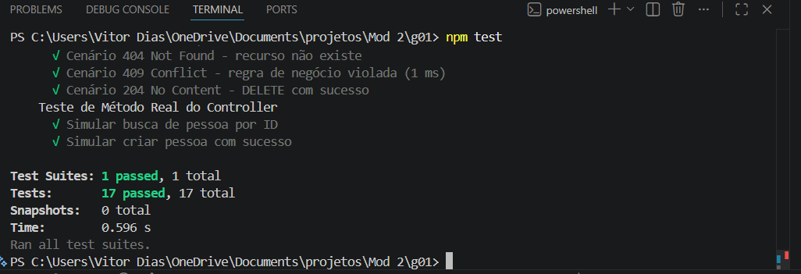

Fonte: Autoral (2026)

A execução dos testes foi realizada por meio do comando npm test, com o objetivo de validar o funcionamento dos endpoints, controllers e regras de negócio da aplicação. Durante a execução, foram verificados diferentes cenários, incluindo o retorno de erro 404 (Not Found) para recursos inexistentes, o tratamento de conflitos de negócio por meio do status 409 (Conflict) e a correta execução de operações de exclusão, que retornaram o status 204 (No Content). Também foram realizados testes do controller para simular a busca de uma pessoa por ID e a criação de um novo registro, garantindo que essas funcionalidades estejam operando conforme o esperado. Ao final da execução, a suíte apresentou resultados positivos, com 1 suíte de testes executada, 17 testes realizados e 17 aprovados, sem falhas ou erros, e tempo total de execução de aproximadamente 0,596 segundos, demonstrando que os componentes testados atendem aos requisitos definidos e estão funcionando de forma estável e consistente.

## 5.2. Testes de usabilidade (sprint 5)

### 5.2.1. Relatório de testes de guerrilha

*Posicione aqui as tabelas com enunciados de tarefas, etapas e resultados de testes de usabilidade. Ou utilize um link para seu relatório de testes (mantenha o link sempre público para visualização).*

### 5.2.2. Relatório de testes SUS (System Usability Scale)

*Posicione aqui o relatório dos testes SUS realizados.*

# <a name="c6"></a>6. Estudo de Mercado e Plano de Marketing (sprint 4)

## 6.1 Resumo Executivo

O GeoRisco Santo André é uma aplicação web desenvolvida para o Departamento de Proteção e Defesa Civil de Santo André com o objetivo de centralizar, em uma interface única, o cadastramento georreferenciado de famílias em áreas de risco. A oportunidade identificada está na modernização dos processos públicos de gestão de risco: a maioria dos municípios brasileiros ainda depende de registros físicos, planilhas dispersas e sistemas não integrados para monitorar populações vulneráveis, gerando uma lacuna expressiva entre a obrigação legal municipal de mapear áreas de risco e a capacidade operacional disponível.
O problema atendido é operacional e direto: a fragmentação de informações entre as etapas do atendimento emergencial compromete a agilidade da resposta, a padronização dos dados e a identificação de perfis prioritários para evacuação. O MVP entrega um formulário digital com captura de coordenadas GPS, registro de grupos vulneráveis como idosos, crianças, gestantes e pessoas com deficiência, e painel de busca com filtros operacionais, desenvolvido para funcionar em dispositivos móveis mesmo em condições de campo com conectividade instável.
Os principais diferenciais competitivos são: desenvolvimento sob medida para os fluxos reais da Defesa Civil, com aderência aos formulários da SDUH e às diretrizes do SUAS; geolocalização nativa dos registros, que permite espacializar famílias e priorizar atendimentos por perfil de vulnerabilidade; operação em campo sem dependência de conexão estável à internet; e interface orientada ao uso em dispositivos móveis pelos agentes durante as visitas.
Os objetivos estratégicos são aumentar a eficiência operacional das equipes de campo, reduzir a dependência de registros físicos, ampliar a disponibilidade de informações para a tomada de decisão da coordenação e apoiar ações preventivas no município de Santo André.


## 6.2 Análise de Mercado

### 6.2.1 Visão Geral do Setor

O GeoRisco Santo André insere-se no setor de tecnologia cívica aplicada à gestão de riscos e desastres, segmento com relevância econômica crescente no Brasil. Do ponto de vista econômico, o Tribunal de Contas da União apurou que, entre 2012 e 2023, o governo federal destinou R$ 33,75 bilhões ao programa de Gestão de Riscos e Desastres da Defesa Civil, dos quais R$ 21,79 bilhões foram efetivamente executados, evidenciando um fluxo expressivo de recursos públicos federais para o setor (TCU, 2024).
Do ponto de vista regulatório, o setor é estruturado pela Lei Federal n.º 12.608/2012, que instituiu a Política Nacional de Proteção e Defesa Civil (PNPDEC) e estabeleceu a obrigatoriedade de sistemas municipais de monitoramento e alerta de desastres, criando demanda formal por soluções digitais integradas (BRASIL, 2012).
No plano tecnológico, observou-se a aceleração da adoção de ferramentas de geolocalização, coleta de dados em campo e integração intersetorial por órgãos públicos municipais. O S2iD, sistema federal mantido pela Secretaria Nacional de Proteção e Defesa Civil, concentra informações sobre desastres e incentiva os municípios a reportar e monitorar ocorrências de forma digital, sinalizando a direção de digitalização do setor (BRASIL, 2023a).

### 6.2.2 Tamanho e Crescimento do Mercado

O mercado potencial do GeoRisco é dimensionado a partir do universo de municípios brasileiros com obrigação legal de cadastramento de populações em áreas de risco. Segundo a Pesquisa de Informações Básicas Municipais do IBGE (IBGE, 2021), o Brasil possui 5.570 municípios, e a pesquisa documenta que a maioria ainda opera com estruturas administrativas pouco especializadas em proteção e defesa civil, evidenciando o potencial de adoção de soluções digitais integradas como o GeoRisco.
Do ponto de vista das perspectivas de crescimento, o orçamento federal autorizado para o programa de Gestão de Riscos e Desastres totalizou R$ 33,75 bilhões entre 2012 e 2023, com apenas 64,5% efetivamente executado no período, segundo dados do TCU (2024). Esse hiato de execução aponta para uma demanda reprimida por instrumentos operacionais mais eficazes que permitam a aplicação dos recursos de forma mais eficiente nos municípios, indicando perspectivas concretas de crescimento da demanda por ferramentas digitais de cadastramento e monitoramento.
O Mapeamento GovTechs da Abstartups (2025) aponta que somente 1,2% das startups brasileiras atuam como govtechs e apenas 2,6% têm o governo como público-alvo principal. Esses dados quantificam a lacuna entre a demanda institucional crescente e a oferta ainda reduzida de soluções tecnológicas especializadas para o setor público, reforçando as perspectivas de crescimento do mercado no segmento de gestão de riscos e desastres.

### 6.2.3 Tendências de Mercado

Três tendências foram identificadas como impulsionadoras da adoção de soluções como o GeoRisco nos próximos anos, cobrindo os eixos tecnológico, comportamental e mercadológico.
No eixo tecnológico, observou-se a digitalização acelerada dos processos de gestão de risco no setor público. A PNPDEC (BRASIL, 2012) determina que União, estados e municípios adotem medidas de prevenção e monitoramento de desastres, incluindo a manutenção de sistemas de informação. O S2iD, sistema federal de registro e monitoramento de desastres, representa a consolidação dessa tendência em nível nacional, funcionando como repositório de dados sobre ocorrências e incentivando os municípios a alimentar sistemas digitais integrados (BRASIL, 2023a).
No eixo comportamental, identificou-se a crescente inserção dos servidores públicos municipais no uso de dispositivos móveis e aplicações web no exercício de suas funções. Segundo a PNAD Contínua (IBGE, 2023), o acesso a smartphones e à internet entre a população brasileira economicamente ativa cresceu de forma consistente nos últimos anos, tendência que se reflete no perfil dos servidores e reduz a resistência à adoção de ferramentas digitais em campo, tornando mais viável a implantação de sistemas como o GeoRisco em equipes de agentes com perfil técnico variado.
No eixo mercadológico, o Mapeamento GovTechs da Abstartups (2025) identificou que o principal obstáculo à entrada de startups no setor público é o excesso de burocracia, apontado por 58,5% dos respondentes. O modelo de parceria acadêmica adotado no GeoRisco, com desenvolvimento realizado por estudantes do Inteli em colaboração direta com a Defesa Civil, contorna esse obstáculo ao operar fora do regime de contratação pública tradicional, representando uma tendência crescente de colaboração entre universidades e prefeituras para digitalização de serviços municipais.

## 6.3 Público Alvo

### 6.3.1 Segmentação de Mercado

Identificaram-se três segmentos principais de mercado para o GeoRisco Santo André, todos inseridos no contexto de gestão pública de riscos e desastres no Brasil.
O segmento primário é composto pelos municípios brasileiros com áreas suscetíveis a desastres e obrigação legal de mapeamento e monitoramento de populações vulneráveis, conforme estabelecido pela Lei n.º 12.608/2012 (BRASIL, 2012). Esse universo abrange especialmente os municípios das regiões Sul e Sudeste, onde o histórico de deslizamentos, inundações e eventos geológicos é mais frequente e a pressão institucional por ferramentas de cadastramento digital é maior. A Pesquisa de Informações Básicas Municipais do IBGE (IBGE, 2021) documenta que a maior parte dos municípios brasileiros ainda não dispõe de estruturas administrativas especializadas em proteção e defesa civil, o que reforça o potencial de adoção da solução nesse segmento.
O segmento secundário é formado por estados com programas estaduais de gestão de risco que necessitam de ferramentas interoperáveis entre os municípios de sua jurisdição, como São Paulo, Rio de Janeiro, Santa Catarina e Minas Gerais.
O segmento terciário abrange órgãos federais como a Secretaria Nacional de Proteção e Defesa Civil (SEDEC/MI), que por meio do S2iD incentiva a digitalização dos processos municipais e poderia integrar ou replicar soluções como o GeoRisco em seu ecossistema de ferramentas (BRASIL, 2023a).

### 6.3.2 Perfil do Público Alvo

O público-alvo da aplicação é composto pelos servidores públicos municipais que atuam diretamente na gestão de áreas de risco, caracterizados em dois perfis funcionais distintos.
O primeiro perfil compreende os agentes de campo, responsáveis pelo cadastramento socioestrutural de famílias em assentamentos precários. Do ponto de vista demográfico, trata-se de servidores predominantemente de nível técnico ou médio, com faixa etária entre 30 e 50 anos, perfil compatível com o dos servidores municipais da área de segurança pública mapeados pela PNAD Contínua (IBGE, 2023). Comportamentalmente, esses agentes realizam visitas em condições adversas, com terreno irregular, sinal instável e tempo limitado, e estão habituados a rotinas burocráticas com exposição variável a ferramentas digitais. A principal dor identificada é a dependência de fichas físicas que frequentemente se perdem ou ficam ilegíveis após o campo. A expectativa central é dispor de uma ferramenta que permita o registro digital direto no local, com captura automática de coordenadas GPS e sem exigência de conexão à internet.
O segundo perfil é composto pelas coordenadoras operacionais, como a Gerente de Prevenção e Minimização de Desastres da Defesa Civil de Santo André. Demograficamente, atua em nível gerencial com formação superior e acesso a estações de trabalho fixas na sede do departamento. Comportamentalmente, analisa dados consolidados e toma decisões estratégicas sobre priorização de atendimentos. A principal dor é a dependência de relatórios manuais produzidos pelos agentes após o retorno do campo, que introduzem atraso e margem de erro. A expectativa é ter acesso a informações organizadas, filtráveis e exportáveis em tempo real.

## 6.4 Posicionamento e Branding
 
### 6.4.1 Proposta de Valor

O GeoRisco Santo André entrega, como principal valor, a centralização digital do processo de cadastramento socioestrutural de famílias em áreas de risco, substituindo integralmente o fluxo baseado em fichas físicas por um sistema georreferenciado acessível em campo.
Para o agente de campo, representado pela persona Marcelo Tavares, identificou-se que o valor central reside na possibilidade de registrar dados diretamente no local da visita, por meio de dispositivo móvel, com captura automática de coordenadas GPS, registro fotográfico do imóvel e operação sem dependência de conexão estável à internet. Elimina-se, assim, a perda de informações decorrente de fichas ilegíveis, extraviadas ou preenchidas de forma incompleta após o retorno ao escritório.
Para a coordenadora operacional, representada pela persona Cintia Aparecida Rossati Xavier, observou-se que o valor se expressa no acesso imediato a dados organizados, filtráveis por bairro, faixa etária, tipo de deficiência e setor de risco, permitindo a priorização ágil de atendimentos e o suporte qualificado à tomada de decisão em situações emergenciais. Dispensam-se, nesse contexto, os relatórios manuais elaborados pelos agentes após o campo, que atualmente introduzem atraso e margem de erro no processo.
Conclui-se que o GeoRisco Santo André agrega valor ao substituir um fluxo fragmentado e dependente de papel por uma solução unificada, rastreável e operável em condições adversas de campo, com aderência aos formulários da SDUH e às diretrizes do SUAS, fortalecendo a capacidade de resposta preventiva da Defesa Civil municipal, em coerência com o perfil de público-alvo descrito na seção 6.3.

### 6.4.2 Posicionamento e Diferenciação

O GeoRisco Santo André posiciona-se como uma solução govtech de gestão de risco desenvolvida especificamente para o contexto operacional das defesas civis municipais brasileiras, o mesmo segmento primário identificado na seção 6.3.1, diferenciando-se das alternativas existentes por quatro atributos centrais.
Em relação aos concorrentes diretos, o processo em papel e as planilhas eletrônicas, identificou-se que essas alternativas não oferecem geolocalização integrada, não operam em campo sem conexão estável e não consolidam automaticamente os dados para consulta gerencial. Em relação aos concorrentes indiretos, sistemas como o S2iD (BRASIL, 2023a) e o e-SUS (BRASIL, 2023b), observou-se que tais plataformas atendem a escopos distintos, sem foco no cadastramento preventivo georreferenciado de famílias em áreas de risco. Essa distinção é coerente com a análise de rivalidade entre concorrentes presente na seção 2.1.1 deste documento.
Os atributos de marca identificados para o GeoRisco são: orientação ao campo, com interface projetada para uso em dispositivos móveis em condições adversas, derivada diretamente das dores do perfil de agente de campo descritas na seção 6.3.2; institucionalidade, com aderência aos formulários da SDUH e às diretrizes do SUAS; e confiabilidade, com validação de dados em tempo real e rastreabilidade dos registros.
A identidade pretendida é a de uma ferramenta pública, técnica e acessível, percebida não como um sistema complexo de TI, mas como uma extensão digital do trabalho que os agentes já realizam em campo. A percepção de valor desejada é a de que o GeoRisco torna o trabalho do agente mais eficiente e o da coordenação mais informado, sem impor curva de aprendizado significativa.

## 6.5 Business Model Canvas

**Figura 10 — Business Model Canvas**
> 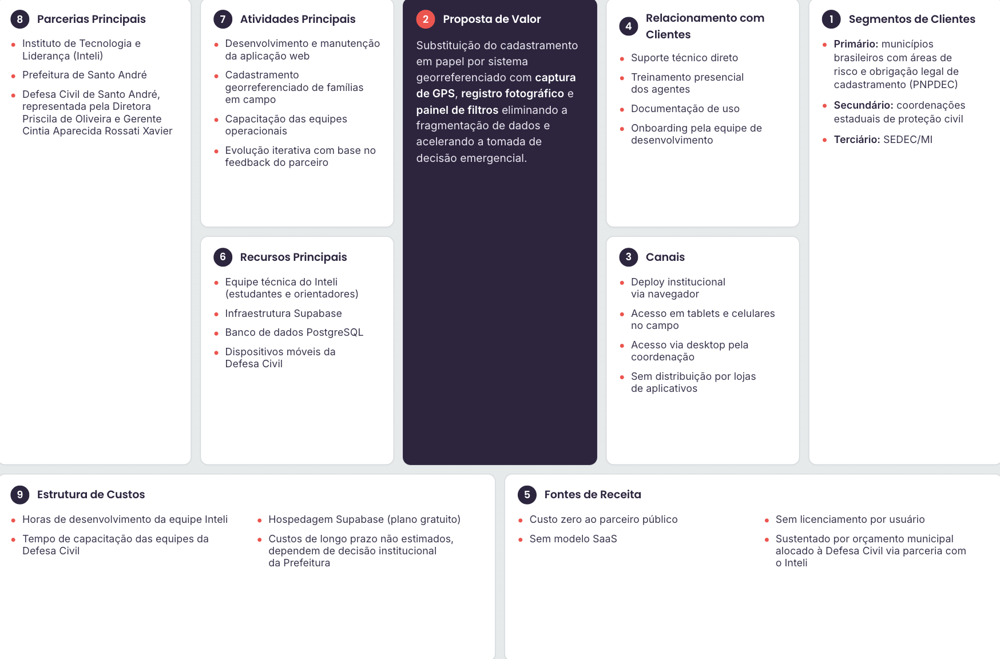
**Fonte:** Autoral (2026)

### Segmentos de Clientes
O segmento primário é composto pelos municípios brasileiros com áreas de risco e obrigação legal de cadastramento de famílias vulneráveis, conforme a PNPDEC (BRASIL, 2012), universo detalhado na seção 6.3.1. O segmento secundário abrange coordenações estaduais de proteção civil que necessitam de ferramentas interoperáveis entre municípios. O segmento terciário compreende órgãos federais como a SEDEC/MI, que poderia integrar soluções como o GeoRisco ao seu ecossistema de ferramentas digitais.

### Proposta de Valor
Substituição do fluxo de cadastramento em papel por um sistema georreferenciado acessível em campo, com captura automática de coordenadas GPS, registro fotográfico e painel de consulta com filtros operacionais, eliminando a fragmentação de dados identificada como principal dor do público-alvo na seção 6.3.2 e acelerando a tomada de decisão em situações emergenciais.

### Canais
A aplicação é disponibilizada por meio de deploy institucional, acessada via navegador em tablets e dispositivos móveis pelos agentes de campo, e via desktop pela coordenação. Não há distribuição por lojas de aplicativos. A forma de distribuição e os canais de entrega estão detalhados na seção 6.6.3.

### Relacionamento com Clientes
O relacionamento é estabelecido por meio de suporte técnico direto, treinamento presencial dos agentes de campo, documentação de uso e onboarding conduzido pela equipe de desenvolvimento em parceria com a coordenação operacional da Defesa Civil.

### Fontes de Receita
O modelo de receita é de custo zero ao parceiro público. A aplicação não gera receita direta, não cobra licenciamento por usuário e não adota modelo SaaS. O sustento financeiro ocorre por meio do orçamento municipal alocado à Defesa Civil, no contexto da parceria institucional com o Inteli, coerente com o modelo de precificação detalhado na seção 6.6.2.

### Recursos Principais
Os recursos principais são: equipe técnica de desenvolvimento formada por estudantes e orientadores do Inteli, infraestrutura de servidores hospedados no Supabase, banco de dados PostgreSQL e os dispositivos móveis já disponíveis na estrutura operacional da Defesa Civil de Santo André.

### Atividades Principais
As atividades principais compreendem o desenvolvimento e manutenção da aplicação web, o cadastramento georreferenciado de famílias em campo, a capacitação das equipes operacionais e a evolução iterativa do sistema com base no feedback do parceiro ao longo das sprints.

### Parcerias Principais
As parcerias centrais são o Instituto de Tecnologia e Liderança (Inteli), responsável pelo desenvolvimento da solução; a Prefeitura de Santo André, que viabiliza o acesso ao campo e aos dados operacionais; e a Defesa Civil de Santo André, representada pela Diretora Priscila de Oliveira e pela Gerente Cintia Aparecida Rossati Xavier, que orientam os requisitos e validam as entregas.

### Estrutura de Custos
Os custos identificados neste momento incluem horas de desenvolvimento da equipe técnica do Inteli, infraestrutura de hospedagem no plano gratuito do Supabase e tempo de capacitação das equipes da Defesa Civil. Custos operacionais de longo prazo, como manutenção pós-entrega e eventual migração de infraestrutura, dependem de decisão institucional da Prefeitura sobre a continuidade da solução e não foram estimados nesta etapa.

## 6.6 Estratégia de Marketing 

### 6.6.1 Produto/Serviço
O GeoRisco Santo André é uma aplicação web georreferenciada voltada ao cadastramento socioestrutural de famílias em áreas de risco, desenvolvida para operar em dispositivos móveis em condições de campo. As funcionalidades implementadas no MVP compreendem o formulário digital de cadastro com validação em tempo real, a captura automática de coordenadas GPS no momento do registro, o upload de fotografias do imóvel e o painel de consulta com filtros combinados por bairro, faixa etária, tipo de deficiência e setor de risco.
Os benefícios operacionais incluem a eliminação do retrabalho de transcrição de fichas físicas, a redução de erros decorrentes de preenchimento manual e a centralização dos dados em uma interface única acessível pela coordenação. O principal diferencial em relação ao processo atual é a geolocalização nativa dos registros, atributo de marca central identificado na seção 6.4.2, que permite espacializar as famílias cadastradas e apoiar a priorização de atendimentos com base na posição geográfica e no perfil de vulnerabilidade.

### 6.6.2 Preço
O modelo de precificação adotado para o GeoRisco Santo André é o de custo zero ao parceiro público. A aplicação não está sujeita a licenciamento por usuário, assinatura mensal ou qualquer forma de cobrança direta ao município. Essa escolha é justificada pelo perfil do segmento primário identificado na seção 6.3.1, composto por municípios com Defesa Civil ativa mas com orçamentos limitados e sem capacidade de pagamento recorrente por software.
O projeto é viabilizado pelo modelo de parceria institucional entre a Prefeitura de Santo André e o Inteli, no qual o desenvolvimento é realizado como entrega acadêmica supervisionada. Os custos de infraestrutura no estágio atual são absorvidos pelo plano gratuito do Supabase. Em eventual continuidade após a entrega acadêmica, os custos operacionais deverão ser incorporados ao orçamento da Secretaria de Meio Ambiente e Mudanças Climáticas de Santo André, que tutela o Departamento de Proteção e Defesa Civil, em coerência com o bloco Fontes de Receita do BMC na seção 6.5.

### 6.6.3 Praça
A aplicação GeoRisco Santo André é disponibilizada por meio de deploy institucional em ambiente web, acessada diretamente pelo navegador dos dispositivos utilizados pelos agentes de campo e pela coordenação da Defesa Civil. Não há distribuição por lojas de aplicativos como App Store ou Google Play e não é necessária instalação autônoma por parte do usuário final, estrutura coerente com o bloco Canais do BMC descrito na seção 6.5.
O acesso em campo ocorre via tablets ou celulares já disponíveis na estrutura operacional da Defesa Civil, sem necessidade de aquisição de hardware adicional. A coordenação acessa o painel de consulta via desktop na sede do departamento. O canal de entrega é integralmente institucional: a aplicação é provisionada pela equipe técnica do Inteli, apresentada formalmente à gestão da Defesa Civil e disponibilizada às equipes de campo após processo de capacitação presencial.

### 6.6.4 Promoção
A estratégia de promoção do GeoRisco Santo André foi definida com base no perfil institucional do parceiro e do segmento primário identificado na seção 6.3.1. Estratégias digitais como SEO, campanhas pagas em redes sociais e marketing de conteúdo não foram adotadas, pois o processo de adoção da solução não ocorre pelo mercado aberto e sim por decisão institucional da Defesa Civil. A estratégia centra-se em três ações de relacionamento direto.
A principal ação é o treinamento presencial das equipes de agentes de campo, conduzido pela equipe de desenvolvimento em conjunto com a coordenação operacional da Defesa Civil. Esse processo serve simultaneamente como capacitação técnica e como demonstração prática das funcionalidades da aplicação em ambiente real, endereçando diretamente as dores comportamentais do público-alvo descritas na seção 6.3.2. Complementarmente, está prevista a apresentação formal da solução à diretoria da Defesa Civil de Santo André e às secretarias parceiras, consolidando o alinhamento institucional e viabilizando a continuidade do projeto após o encerramento do período acadêmico. Por fim, a documentação técnica produzida ao longo do desenvolvimento, incluindo o WAD, o README e os diagramas de arquitetura, atua como instrumento de divulgação para replicação da solução em outros municípios, em alinhamento com a estratégia de parcerias institucionais descrita na seção 6.5.

# <a name="c7"></a>7. Conclusões e trabalhos futuros

## 7.1 Objetivos atingidos e pontos fortes 
O GeoRisco Santo André foi desenvolvido com o objetivo de centralizar, em uma interface digital única, o cadastramento de famílias residentes em áreas de risco do município de Santo André. A solução substitui o processo manual e fragmentado conduzido por agentes de campo da Defesa Civil, que operavam com fichas físicas, planilhas isoladas e sistemas sem integração entre as secretarias envolvidas. Os resultados alcançados ao longo das cinco sprints de desenvolvimento permitem concluir que os objetivos centrais propostos na seção 2 deste documento foram atingidos em sua dimensão prioritária, correspondente ao Módulo de Mapeamento Socioestrutural Georreferenciado.
O módulo de cadastro foi implementado contemplando o formulário digital de registro de famílias com captura de coordenadas de latitude e longitude via API de geolocalização do navegador (US02), a identificação de perfis de vulnerabilidade como idosos, crianças, gestantes e pessoas com deficiência (US03), o registro fotográfico do imóvel vinculado ao cadastro (US08) e o registro de informações de saúde e de caracterização estrutural da moradia (US06 e US07). Verificou-se que as funcionalidades centrais do MVP foram entregues de forma funcional, com persistência no banco de dados PostgreSQL via Supabase e validação das regras de negócio na camada de serviço.
O painel de consulta e filtragem foi desenvolvido de forma funcional, permitindo à coordenadora operacional aplicar filtros simultâneos por bairro, setor de risco, faixa etária e perfil de vulnerabilidade, conforme estabelecido na US04. A consulta e edição de cadastros previamente realizados foram igualmente implementadas, atendendo à US05.
Identificaram-se como pontos fortes da solução a fidelidade ao fluxo operacional real da Defesa Civil, a aderência à Ficha de Atualização de Dados dos Moradores em Assentamentos Precários fornecida pela Secretaria de Desenvolvimento Urbano e Habitação como referência primária, e a adoção de arquitetura em camadas (Controller, Service, Repository) com banco de dados relacional estruturado, o que favorece a manutenção e a extensão futura do sistema.

## 7.2 Pontos a melhorar
Embora os objetivos centrais tenham sido atingidos, observou-se ao longo do desenvolvimento um conjunto de limitações que restringem a completude operacional da solução entregue.
A funcionalidade de exportação de dados nos formatos CSV e PDF, prevista no RF033 e na US10, não foi implementada no MVP entregue. Constatou-se que o desenvolvimento dessa funcionalidade exigiria integração com bibliotecas de geração de documentos e uma camada adicional de controle de anonimização de dados pessoais, conforme exigido pela Lei Geral de Proteção de Dados (LGPD), o que extrapolou o escopo das sprints disponíveis.
A captura de coordenadas GPS apresentou comportamento inconsistente em dispositivos com sinal de localização instável, confirmando o risco R1 identificado na Matriz de Riscos do projeto (seção 2.1.5). Em campo, a indisponibilidade de sinal pode exigir o preenchimento manual das coordenadas, o que representa uma dependência operacional que reduz a agilidade do cadastro em situações emergenciais.
A ausência de modo offline representa outra limitação significativa, conforme antecipado no risco R2. Assentamentos precários frequentemente localizam-se em áreas com cobertura de sinal reduzida, e a aplicação atual não suporta preenchimento sem conexão com a internet, o que pode inviabilizar o cadastro em determinadas condições de campo.
A visualização georreferenciada em mapa interativo com mapa de calor (US11) e o painel de indicadores agregados (US12), previstos no escopo original, não foram implementados no MVP entregue. Essas funcionalidades representam evoluções de alto valor estratégico para a coordenação operacional da Defesa Civil e constituem prioridade para iterações futuras do sistema.

## 7.3 Melhorias derivadas dos testes de usabilidade
Realizaram-se testes de guerrilha com seis participantes com perfil de usuários jovens familiarizados com tecnologia, abrangendo cinco tarefas correspondentes às histórias de usuário US01, US03, US04, US05 e US08. Os testes foram conduzidos em junho de 2026 e os resultados consolidados na planilha de registro de ocorrências do grupo. A partir dos dados coletados, identificaram-se as seguintes melhorias, ordenadas por severidade decrescente:

### Bug crítico no modo de edição de cadastro (severidade 4: catástrofe).
 Nos testes da US08, observou-se que todos os seis participantes foram redirecionados para o formulário de criação de novo cadastro com todos os campos em branco ao acionar o botão de edição de um registro existente, inviabilizando completamente a funcionalidade. Propõe-se como plano de ação a correção do fluxo de navegação do botão de edição, garantindo que o formulário seja carregado com os dados pré-preenchidos do cadastro selecionado.

### Bug crítico na busca textual de cadastros (severidade 4: catástrofe). 
Nos testes da US04, identificou-se que a busca por nome não retornou resultados correspondentes a cadastros existentes no sistema (participantes P1 e P3). Propõe-se como plano de ação a revisão da lógica de busca textual, garantindo que a consulta ao banco de dados retorne corretamente os registros cujo campo de nome contenha o termo pesquisado.

### Sinalização insuficiente de campos obrigatórios (severidade 3: alta).
 Nos testes da US01 e US03, verificou-se que quatro dos seis participantes (P2, P3, P4 e P5) não identificaram com clareza quais campos eram obrigatórios antes de tentar submeter o formulário. Propõe-se como plano de ação a adição de indicador visual consistente nos campos obrigatórios, como asterisco acompanhado de legenda explicativa, e a exibição de mensagens de erro contextuais junto a cada campo não preenchido no momento da tentativa de envio.

### Seleção múltipla indevida em campos de escolha única (severidade 3: alta).
 Nos testes da US01, constatou-se que três participantes (P1, P3 e P4) conseguiram selecionar mais de uma opção em campos que deveriam admitir apenas uma resposta, como o campo de condição de ocupação do imóvel. Propõe-se como plano de ação a substituição dos componentes de seleção múltipla por componentes de seleção única nos campos que admitem apenas uma resposta, eliminando a ambiguidade de interação.

### Ausência de preenchimento automático de endereço por CEP (severidade 3: alta).
 Nos testes da US01, dois participantes (P2 e P5) demonstraram dificuldade no preenchimento manual dos campos de endereço e sinalizaram a necessidade de preenchimento automático a partir do CEP. Propõe-se como plano de ação a integração com a API pública ViaCEP para preenchimento automático dos campos de logradouro, bairro e município a partir do CEP digitado pelo agente de campo.

### Ambiguidade no botão de navegação do formulário (severidade 3: alta). 
Nos testes da US01, observou-se que um participante (P6) confundiu o botão de retorno ao painel geral com os botões de navegação interna entre seções do formulário. Propõe-se como plano de ação a diferenciação visual clara entre os controles de navegação interna e os controles de saída da página, por meio de hierarquia visual e posicionamento distintos.

### Mensagens de erro com linguagem técnica (severidade 2: baixa). 
Nos testes da US01, verificou-se que participantes que encontraram falhas na persistência dos dados receberam mensagens com terminologia técnica como "fetch", que não comunicam o problema de forma compreensível para o usuário final. Propõe-se como plano de ação a substituição de todas as mensagens de erro técnicas por mensagens em linguagem simples, orientadas à ação do usuário.

### Geração manual obrigatória do ID de cadastro (severidade 2: baixa).
 Nos testes da US01, um participante (P4) registrou confusão ao perceber que o identificador do cadastro deveria ser preenchido manualmente. Propõe-se como plano de ação a geração automática do ID de cadastro pelo sistema no momento da criação do registro, eliminando esse campo do formulário preenchível pelo agente.

### Redundância entre os botões "membro" e "adicionar pessoa" (severidade 2: baixa).
 Nos testes da US01, dois participantes (P3 e P6) demonstraram dificuldade para compreender que os dois botões representavam a mesma ação. Propõe-se como plano de ação a remoção do botão redundante e a padronização da nomenclatura, mantendo apenas um ponto de entrada para adição de membros familiares ao cadastro.

### Ausência de indicador de carregamento em operações de persistência (severidade 2: baixa).
 Nos testes da US03, observou-se que um participante (P5) interpretou a ausência de feedback visual durante o carregamento como falha do sistema. Propõe-se como plano de ação a adição de indicador de carregamento em todas as operações assíncronas de persistência de dados, informando ao usuário que a ação está em andamento.

### Ausência de subcampos condicionais para gestantes (severidade 1: cosmética).
 Nos testes da US03, um participante (P2) observou que ao selecionar a condição de gestante, o sistema não exibia campos adicionais para o registro do tempo de gestação. Propõe-se como plano de ação a adição de um campo condicional de semanas de gestação, exibido apenas quando essa opção for selecionada.

## 7.4 Trabalhos futuros
Além das melhorias derivadas diretamente dos testes de usabilidade, identificou-se um conjunto de evoluções estruturais que ampliariam significativamente o impacto operacional do GeoRisco Santo André. Tais perspectivas não integram o escopo entregue, sendo registradas aqui como diretrizes para desenvolvimento futuro em continuidade ao projeto.

### Modo offline com sincronização automática. 
Considera-se prioritário o desenvolvimento de funcionalidade de preenchimento offline, com armazenamento local temporário no dispositivo e sincronização automática assim que a conexão for restabelecida. Essa capacidade responderia diretamente ao risco R2 identificado na fase de planejamento e ampliaria a cobertura operacional em assentamentos com sinal instável.

### Exportação de dados em CSV e PDF com anonimização LGPD.
 A implementação da funcionalidade de exportação, prevista na US10 e no RF033, permitiria que a coordenadora operacional gerasse relatórios filtrados para reuniões intersecretariais e para o Plano de Contingência municipal. A anonimização de campos sensíveis como nome e CPF configuraria conformidade com a Lei Geral de Proteção de Dados.

### Visualização georreferenciada com mapa de calor.
O desenvolvimento do módulo de mapa interativo previsto na US11 permitiria a identificação visual de regiões de maior densidade de vulnerabilidade no município, convertendo os dados cadastrais em insumo estratégico para o planejamento preventivo da Defesa Civil.

### Painel de indicadores agregados.
 A implementação do painel de indicadores previsto na US12, com totalizadores por setor de risco, distribuição etária e perfis de vulnerabilidade, forneceria à coordenação operacional uma visão consolidada do panorama de risco em tempo real, com atualização automática a cada novo registro persistido.

### Módulo de gestão de abrigos emergenciais.
 Como extensão de médio prazo, propõe-se o desenvolvimento do módulo operacional de gestão de acolhimento em abrigos, incluindo triagem multidisciplinar e prontuário alinhado às diretrizes do Sistema Único de Assistência Social (SUAS), conforme previsto na proposta original do projeto descrita na seção 2.1.3.3.

### Integração com sistemas municipais existentes. 
Identifica-se como oportunidade futura a interoperabilidade com sistemas já adotados pela Prefeitura de Santo André, como o e-SUS Atenção Primária e o S2iD, o que permitiria o enriquecimento da base cadastral sem retrabalho de coleta e fortaleceria a coordenação intersetorial entre as secretarias de Habitação, Saúde e Assistência Social.

# <a name="c8"></a>8. Referências (sprints 1 a 5)
 c   c 
_Incluir as principais referências de seu projeto, para que seu parceiro possa consultar caso ele se interessar em aprofundar. Um exemplo de referência de livro e de site:_<br>

LUCK, Heloisa. Liderança em gestão escolar. 4. ed. Petrópolis: Vozes, 2010. <br>
SOBRENOME, Nome. Título do livro: subtítulo do livro. Edição. Cidade de publicação: Nome da editora, Ano de publicação. <br>

INTELI. Adalove. Disponível em: https://adalove.inteli.edu.br/feed. Acesso em: 1 out. 2023 <br>
SOBRENOME, Nome. Título do site. Disponível em: link do site. Acesso em: Dia Mês Ano

[^1]: PORTER, Michael E. **Competição: estratégias competitivas essenciais.** 2. ed. Rio de Janeiro: Elsevier, 2008.

ABSTARTUPS. Mapeamento GovTechs. São Paulo: Associação Brasileira de Startups, 2025. Disponível em: https://abstartups.com.br/wp-content/uploads/2025/06/Mapeamento-Govtechs.pdf. Acesso em: 8 jun. 2026.

BRASIL. Lei n.º 12.608, de 10 de abril de 2012. Institui a Política Nacional de Proteção e Defesa Civil (PNPDEC); dispõe sobre o Sistema Nacional de Proteção e Defesa Civil (SINPDEC). Diário Oficial da União, Brasília, 11 abr. 2012. Disponível em: https://www.planalto.gov.br/ccivil_03/_ato2011-2014/2012/lei/l12608.htm. Acesso em: 8 jun. 2026.

BRASIL. Ministério da Integração e do Desenvolvimento Regional. S2iD — Sistema Integrado de Informações sobre Desastres. Brasília: Secretaria Nacional de Proteção e Defesa Civil, 2023a. Disponível em: https://s2id.mi.gov.br. Acesso em: 2 jun. 2026.

BRASIL. Ministério da Saúde. e-SUS Atenção Primária. Brasília: Departamento de Atenção Básica, 2023b. Disponível em: https://esus.saude.gov.br. Acesso em: 8 jun. 2026.


# <a name="c9"></a>Anexos

*Inclua aqui quaisquer complementos para seu projeto, como diagramas, imagens, tabelas etc. Organize em sub-tópicos utilizando headings menores (use ## ou ### para isso)*
